# Aortta

Aortan sairaudet ovat tärkeä kardiovaskulaarimortaliteetin aiheuttaja. Akuuttien välittömästi hengenvaarallisten tilanteiden (kuten akuutti aorttaoireyhtymä tai aortan repeämä) ulkopuolella aortan sairaudet ovat asymptomaattisia eivätkä aiheuta statuslöydöksiä, jonka takia niiden diagnoosi ja seuranta perustuu kuvantamiseen -- ensisijainen ja helpoin kuvantamistekniikka on yleensä transtorakaalinen ultraääni. 

Yleisin vastaan tuleva aorttalöydös on aortan tyven ja nousevan aortan dilataatio. Aortan laajentuma tulee usein esiin oireettomalla potilaalla sattumalöydöksenä muita asioita tutkittaessa. Kappaleen tärkein osio käsitteleekin aortan ulottuvuuksia, niiden mittaamista ja raja-arvoja. 

## Anatomia

Aortan anatomia tulee tuntea, jotta voidaan tunnistaa ja myös mitata aortan eri osat ultraäänikoneen näytöltä. 

Aortta jaetaan **nousevaan osaan (ascending aorta), kaareen (aortic arch) ja laskevaan osaan (descending aorta)** sekä toisaalta anatomisen sijaintinsa mukaan **rinta- (thoracic aorta) ja vatsa-aortaksi (abdominal aorta).** 

Nouseva aortta käsittää alueen aorttaläpästä noin articulatio manubriosternalikseen (rintalastan kulma, sternal angle), jonka tasolla aortta pääsee ulos perikardiumpussista -- tämän jälkeen ollaan aortan kaaressa.  

Aortan kaaresta lähtee kolme päähaaraa, joiden nimet ovat järjestyksessä kulkusuuntaan a. brachiocephalica, a. carotis communis ja a. subclavia. Kierroksen tehtyään ja palattuaan n. T4-nikaman tasolle aortta jatkaa laskevana aorttana. Tässä kohtaa aortta on vielä rinta-aorttaa, mutta päästessään pallean alapuolelle sitä kutsutaan vatsa-aortaksi. 

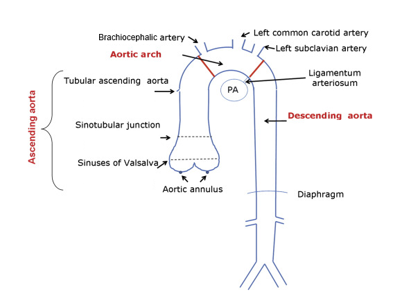

### Nousevan aortan ulottuvuudet 

Nousevasta aortasta mitataan useimmiten vain **aortan tyvi** (usein myös käytetään termiä "aortic root" eli aortan juuri, mutta aortan juuri sinänsä on kompleksi, joka käsittää aortan annuluksen, sinus valsavat ja sinotubulaarijunktion) ja se merkitään varsin yleisesti pelkällä lyhenteellä “Ao” lausuntoon. Aortan tyvi tarkoittaa tarkemmin siis **Valsalvan sinusten välistä läpimittaa.** Valsalvan sinukset siis ovat pieniä pusseja, jotka sijaitsevat juuri aorttaläpän päällä -- kuspit ovat siis anatomisia tiloja, joita rajaa internaalisesti aorttaläpän kuspit ja ulkoisesti aortan seinämät ulkoiset pullistumat. Jokaiselle kuspille on oma sinuksensa. Sinuksista myös lähtee sepelvaltimot eli niistä löytyy koronaariostiumit (sepelvaltimoiden lähtöaukot): oikeasta sinuksesta lähtee RCA ja vasemmasta sinuksesta lähtee vasen päähaara, mutta posteriorisesta sinuksesta (non-koronaarisinus) ei lähde sepelvaltimorunkoa. 

**Aortan mittaukset suositellaan nykyään tehtävän 2D-kuvasta eikä M-moodista,** koska sydämen liike usein johtaa M-moodikursorin siirtymiseen suhteessa aortan rakenteisiin. ASE:n mukaan tämä liike johtaa systemaattiseen aortan läpimitan aliarvioimiseen n. 2 millimetrillä. Jotkut ovat vielä vanhastaan tottuneet mittaamaan M-moodilla aortan (ja myös eteisenkin usein samalla), mutta nykyään ensisijaisesti kannattaa opetella 2D-kuvamittaukset.  

Aluksi siis haetaan mahdollisimman hyvä PLAX-projektio, jossa aortan rakenteet näkyvät tarkasti. Sitten pysäytetään liikkuva 2D-kuva Freeze-painikkeella. Pallohiirellä haetaan pysäytetystä kuvasarjasta loppudiastole, joka on käytännössä silloin kun mitraaliläppä alkaa sulkeutumaan ja aortta on kiinni -- kuvantaminen tehdään diastolessa, koska systole aiheuttaa parin millimetrin laajenemista.  Aortan tyvi mitataan nykysuositusten mukaan **leading-to-leading edge -metodilla** (outer to inner, etureunasta etureunaan). Käytännöt kuitenkin eroavat eri guidelinejen välillä, mutta niin ESC kuin ASE vielä suosittelevat leading-to-leading edge -mittauksia. Jotkut lähteet nykyään suosittelevat inner-to-inner edge -metodia, mutta käytännössä ero eri mittaustapojen välillä on n. 1-4 millimetrin luokkaa yleensä. 

<li>"Leading-to-leading edge" tarkoittaa sitä, että mitataan rakenne sen anteriorisen seinämän ulkopinnasta posteriorisen seinämän sisäpintaan. </li>
<li>Tekniikkaa käytetään, koska aikaisemmin M-moodia suosittiin enemmän ja leading edgen reuna oli helpommin siinä erotettavissa -> viitearvot rakennettiin M-moodimittauksista. Jos guidelineissa vaihdettaisiin suoraan ns. anatomisesti oikeampaan inner-to-inner-edge-tekniikkaan, niin potilaat saisivat systemaattisesti "aliarvioidut" aortan mitat suhteessa eri tavalla mitattuihin viitearvoihin -> jotkut potilaat, jotka olisivat oikeasti kandidaatteja operaatiolle, olisivat vielä indikaation ulkopuolella.</li>

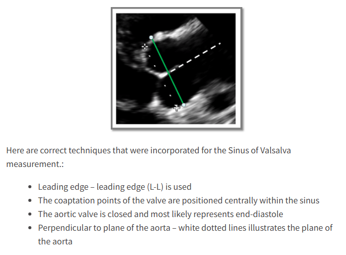
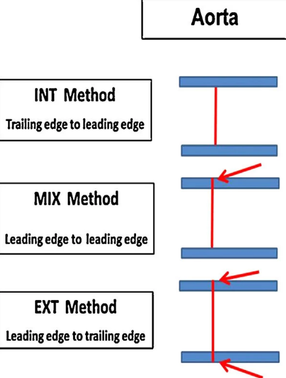

---

Aortan tyven lisäksi nousevasta aortasta voidaan mitata myös **sinotubulaarijunktio (STJ) ja nouseva tubulaarinen aortta (ATA).** Sinotubulaarijunktio tarkoittaa nimensä mukaan aluetta Valsalvan sinusten ja aortan tubulaarisen konfiguraation välissä. 

Lisäksi mittauksiin sisältyy usein sinänsä itse aorttaläpän mittauksista ns. **virtuaalinen aortan annulus** eli aortan purjeiden pohjien muodostamasta linjasta piirretty läpimitta. Se kuvastaa yleensä aortan juuren kapeinta osaa. Vaikka se ei ole todellinen anatominen rakenne, niin se muodostaa echossa selkeä virtuaalisen renkaan. Alla olevassa kuviossa oleva sininen linja taas on ns. oikea anatominen rakenne eli aortan ja kammion välinen junktio. Kun aortan annulus mitataan, niin tyypillisesti käytetään virtuaalista rengasta. Se on tärkeä mitta aorttaläpän toimenpiteitä suunniteltaessa. 

<li>Aortan annulus toimii myös välimaastona mittausten suhteen. Kaikki sen aorttapuolella mitataan loppudiastolessa ja leading-edge-to-leading-edge-tekniikalla. Taas aortan annulus ja vasemman kanavan ulosvirtauskanava (LVOT) mitataan keskisystolessa ja inner-to-inner-edge. LVOT:sta lisää varsinkin aorttastenoosia käsittelevässä kappaleessa.</li>

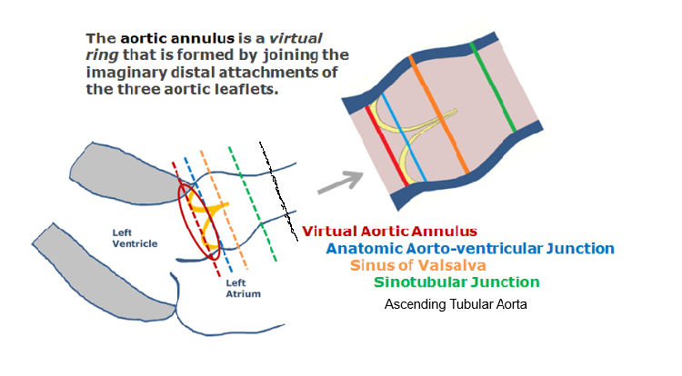
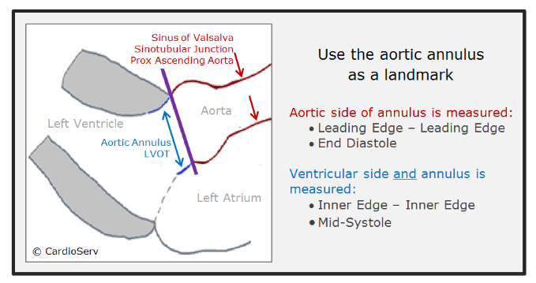
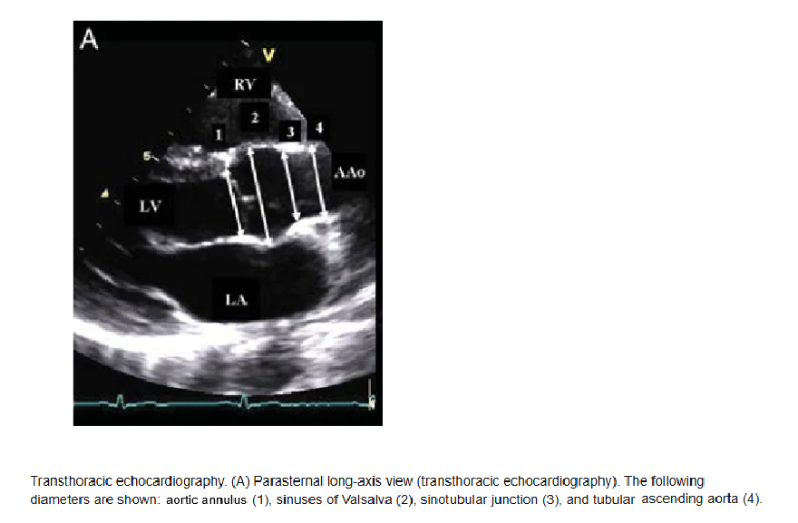

---

### Aortan muut mitat

Rinta-aortasta (vatsa-aorttaa ei käsitellä tässä kappaleessa) voidaan lisäksi mitata aortan kaaren ja myös laskevankin aortan läpimittoja. Näitä mittauksia varten tulee hakea **suprasternaalinen pitkittäisakseli (suprasternal notch (SSN) view; long axis) -projektio.** Se visualisoi aortan kaarta ja myös proksimaalista laskevaa aorttaa. 

Suprasternaalisesta ikkunasta tehdyistä aortan ulottuvuuksien mittaamisesta on vain vähän guidelineja, joten helpointa on etsiä eri kohtia nousevasta aortasta, aortan kaaresta ja laskevasta aortasta ja mitata niiden läpimittoja. Voi mitata esim. ennen truncus brachiocephalicaa (distal ascending aorta / proximal aortic arch), a. brachiocephalican ja a. carotis communiksen välistä, a. carotis communiksen ja a. subclavian välistä ja vielä ns. aortan istmuksen eli a. subclavian distaalipuoleisen aortan osan ductus arteriosuksen kiinnittymiskohdassa.  

Tulee varoa varsinkin proksimaalista kaarta mitatessa, että ei mittaa v. brachiocephalica sinistraa mukaan (voi helposti ajatella superiorisen seinämän olevan osa oartan seinämää, jos ei näe sen inferiorista seinämää tarkasti), jolloin kaaresta tulisi mitattua liian paksu.  

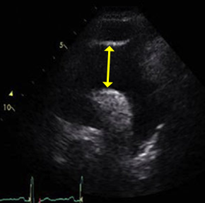
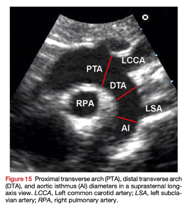

### Normaaliarvot

Pääasiassa mittauksilla etsitään, onko aortan dilataatiota ja varsinkin aneurysmaa todettavissa. Määritelmällisesti aortan aneurysma tarkoittaa paikallista patologista aortan dilataatiota, jossa aortan läpimitta on paikallisesti yli 1,5x normaaliin verrattuna. Tämä määritelmä pätee hyvin laskevaan rinta-aorttaan ja vatsa-aorttaan. Kuitenkin aortan juuren suhteen määritelmä hieman pettää; esimerkiksi 40-vuotiaalla miehellä aortan juuren keskimääräinen paksuus on n. 3.5cm, mutta 1.5x-kriteerillä laskettuna hänen aortan juurensa tulisi olla 5.25cm, jotta se olisi aneurysma, vaikka jo tätä ennen sitä ajateltaisiin merkittävästi laajentuneeksi ja aneurysmaattiseksi. Joillain potilailla jo 5cm aortan juuri olisi jopa indikaatio korjaukselle. Normaalin ylärajaksi on määritelty aortan juuren suhteen mitta, joka on yli 2 keskihajontaa normaalin keskiarvon yläpuolella. Termiä ektasia voi käyttää kuvaamaan laajentumaa, joka ei vielä ole aneurysman tasolla. 

Aikuisilla aortan normaalit ulottuvuudet ovat riippuvaisia iästä ja kehon koosta (varsinkin pituus on yksi merkittävimmistä aortan juuren koon ennustajista) sekä sukupuolesta -- ulottuvuudet ovat suurempia miehillä, vaikka ikä ja kehon koko olisivatkin samat. Monissa lähteissä aortan ulottuvuudet on indeksöity kehon pinta-alaan (BSA), mutta tämäkään ei ole täydellinen mittari. Sitä kuitenkin käytetään paljonkin ja ASE on esittänyt normaalirajat aortan juuren läpimitalle iän, sukupuolen ja BSA:n mukaan. 

<li>Kannattaa myös tiedostaa, että aorttakin on yksi sydämen mitoista, joka voi terveillä urheilijoilla olla lievästi suurempi kuin normaalisti. Keskiarvolta huippu-urheilijan aortan juuri on n. 1.69mm leveämpi kuin ei-urheilijoilla. Nuorilla urheilijoilla taulukon mukaisella normaalilla BSA:lla normaalin ylärajat ovat miehillä 40mm ja naisilla 34mm.</li>

---

Sen sijaan, että yrittäisi muistaa alla olevan taulukon tai lähtisi aina laskemaan jokaisen potilaan kohdalla BSA:ta, niin voi vain muistaa numeron 4 cm (tai kuten yleensä ulottuvuus ilmoitetaan millimetreissä niin 40 mm). **Jos nousevassa aortassa läpimitta on jossain kohtaa yli 4 cm, niin aortan juuri on yleensä ajateltu dilatoituneeksi** -- joillain potilailla tosin tämä nyrkkisääntö ei ole täysin pätevä, mutta sillä pääsee pitkälle. Naisilla raja on yleensä 36 mm. Kehon pinta-alaan suhteutettuna normaalin aortan halkaisijan ylärajaksi katsotaan 22 mm/m² (aortic size index, ASI: aortan halkaisija [mm]/kehon pinta-ala [m2])). 

<li>ASI:n käyttö ylipainoisilla voi vääristää tuloksia, joten korjaus pituuden mukaan (AHI) on yleistymässä. Tutkimusnäytön mukaan AHI-arvoon ≤ 24 mm/m liittyy matala (4%/vuosi) ja AHI-arvoon > 32 mm/m korkea (12%/vuosi) aorttatapahtuman/kuoleman riski.</li>

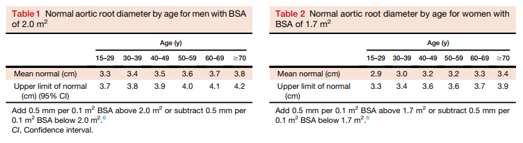
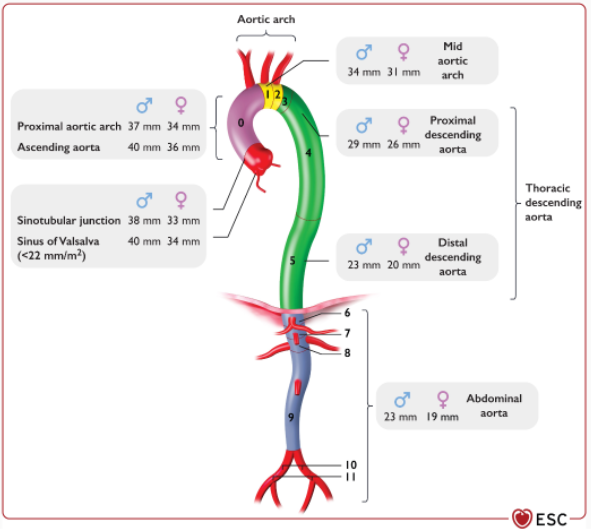

### Miksi dilataatio kiinnostaa?

Rinta-aortan laajentuma on yleensä oireeton, muun kuvantamisen yhteydessä havaittu sattumalöydös. Lähteestä riippuen rinta-aortan laajentuman esiintyvyys on 5–10/100 000 henkilövuotta ja miehillä yleisempi kuin naisilla (suhde 4:1). 

Rinta-aortan laajentumista noin 60 % sijaitsee aortan tyvessä ja/tai nousevassa aortassa. Nousevan aortan halkaisija kasvaa hieman nopeammin laskevaan rinta-aorttaan verrattuna, ja tyypillisesti laajentuman kasvu on nopeampaa naisilla. 

Aortan halkaisijan kasvaessa akuutin aorttasyndrooman riski kasvaa merkittävästi. Akuutti aorttasyndrooma tarkoittaa äkillistä aortan seinämävauriota ja siitä seuraavia tapahtumia. Tyypillisiä akuutin aorttasyndrooman ilmenemismuotoja ovat aortan dissekaatio, seinämän sisäinen verenpurkauma ja läpäisevä ateroskleroottinen haavauma (lisää näistä vielä tässä kappaleessa). Tutkimusnäytön perusteella laajentuman korjausta suositellaan nykyään aortan halkaisijan ylittäessä 50–55 mm riippuen potilaan muista akuutille aorttasyndroomalle altistavista riskitekijöistä. Myös nousevan aortan laajentuman kasvunopeus on otettu huomioon hoitosuosituksissa siten, että nopeasti kasvavat laajentumat suositellaan leikkaamaan, mikäli potilaan leikkausriski on pieni. 

Nousevan aortan laajentuman kasvunopeus vaihtelee tyypillisesti välillä 0,1–2,8 mm/vuosi, ja tätä suuremmat kasvunopeudet ovat harvinaisia. Nousevan aortan halkaisijan lisäksi myös laajentuman sijainti vaikuttaa akuutin aorttasyndrooman riskiin. Aortan tyven laajentumat ovat vaarallisempia, koska niihin liittyy suurempi dissekaatioriski ja ne myös kasvavat nopeammin tubulaarisen osan laajentumiin verrattuna. 

Vaikka aortan laajentuman halkaisija on edelleen akuuttien aorttasyndroomien tärkein riskitekijä, **suurimmalla osalla dissekaation saaneista potilaista laajentuma ei ehdi saavuttaa leikkausrajaa.** Tämän vuoksi on pyritty löytämään myös uusia akuutin aorttasyndrooman riskitekijöitä. Yksi uusimmista tutkimuskohteista on nousevan aortan pituus (ei tyypillisesti mitata ultraäänellä). Tutkimuksissa on todettu, että dissekaatiopotilailla nouseva aortta on pidempi kuin muilla nousevan aortan laajentumaa sairastavilla potilailla ja terveillä verrokeilla. Potilailla, joilla nousevan aortan pituus on vähintään 13 cm, on lähes viisinkertainen akuutin aorttasyndrooman riski verrattuna potilaisiin, joilla nousevan aortan pituus on alle 9 cm. Yli 11 senttimetrin pituisen nousevan aortan on todettu olevan raja, jonka jälkeen akuutin aorttasyndrooman riski kasvaa huomattavasti, ja uudet hoitosuositukset ottavatkin nyt huomioon laajentuman maksimihalkaisijan lisäksi myös nousevan aortan pituuden leikkaushoitoa harkittaessa. 

### Kuvantamisista tarkemmin

Sydämen ultraäänitutkimus on perustyökalu, jolla mitataan aortan tyvi ja nouseva osa. Se ei kuitenkaan ole täydellinen kuvantamiskeino ja **tietokonetomografia tai magneettikuvaus tehdään, kun ultraäänilöydös on epävarma, laajentuma ylittää seurantakynnyksen tai suunnitellaan leikkausta.** Kuvantamismetodien välillä on eroja sen suhteen, että miten aortta mitataan niissä (myös kursorin sijainti vaihtuu kuvantamisen välillä; TT/MK-kuvantamisessa mitataan ulottuvuudet sisäreunasta sisäreunaan) ja mitä mittoja kerätään.

<li>MK-tutkimuksen etuna on hyvän toistettavuuden lisäksi se, ettei sen käyttöön liity ionisoivaa säteilyä. Siksi se on erityisen hyvä kuvantamismuoto nuorilla ja se on mahdollista toteuttaa myös raskauden toisella ja kolmannella kolmanneksella ilman varjoainetta. Toisaalta MK-tutkimus kestää kauemmin ja osa potilaista saattaa siitä syystä kokea sen epämiellyttävänä mm. ahtaanpaikankammoon tai staattisen asennon aiheuttamaan selkäkipuun liittyen. Aortan MK-tutkimus voidaan toteuttaa ilman varjoainetta (gadolinium), joten se sopii potilaille munuaisten toiminnasta riippumatta.</li>
<li>TT-tutkimus on myös hyvin toistettava menetelmä aortan mittojen arvioimiseen. Tutkimuksessa käytetään kuitenkin säteilyä, mikä tulee huomioida varsinkin, jos seurantakuvauksia tehdään paljon ja erityisesti nuoria potilaita kuvattaessa. TT-tutkimuksessa käytetään jodipitoista varjoainetta, mikä voi aiheuttaa rajoitteita mm. munuaisten vajaatoiminnassa tai jodivarjoaineallergisille. Edellä kuvattujen seikkojen lisäksi seurantamenetelmän valintaan vaikuttaa tutkimusten paikallinen saatavuus. Säteilytutkimuksia tehtäessä lähettävän lääkärin tulee myös aina varmistaa, ettei tutkittava ole raskaana.</li>

---

Echossa PLAX:sta mitattu aortan tyven mittaus on tärkein mitta tyvestä. PLAX on tärkein projektio myös STJ:lle ja nousevalle aortalle. PLAX:ssa siis aortta yleensä leikataan suhteellisen kohtisuorasti pitkään akseliin nähden, jolloin ei valheellisesti yliarvioida paksuutta vinon leikkeen kautta. 

Varsinkin CT- ja MRI-kuvissa mitataan tästä poiketen joko sinus-sinus- tai sinus-kommissuura-mitat jokaiselle kuspille poikkileikkauksesta; tätä voi kuitenkin periaatteessa myös harrastaa ultraäänikuvien kanssakin antamaan alustava arvio dilataation symmetrisyydestä. PSAX-projektiota voidaan siis käyttää lisätukena kartoittamaan aortan tyven anatomiaa tarkemmin. PLAX käsittää vain yhden poikkileikkaustason -- yleensä siinä nähdään oikean koronaarisinuksen ja non-koronaarisinuksen välinen tila. Jos potilaalla on asymmetristä dilataatiota (esim. yksi tietty sinus on pullistuneempi), niin PLAX voi aliarvioida oikean maksimaalisen läpimitan. Jos pullistuma on todella asymmetrinen ja periaattessa vain säkkimäinen pullistuma, joka työntyy ulospäin yhdessä verisuonen kohdassa, niin se on sukkulamaista repeämäherkempi. Säkkimäinen pullistuma voi liittyä mm. infektioon, läpäisevään ateroskleroottiseen haavaumaan, traumaan tai tulehduksellisiin sairauksiin. Myös bikuspiseen aorttaläppään usein liittyy asymmetrinen aortan tyvi.

**PSAX on tärkeä projektio tarkistaa tämän ulkopuolellakin, koska aortan halkaisijan mittaamisen lisäksi on erittäin tärkeää havainnoida ja kirjata aorttaläppäpurjeiden määrä** (lisää tästä vielä tässä kappaleessa) **sekä läpän toiminta, sillä ne vaikuttavat seurantaan ja leikkausrajoihin.**

CT- ja MRI-kuvissa mitataan yleensä myös aikaisemmin mainittu aortan pituus, jota kautta voidaan laskea mm. leikkausrajoihin vaikuttava aortan läpimitan/korkeuden suhde 

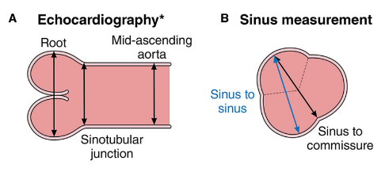
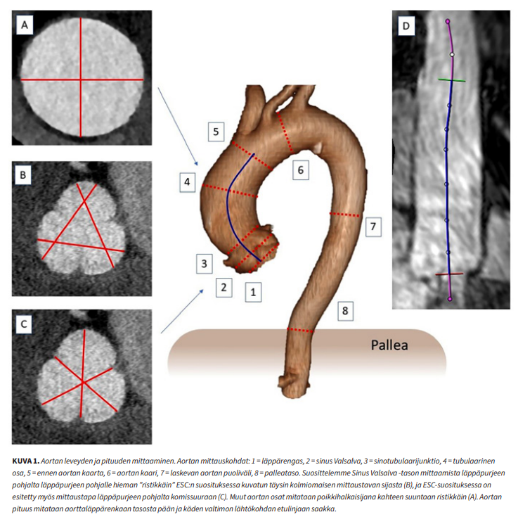
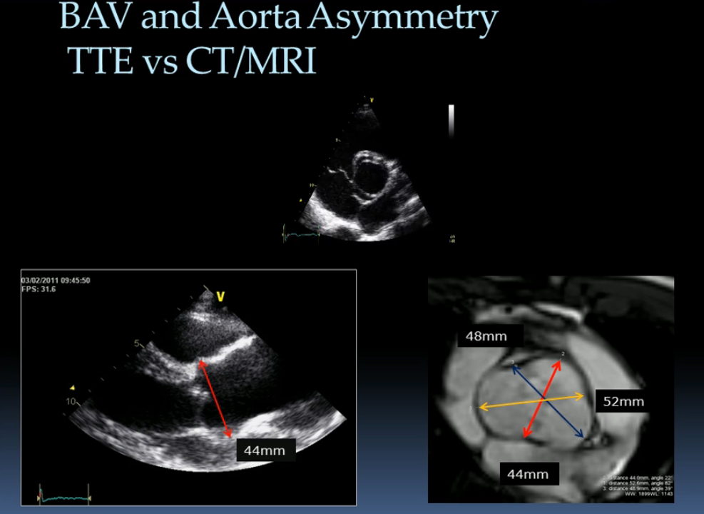

### Nousevan aortan laajentuman seuranta ja kirurginen hoito 

Aortan laajentuman seuranta suositellaan tehtäväksi samaa kuvantamismenetelmää käyttäen **6 kuukauden - 3 vuoden välein riippuen aortan leveydestä ja kasvunopeudesta.** Aortan halkaisijaan perustuva seuranta- ja leikkaussuositus on esitetty kaaviomuodossa alla olevassa kuvassa. 

On kuitenkin huomionarvoista todeta, että jopa puolella työikäisistä suomalaisista miehistä on edellä kuvattujen raja-arvojen mukaan aortan laajentuma. ESC:n suosituksessa
esitetyt aortan laajentuman halkaisijaan perustuvat seurannan alarajat saattavatkin olla liian matalia käytettäväksi sellaisenaan suomalaisessa väestössä. Kehon kokoon suhteutetut
mitat ovat tässä mielessä suositeltavampia. Yleisesti on käytössä suhteutus kehon pinta-alaan (aortic size index, ASI), mutta pelkästään potilaan pituuteen perustuva indeksöinti (AHI) yleistyy, koska ylipaino vääristää tuloksia pinta-alaan suhteuttaessa. **Normaalin ASI:n rajaksi katsotaan 22 mm/m² ja taan AHI:n mukaan 24 mm/m on matalan riskin potilas.**

<li>Suomessa ei ole kansallista hoitosuositusta aortan laajentuman seurannasta, mikä hankaloittaa hoitopäätöksen tekoa. Ilman selkeitä suosituksia hoitokäytännöt vaihtelevat alueittain. Toivottavasti jossain vaiheessa laaditaan aorttopatioiden Käypä hoito -suositus, joka huomioisi myös kansalliset, väestöämme mahdollisesti paremmin edustavat tutkimustulokset.</li>
<li>Aortan laajentumien sattumalöydöksien esiintyvyys on noussut viime aikoina ja tämän voisi olettaa jatkuvan jatkossakin. Terveydenhuollon resurssien vähentyessä kaikkien tapausten säännöllinen seuranta saattaa olla mahdotonta, mikäli seurantasuositusta noudatetaan kirjaimellisesti erityisesti raja-arvoisten aortan laajentumien osalta. Monet näistä lieväasteisista laajentumista eivät välttämättä koskaan etene, mutta ne vaatisivat silti säännöllistä kuvantamista ja vastaanottokäyntejä ja saattavat aiheuttaa potilaissa ja omaisissa huolta. Tämä kuormittaa terveydenhuoltojärjestelmää ja haastaa sen kykyä ylläpitää tehokkaita ja järkeviä seurantaprotokollia. Lisäksi suosituksesta puuttuu ohjeet siitä, milloin seuranta voidaan lopettaa.</li>

---

**Laajentuma on yleensä aiheellista hoitaa, kun läpimitta ylittää ≥ 55mm.** Nykysuosituksissa kuitenkin tietyt tekijät voivat laskea rajaa jopa ad 50mm (ja mahdollisesti jopa harvoin ad 45mm esim. Marfanin oireyhtymä -potilailla). Riski komplikaatioille yleensä nousee merkittävästi normaalipopulaatiossa kahdessa kohtaa: 52.5mm ja 57.5mm kohdilla. Tämän takia varsinkin rajat 50mm ja 55mm on asetettu leikkausrajoiksi. 

---

Nousevan aortan laajentuman ensisijainen hoito on avosydänkirurgia. Laajentuman sijainnista riippuen kyseeseen tulee joko koko aortan tyven korjaaminen yhdistelmäproteesilla sisältäen aorttaläpän ja sepelvaltimoiden istutuksen (composite graft) tai silloin, kun laajentuma sijaitsee vain aortan tubulaarisessa osassa, korjaus tubulaarisella verisuoniproteesilla. Korjaus ulotetaan niin, että distaalianastomoosin alueella aorttan halkaisija on alle 45 mm, ja tarvittaessa korjataan myös aortan kaari, joko puolikaarikorjauksella tai kokonaan, istuttaen kaaren valtimot proteesiin. Jos potilaan aorttaläppä ja läpän toiminta ovat normaaleja mutta laajenema alkaa jo sinus Valsalvan alueelta, voidaan nousevan aortan korjaus tehdä myös läpän säästävällä leikkauksella, jossa oma läppä kiinnitetään aorttaproteesin sisälle (David-leikkaus). Erityistapauksissa, kun laajenema ei lähde aortan tyvestä ja/tai potilaalla on merkittäviä perussairauksia, jotka puoltavat avosydänkirurgisesta leikkauksesta pidättäytymistä, distaalisen nousevan aortan ja aortan kaaren laajentumia voidaan hoitaa endovaskulaarisin menetelmin (thoracic endovascular repair, TEVAR). Näissä tapauksissa, jos TEVAR-hoito joudutaan aloittamaan nousevan aortan puolelta, on aortan kaaren valtimot ohitettava erikseen debranching-tyyliin nousevasta aortasta. Distaalisen aortan kaaren laajentumissa kyseeseen voi tulla myös TEVAR-hoito niin, että tarvittaessa vasempaan kaulavaltimoon ja solisvaltimoon tehdään ohitus tai haaroitettu endovaskulaarinen proteesi. 

Avokorjauksen jälkeen suositellaan TT-tutkimusta kuukauden sisällä toimenpiteestä sekä sen jälkeen vuosittaista seurantaa ensimmäisten kahden vuoden ajan, minkä jälkeen siirrytään joka viides vuosi tehtävään seurantatutkimukseen, mikäli löydökset ovat muuttumattomat. 

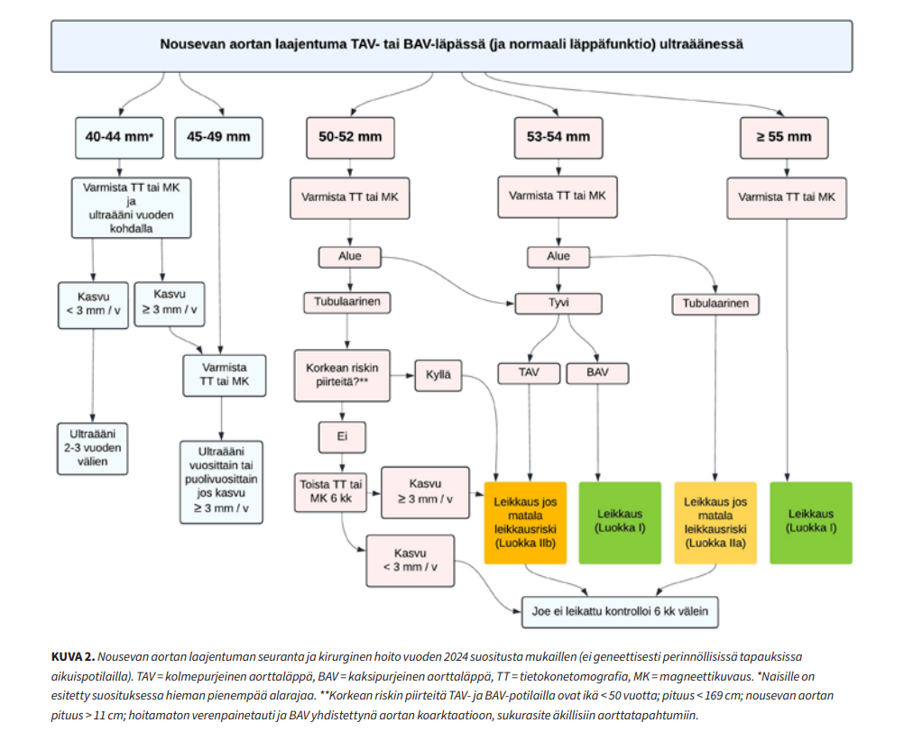
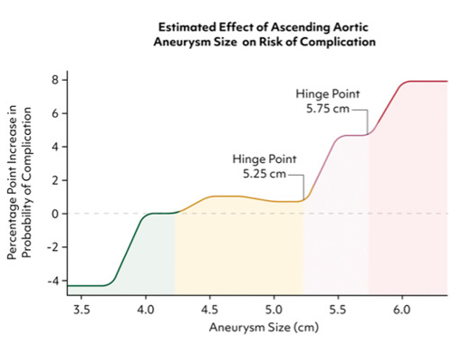

### Rinta-aortan dilataation etiologia ja genetiikan huomioiminen

Rinta-aortan dilataatio ja aneurysma voivat olla **sporadisia ja idiopaattisia,** mutta hyvin usein joitakin riskitekijöitä on todettavissa. **Noin puolet rinta-aortan aneurysmista liittyy ateroskleroosiin.** Ateroskleroosin riskitekijöistä etenkin kohonnut verenpaine, mutta myös tupakointi ja hyperkolesterolemia altistavat aneurysmien muodostumiselle. Ateroskleroosissa sisäkerros paksuntuu ja välivaiheiden kautta aterooma johtaa elastisten säikeiden ja sileälihaksen hajoamiseen aortan keskikerroksessa. Tämä kudos korvautuu sidekudoksella ja lipideillä, jotka heikentävät seinämää ja altistavat aneurysmaattiselle rappeutumiselle.

Myös aortan vammat, aorttatulehdukset eli aortiitit (esim. syfilis, jättisoluarteriitti, Takayasun arteriitti), aikaisempi aortan kirurgia ja muun muassa erilaiset sepelvaltimotoimenpiteet voivat altistaa aortan vaurioitumiselle ja aneurysmien synnylle. Kokaiinin ja amfetamiinin käyttöön voi liittyä nousevan aortan aneurysmamuodostuksen ja dissekoituman riski (voimakas sympateettinen overdrve johtaa hypertensioon, takykardiaan ja lisääntyneeseen stressiin aortan seinämässä; pitkäaikaiskäyttöön liittyy myös endoteelidysfunktio, sileälihasapoptoosi ja seinämäjäykkyyden krooninen lisääntyminen). 

Synnynnäisistä, ei selkeästi perinnöllisistä syistä mm. **kaksiliuskaiseen aorttaläppään liittyy suurentunut riski** kehittää varsinkin aortan tyven ja nousevan aortan dilataatio ja jopa dissekoituma. Muita ovat mm. Turnerin oireyhtymä (45,X) aortan koarktaatio ja kompleksiset synnynnäiset sydänpatologiat.  

<li>Yli 70 %:lla Turnerin oireyhtymää potevista naisista on rakenteellisia sydän- tai verenkiertoelimistön poikkeavuuksia. Aortan osalta tavallisimpia ovat bikuspidaalinen aorttaläppä (30 %) ja aortan koarktaatio (12 %). Noin kolmanneksella on jonkinlainen aortan tai suurten suonten laajenema. Turner-potilaat kuuluvat säännölliseen kardiologiseen seurantaan. Mikäli aortta on laajentunut, magneettikuvausta suositellaan tilanteesta riippuen 1–3 vuoden välein. Dissekaatioriski on huomattava. Potilaat ovat usein pienikokoisia eikä yksiselitteisiä aortan leikkausrajoja ole käytettävissä.</li>

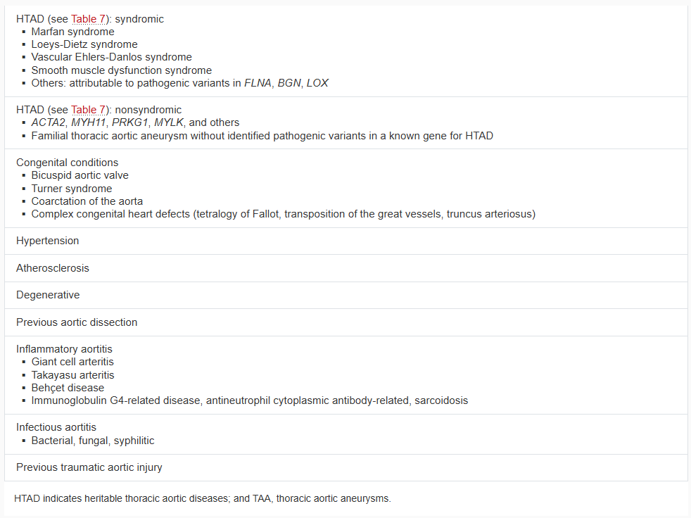

Lisäksi taulukossa mainitut syndroomiset (systeemisiä fyysisiä piirteitä) ja ei-syndroomiset (aorttaan isoloituneet) perinnölliset aorttasairaudet (HTAD) ovat varsinkin nuorilla potilailla merkittävä selittävä tekijä. Näitä ei yleensä tule liikaa opiskeltua kardiologian ulkopuolella, joten käydään kertauksena tärkeimmät läpi. 

<li>Yleisin syndroominen HTAD on **Marfanin oireyhtymä,** jonka esiintyvyydeksi on arvioitu 2–3/10 000. Sen aiheuttaa autosomaalisesti dominantti geenimutaatio fibrilliini-1- eli FBN1-geenissä (kromosomissa 15). On siis häiriö fibrilliinissä, joka on elastiinin ympärille tupen muodostava glykoproteiini (Marfan-potilailla on kuvattu myös TGFBR1- ja TGFBR2-geenien mutaatioita. Molekyylibiologisella tasolla fibrilliini-1:n tehtävä on TGF-beetan sitominen ja inaktivointi. Liiallinen TGF-beeta-aktiivisuus johtaa sidekudoksen holtittomaan kasvuun, jota luonnehtii elastisten säikeiden pilkkoutuminen ja epäjärjestys). Elastiini on proteiini ekstrasellulaarimatriksissa, joka antaa kudoksille (esim. affisioi luusto, sydän, silmät, verisuonet) niiden elastisiteetin. Kyseessä on siis systeeminen sidekudostauti, jolle on tunnusomaista sydän- ja verenkiertoelimistön, tuki- ja liikuntaelimistön sekä silmien ja keuhkojen vaihtelevanasteiset oireet ja niiden yhdistelmät. Sydänoireisiin kuuluvat aortan etenevä dilataatio, mihin liittyy dissekaatioriski (aortan lisääntynyt jäykkyys -> heikentynyt paineen sieto -> aneurysma-/dissekoituma-alttius (dissekoituma yleisin kuolemaan johtava komplikaatio Marfanissa)) ja mahdollisesti vuotava aorttaläppä sekä mitraaliläpän vajaatoiminta, mihin voi liittyä rytmihäiriöitä, endokardiitti tai sydämen vajaatoimintaa. Aortan tyven laajeneminen on todettavissa 60–80 %:lla potilaista. Alle 40-vuotiaiden aortan dissekoitumista noin 5 %:ssa on syynä Marfanin oireyhtymä.</li>
  <ul>
    <li>Diagnoosi perustuu Ghentin kriteereihin. Aina ei ole tarvetta geenitutkimuksille, vaan diagnoosi voi useinkin olla kliininen. Koska MFS on harvinainen, moniongelmainen, usein
jo lapsuudessa ilmenevä perinnöllinen sairaus, on esitetty, että olipa potilas lapsi tai aikuinen hänet lähetetään yliopistosairaalan perinnöllisyyslääketieteen ja kardiologian yksikköön epäiltäessä MFS:a.</li>
  <ul>
    <li>Vaikka vuosittain tehtävällä ultraäänitutkimuksella voidaan arvioida läppien tilannetta ja seurata nousevaa aorttaa, koko aortan huolellinen seuranta toistetulla tietokonetomografialla tai magneettikuvauksella on suositeltavaa. Jos nouseva aortta on selvästi laajentunut mutta leikkauskriteerit eivät vielä täyty, TT- tai magneettikuvaus tehdään 6–12 kuukauden välein. Jos aortan tyvi on normaali, magneettikuvaus tehdään 5 vuoden välein. Seuranta on elinikäistä.</li>
    <li>Aortan laajentumaa estämään on käytetty beetasalpaajia yli 20 vuoden ajan sekä aikuis- että lapsipotilailla, mutta näyttö niiden tehosta on ristiriitaista. Losartaanin osoitettiin hiirimallissa vähentävän TGF-beetan signaaliketjun aktiviteettia ja jopa estävän aortan laajentumisen. Kliinisissä tutkimuksissa losartaani ei kuitenkaan ollut beetasalpaajaa tehokkaampi estämään dilataatiota. Suositusten perusteella diagnoosin varmistuttua kaikille Marfan-potilaille tulisi aloittaa suuriannoksisen beetasalpaajalääkitys tai losartaani tavoiteannoksella 100 mg vuorokaudessa.</li>
    <li>**Marfan-potilaan nousevan aortan leikkausta suositellaan aikaisemmin kuin normaaliväestössä: läpimitan ylittäessä 50 mm.** Mikäli suvussa on aortan dissekoitumia, läpimitta kasvaa yli 3 mm/vuosi tai potilaalla on selvä aortta- tai mitraaliläpän vuoto tai raskaustoive, leikkausraja on 45 mm. Muun aortan dilataation osalta leikkausrajaksi on suositeltu 50 mm tai osoitettu aortan kasvutaipumus. Vaikka osa aortasta olisi korvattu proteesilla, täytyy jäljelle jäänyttä aorttaa seurata edellä mainittujen periaatteiden mukaisesti huomattavan laajenemis- ja dissekaatioriskin vuoksi.</li>
  </ul>

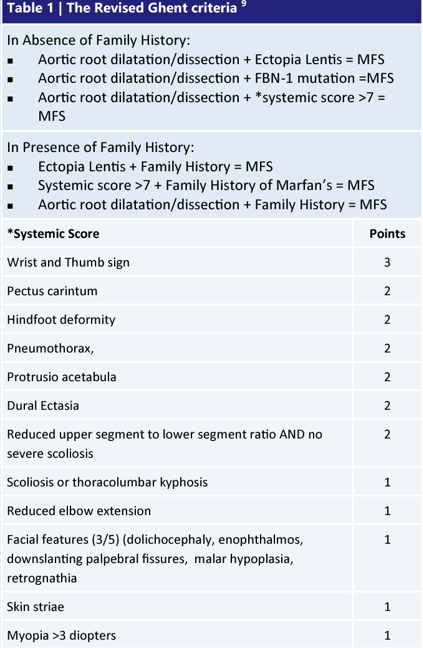
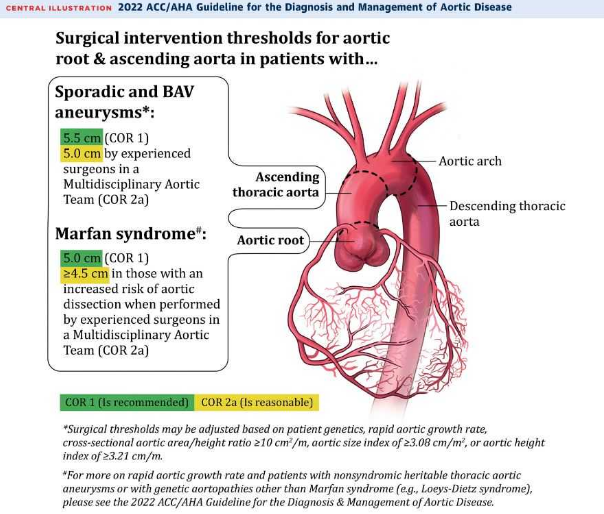

Muita syndroomisia aorttasairauksia ovat mm. **Loyes–Dietzin oireyhtymä (LDS) ja vaskulaarinen Ehlers–Danlosin oireyhtymä (vEDS; vanh. tyypin 4 Ehlers–Danlosin oireyhtymä).**

<li>LDS on autosomaalisesti dominantisti periytyvä sairaus, johon liittyy aortan laajenemisen ohella tyypillisinä piirteinä huomattava valtimoiden mutkaisuus, hypertelorismi (silmien sijainti tavallista etäämpänä toisistaan) ja kitalakihalkio/kaksiosainen uvula Aneurysmia voi kehittyä aortan lisäksi muihin suoniin, kuten viskeraali- ja aivovaltimoihin. LDS aiheutuu usein tyypin I tai II TGF-beetareseptoreiden (TGFBR1, TGFBR2) mutaatioista (kuten Marfaninkin oireyhtymä joskus) -- harvinaisempia ovat SMAD2, SMAD3, TGFB2 tai TGFB3. Toisin kuin Marfanin oireyhtymää sairastavilla, Loeys-Dietzin oireyhtymää sairastavilla ei yleensä todeta pitkien luiden liikakasvua eikä mykiön siirtymää. Loeys-Dietz-potilaiden valtimotauti sen sijaan etenee usein aggressiivisemmin ja johtaa aortan dissekoitumaan tai repeämään varhaisemmassa vaiheessa ja nuorempana.</li>
<li>Ehlers-Danlosin syndrooma (EDS) viittaa joukkoon perinnöllisiä monimuotoisia tukikudoksen sairauksia; yleisin tyyppi on hypermobiili muoto (tyypillistä nivelten ylitaipuisuus ja yliliikkuvuus; altistaa mm. nivelluksaatioille). Vakavin muoto on vaskulaarinen EDS, joka johtuu tyypin III kollageenin synteesiä ja rakennetta häiritsevästä COL3A1-mutaatiosta  -> verisuonien ja onttojen elimien (esim. suoliston) seinämien heikkous, mikä johtaa verisuonien aneurysmiin ja repeämiin ja dissekoituma-alttiuteen sekä alttiuteen onttojen elimien, kuten sigmasuolen ja kohdun repeämille. Sairaudelle on tyypillistä myös tietynlaiset kasvonpiirteet (ohuet huulet, ylähuulen keskiviivaura huulesta sierainten tyveen, pieni leuka, ohut nenänselkä, suuret silmät) ja ohut, mustelmaherkkä iho. vEDS:ssä mikä tahansa affisioitunut valtimosuoni voi dissekoitua ilman merkittävää laajenemista. Leikkaukseen joudutaan usein päivystyksellisesti, ja kudosten yleinen hauraus suurentaa leikkausriskiä. Yleisesti hyväksyttyjä aortan leikkausaiheita ei ole käytössä, vaan hoitoratkaisut tapahtuvat yksilöllisin perustein.</li>

---

Kliiniseen käyttöön on tullut kaupallisista laboratorioista saatavia aortan geenipaneelitutkimuksia, jolla voidaan seuloa suurin osa tiedossa olevista mutaatioista. Uusia mutaatioita löytyy koko ajan, ja tieto karttuu valtavalla vauhdilla. Täysin vakiintuneita käyttöaiheita tai suosituksia aortan sairauksien geenitestaukseen ei vielä ole maassamme olemassa.

**Mikäli suvussa on aortan dissekoitumia tai aneurysmia tai potilaan kliiniset piirteet viittaavat esimerkiksi Marfanin tai Loyes-–Dietzin oireyhtymään, on suositeltavaa keskustella potilaan kanssa mahdollisesta periytyvyydestä ja geenitutkimusten hyödyistä ja haitoista sekä ohjata hänet mahdollisuuksien mukaan kliinisen geneetikon vastaanotolle.** Geenitestausta suositellaan harkittavaksi, jos indeksipotilaan ohella vähintään yhdellä ensimmäisen asteen sukulaisella on ollut aortan dissekoituma tai laajenema tai jos potilaalla on aortan dissektion tai dilataation lisäksi muita selvästi kliinisiä poikkeavia löydöksiä (esim. Marfanin oireyhtymään viittaavat kliiniset piirteet tai huomattava valtimoiden mutkaisuus). Geenitestausta suositellaan myös, mikäli ensimmäisen asteen sukulaisella on aortan sairaus ja siihen liittyvä tunnettu geenimutaatio. Myös nuorten potilaiden geenitestausta voi harkita. Kehittyneestä geenidiagnostiikasta huolimatta suvuittain esiintyvistä aortan sairauksista ei läheskään aina pystytä identifioimaan tunnettua, varmasti merkittävää geenivirhettä, jolla olisi merkitystä sukulaisten tutkimiselle.

## Sudenkuopat

### Väärä kulma {#Vaara-kulma}

Usein näkee, että aivan leveintä kohtaa ei olla mitattu Valsalvan sinusten välistä läpimittaa haettassa. Tarkoitus on siis vetää kaliiperilla viiva niin, että se käsittää sinusten maksimaalisen kuoppaisuuden ja kulkee kohtisuorasti aortan pitkittäisakselia pitkin. Ensimmäisessä kuvassa kaliiperit ovat liian lähellä annulusta ja missaavat maksimaalisen läpimitan. 

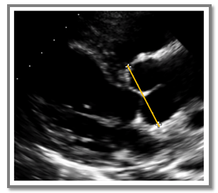
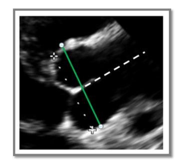

### Väärä ajoitus ja tekniikka {#Vaara-ajoitus-ja-tekniikka}

Voi helposti ajautua mittaamaan LVOT:n, annuluksen, tyven, STJ:n ja ATA:n samasta freeze-framesta, mutta tulee aina pitää mielessä oikea ajoitus kullekin mitalle. Samoin itse mittaustekniikka jää helposti vaihtamatta eri mittojen välillä. **Helppo muistisääntö on kuitenkin se, että kaikki aortan virtuaalisen annuluksen aorttapuolella mitataan loppudiastolessa ja leading-edge-to-leading-edge-tekniikalla. Taas aortan annulus ja vasemman kanavan ulosvirtauskanava (LVOT) mitataan keskisystolessa ja inner-to-inner-edge.**

### Koronaariostiumit

Echossa voi usein ihan visuaalisesti nähdä sepelvaltimoiden päärunkojen lähtöaukot eli koronaariostiumit: oikeasta sinuksesta lähtee RCA ja vasemmasta sinuksesta lähtee vasen päähaara, mutta posteriorisesta sinuksesta (non-koronaarisinus) ei lähde sepelvaltimorunkoa. Ostiumit ja itse suonet on hyvä tiedostaa ja tunnistaa, jotta ei säikähdä niitä tai mittaa niistä aortan paksuutta. Tyypillisesti PLAX:ssa voidaan nähdä erityisesti proksimaalinen RCA. Vasen päähaarakin voidaan visualisoida off-axis-kuvantamisella, mutta normaalissa PLAX:ssa näkyy siis yleensä oikea sinus ja non-koronaarisinus. 

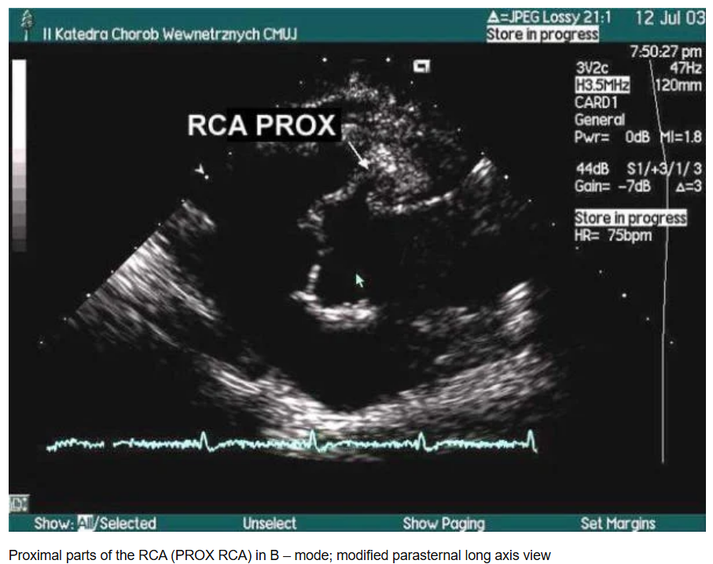

## Aortan kuspisuus 

Vaikka tämä kappale käsitteleekin enemmän itse aorttaa eikä niinkään aorttaläppää, niin aorttaläpän kuspisuus/liuskaisuus on vahvasti osa aorttapatologiakeskustelua. Käsitelläänkin nyt tässä kappaleessa, miten arvioidaan kuinka monta liuskaa potilaan aorttaläpässä on. 

Normaalistihan aorttaläppä koostuu kolmesta kuspista eli liuskasta eli purjeesta. **Kaksipurjeinen/Kaksiliuskainen aorttaläppä (BAV, bicuspid aortic valve) on kuitenkin yleisin synnynnäinen sydänvika, ja sen esiintyvyys on 1–2 %.** Se on selvästi yleisempi miehillä kuin naisilla (esiintyvyys 2:1). Kahdessa tutkimuksessa kaksiliuskaisen aorttaläpän omaavan potilaan ensimmäisen asteen sukulaisista noin 24–37 %:lla on myös kaksiliuskainen aorttaläppä. Kaksiliuskainen aorttaläppä saattaa periytyä autosomaalisesti dominantisti, mutta penetranssi on alentunut. Kaksipurjeinen aorttaläppä liittyy usein muihin synnynnäisiin sydänvikoihin, kuten kammioväliseinäaukkoon, avoimeen valtimotiehyeeseen, aortan koarktaatioon tai katkenneeseen aortan kaareen. Turnerin oireyhtymäpotilailla on todettu miltei kolmanneksella kaksipurjeinen aorttaläppä. 

<li>Kaksipurjeinen aorttaläppä on perinnöllinen sairaus, mutta sille altistavat geenivirheet tunnetaan puutteellisesti. Noin 10 %:lla potilaista ensimmäisen asteen sukulaisella todetaan myös kaksipurjeinen aorttaläppä. Kansainvälisten suositusten mukaan BAV-potilaan ensimmäisen asteen sukulaiset olisi hyvä tutkia sydämen ultraäänitutkimuksella aorttaläpän rakenteen selvittämiseksi.</li>

---

Kaksipurjeinen aorttaläppä on kliinisesti merkittävä paitsi yleisyytensä vuoksi myös siihen liittyvien moninaisten ongelmien vuoksi. Bikusdaalipiseen läppään kehittyy iän myötä lähes aina jonkinasteinen läppävika, ja on arvioitu, että jopa neljännes BAV-potilaista joutuu elämänsä aikana läppäleikkaukseen. Nuorilla potilailla aorttaläpän vuoto on stenoosia yleisempi, kun taas vanhemmilla potilailla stenoosikomponentti on usein hallitsevampi. 

<li>**Aorttaläpän ahtauma on kaksipurjeisen aorttaläpän yleisin komplikaatio ja se on yleisin syy aorttaläppäproteesille alle 60-vuotiailla.** Voi ajatella, että kun aorttaläpässä on vain kaksi purjetta, niin ne jakavat keskenään saman stressin kuin normaalitilanteessa jakautuisi kolmelle. Tällöin yksi purje kokee enemmän painevauriota ja stenoosi tapahtuu n. 10-20 vuotta aikaisemmin kuin normaalitilanteessa.Kaksiliuskainen aorttaläppä saattaa myös olla jo synnynnäisesti ahdas.</li>
<li>Aorttaläppävuoto on hieman harvinaisempi kaksipurjeisen aorttaläpän aiheuttama komplikaatio. Mekanismina voi olla aorttaläpän prolapsi, aortan tyven dilataatio ja aorttaläpän endokardiitti.</li>
<li>**Tavallinen ongelma on nousevan aortan laajeneminen, joka kehittyy lähes puolelle BAV-potilaista.** Aortta on yleensä selvimmin laajentunut tubulaarisesta osasta, mutta myös sinusosa voi olla laajentunut. Aortan laajenemisnopeus vaihtelee paljon, mutta keskimäärin se on noin 1 mm/vuosi. Tähän liittyen potilailla on huomattava, noin nelinkertainen dissekoitumariski terveeseen väestöön verrattuna. Kuten muissakin aortan sairauksissa dissekoitumariski korreloi aortan läpimittaan.</li>
  <ul>
    <li>Kun potilaalla todetaan kaksipurjeinen aorttaläppä, on tärkeää jo diagnoosivaiheessa ja seurannassa kiinnittää huomio nousevaan aorttaan läppävian ohella. Nousevan aortan laajentuman aste arvioidaan vähintäänkin ultraäänellä, mieluummin TT:llä tai magneettikuvauksella. Pelkkään ultraäänitutkimukseen voi luottaa vain, jos nouseva aortta on ehdottoman normaali ja näkyvyys on erinomainen. Seurantaväli riippuu aortan läpimitasta, mutta jos aortan läpimitta ylittää 45 mm, arvio tulisi tehdä vuosittain. Magneettikuvaus on suositeltavin seurantamenetelmä säderasituksen puuttumisen vuoksi, mutta tarvittaessa voidaan käyttää TT:tä. Ultraääniseurantaa voidaan käyttää, jos näkyvyys on hyvä eikä magneettikuvaus- ja ultraäänimittausten välillä ole eroa.</li>
  </ul>

---

Bikuspisen aorttaläpän anatomia voi vaihdella ja eri tyyppien luokittelu vaihtelee vuosien ja eri lähteiden välillä paljon. Tällä hetkellä ehkä **hyväksytyin luokittelu on kansainväliseen konsensuslausumaan perustuva jako, jossa on kolme eri päätyyppiä ja jokaisessa päätyypissä on spesifisiä fenotyyppejä.**

<li>Selvästi yleisin päätyyppi on ns. **fuusioitunut BAV** (n. 90-95% tapauksista), jossa kaksi alun perin kolmesta läppäpurjeesta on synnynnäisesti kasvanut yhteen, vaikka onkin vielä kolme erotettavissa olevaa aortan sinusta. Yhteenkasvaneiden purjeiden välillä on yleensä havaittavissa saumakohta eli **raphe** (n.70% tapauksissa), mutta se voi myös puuttua (jolloin puhutaan fused BAV without raphe). Raphe ei aina ole nähtävissä ensimmäisessä echossa ja voi muodostua kalkkeutumisen kautta näkyväksi vuosien kuluessa. Yhteenkasvaneet purjeet ja ei-fuusioitunut purje ovat yleensä eri kokoiset ja muotoiset. </li>
  <ul>
    <li>Yleisin (n.70-80%) uusioituneen BAV:n fenotyyppi on oikea-vasen (Right-Left, RL) kuspifuusio. Oikea-ei-fuusio (eli oikean ja ja ei-sepelvaltimopurjeen fuusio) on toiseksi yleisin (20-30%) ja vasen-ei-fuusio on harvinaisin. </li>
  </ul>
<li>Harvinaisempi (n. 5-7%) ns. "aito" biskupinen läppä on nimeltään **kaksisinuksinen tyyppi (2-sinus BAV), jossa ei ole fuusiota eikä raphea,** vaan läpässä on puhtaasti kaksi isoa, usein samankokoista purjetta ja vain kaksi Valsalvan sinusta. Komissuurat (purjeiden kiinnityskohdat) ovat 180 asteen kulmassa toisiinsa nähden.</li>
  <ul>
    <li>Fenotyyppijaottelu perustuu purjeiden sijaintiin: anteroposteriorinen tai laterolateraalinen. </li>
  </ul>
<li>Harvinaisin tyyppi on ns. **osittain fuusioitunut tyyppi (forme fruste).** Anatomisesti läppä on kolmipurjeinen, mutta yhdessä komissuurassa on osittainen (alle 50 %) yhteenkasvama (mini-raphe). Vaikka se ei ole tiukasti ottaen kaksipurjeinen, se käyttäytyy hemodynaamisesti usein bikuspisen läpän tavoin ja altistaa samoille ongelmille.</li>

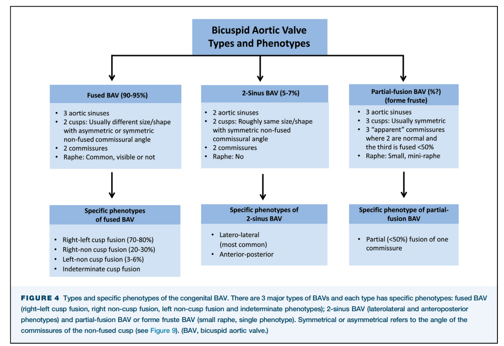
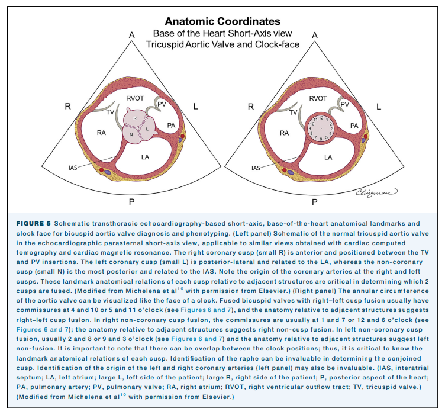
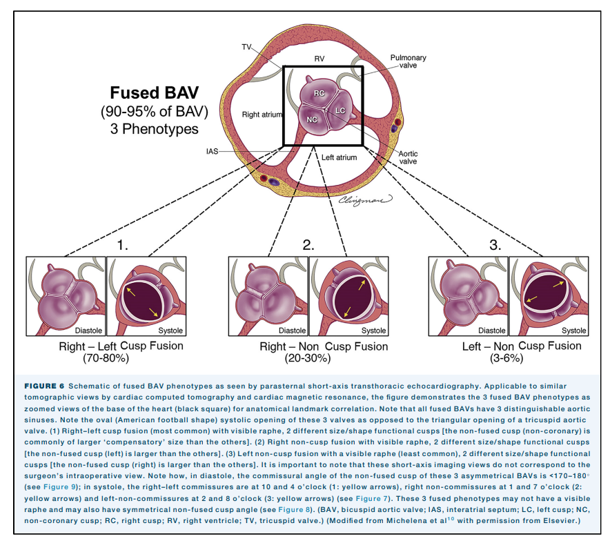
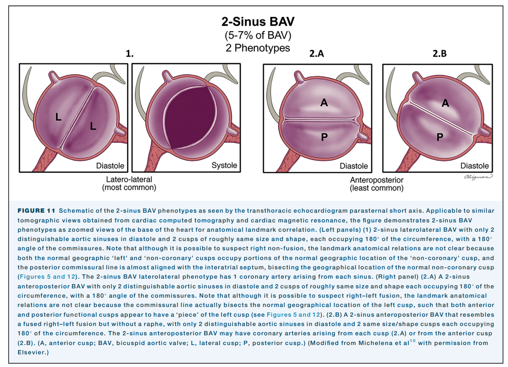
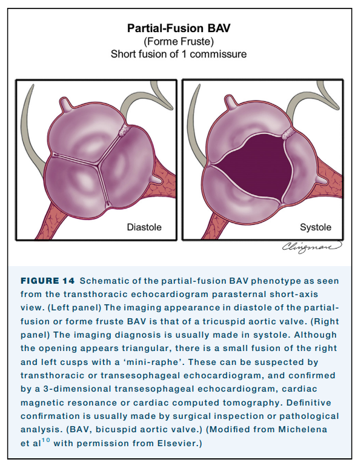

---

**Aorttaläpän morfologia näkyy ultraäänitutkimuksessa parhaiten parasternaalisessa lyhytakseliprojektiossa (PSAX).** Läppäpurjeiden määrä kannattaa tarkastaa nimenomaan **systolessa,** jolloin nähdään aukeaako läppäpurjeiden välinen sauma vai ei. Diastolessa saattaa läppäpurjeiden välissä näkyä sauma (raphe), joka ei kuitenkaan systolessa avaudu. Sauma hämää, koska se voi saada aorttaläpän näyttämään aivan normaalilta kolmipurjeiselta läpältä (ns. Mersu-merkki). 

Usein näkyvyys on kuitenkin sen verran heikko, että aivan täysin luotettavaa arviota aorttaläpän rakenteesta ei voida antaa. Mitä vanhempi potilas on ja mitä enemmän läppään on kertynyt kalkkia, sitä vaikeampaa raphen erottaminen on todellisesta komissuurasta. Jos läpän rakenteella on esim. leikkauksen takia merkitystä, niin, tyypityksen varmistamiseksi tehdään usein ruokatorven kautta tehtävä ultraääni (TEE) tai sydämen TT-kuvaus (tietokonetomografia), joilla anatomia saadaan erottumaan paremmin. 

**Alla on video, joka vertaa normaalia aorttaläppää ja kaikkein yleisintä bikuspista läppää eli oikea-vasen-fuusiota, jossa on raphe.** Sen jälkeen on kuvia, joissa on esimerkkejä erilaisista bikuspisista läpistä.

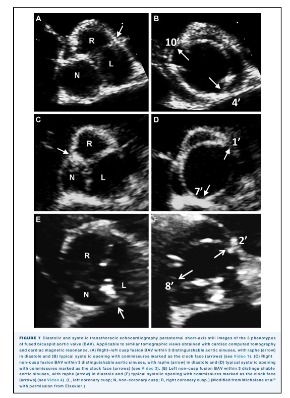
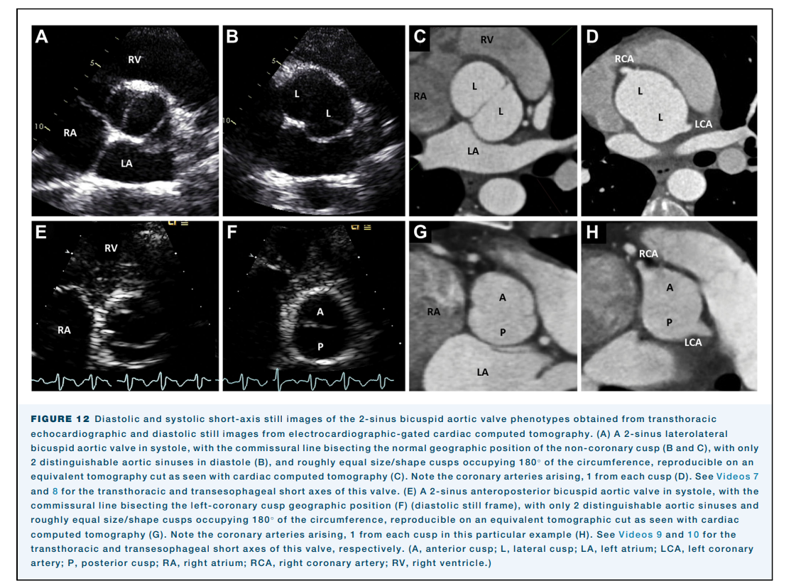
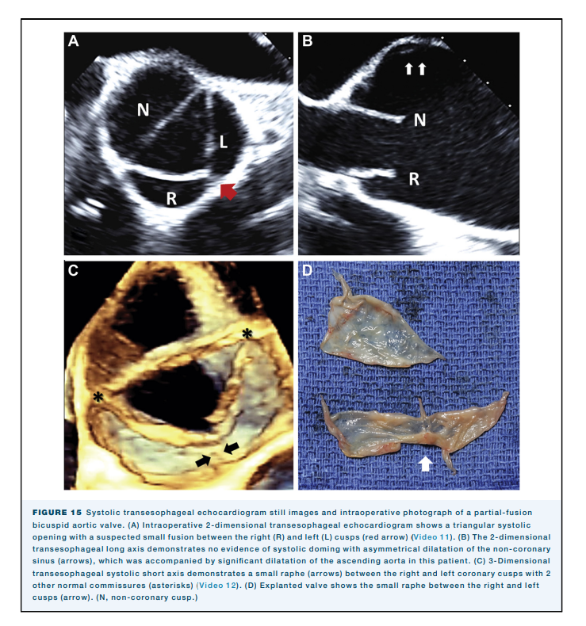

Visuaalisen arvion lisäksi kannattaa ainakin läpän korjausleikkausta suunniteltaessa mitata yleisimmässä tyypissä eli fuusioituneessa tyypissä **ei-fuusioituneen läpän kommissuurien välinen kulma.** Kulman terävöityessä leikkauksesta tulee vaikeampaa. Yleensä mitataan myös mm. aortan annulus ja muita aortan mittoja riippuen vähän suunnitellusta leikkauksesta -- varsinkin läpän korjausleikkausta varten yksi merkittävimmistä on aorttaläpän koaptaation efektiivinen korkeus (geometrista korkeutta ei saa mitattua echossa yleensä; korkeudet kuvastavat sitä, onko tarpeeksi läppäkudosta käytettävissä).  

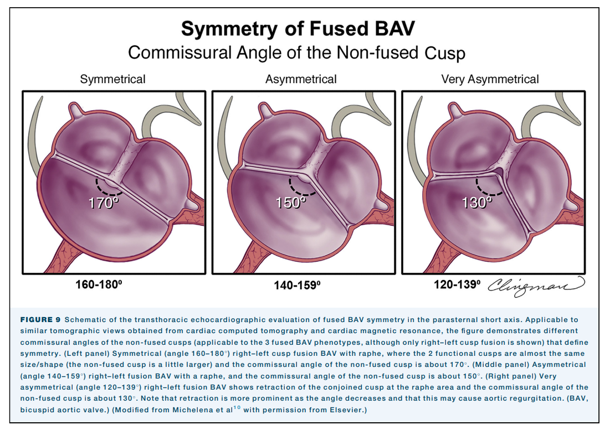
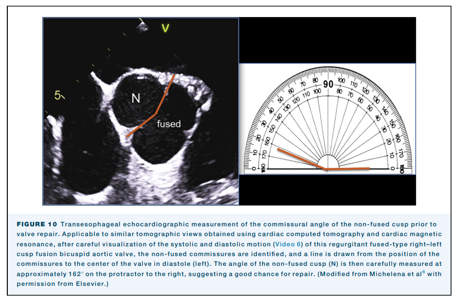
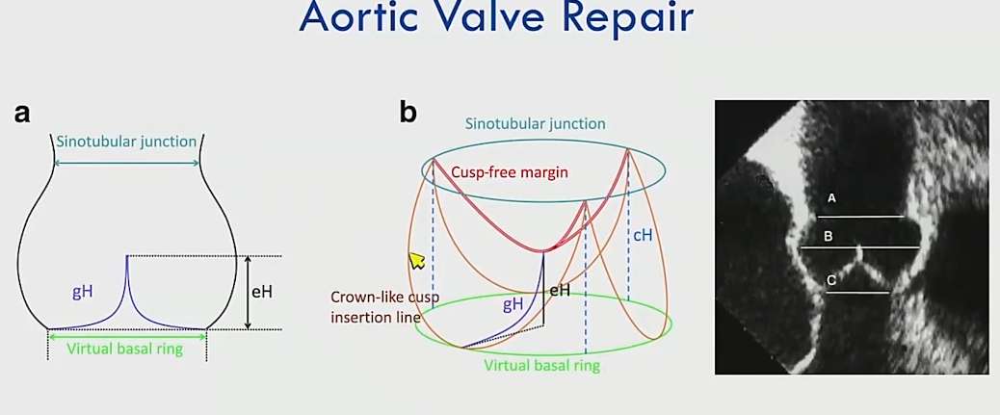

Bikuspisen aortan ekokardiografiseen arvioon liittyy itse läpän lisäksi tietysti **aortan dilataation ja koarktaation etsiminen,** koska nämä ovat erityisen yleisiä BAV-potilailla. Dilataation prevalenssi BAV-potilailla on lähteestä riippuen n. 40-70%. Koarktaatio on n. 7-10%:lla aikuispotilaista, joilla on BAV (ja toiseen suuntaan: jos on koarktaatio, niin BAV on 50-60%:lla). 

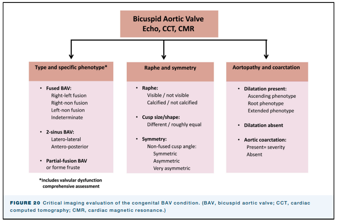

## Koarktaatio

Aortan koarktaatiolla (CoA) tarkoitetaan synnynnäistä ja paikallista kaventumaa, joka sijaitsee tavallisesti valtimotiehyen (tai sen jäänteen) laskukohdan lähellä. Koarktaatiossa erotetaan kolme anatomista tyyppiä: preduktaalinen, duktaalinen ja postduktaalinen koarktaatio. On myös klassisesti olemassa jako infantiiliin ja aikuistyyppiseen koarktaatioon.

<li>Infantiili muoto tarkoittaa preduktaalista tyyppiä. Siinä aortta on kaventunut tai hypoplastinen proksimaalisesti ductus arteriosuksesta (preduktaalinen). Ahtauman takia veri kulkee mieluummin aortan proksimaalisiin päähaaroihin, kun niissä on matalampi paine-ero. Tämän seurauksena laskevan aortan saama veri itse aortan kaaresta vähenee ja laskevaa aorttaa ruokkiikin avoin ductus arteriosus (PDA, patent ductus arteriosus). Infantiili muoto siis esiintyy yleensä PDA:n kanssa. Se ilmenee usein hypertensiona yläraajoissa ja hypotensiona alaraajoissa (yleensä koarktaatio tapahtuu a. subclavia sinistran jälkeen, mutta voi olla sitä ennenkin, jolloin virtaus vasempaan yläraajaan on heikompi ja hitaammin saapuva kuin oikealle (radio-radial delay)).</li>
<li>PDA:n kautta tuleva veri on pääasiassa heikosti hapettunutta, mutta se on silti tärkeä, koska alaraajojen on parempi saada heikosti hapettunutta verta kuin ei yhtään verta. Kun PDA sulkeutuu syntymän jälkeen, niin laskevan aortan virtaus on todella vähäistä -> kardiogeenisen shokin oireet ilmenevät nopeasti (tämän takia on ns. infantiili muoto). Valtimotiehytvirtauksesta riippuvassa koarktaatiossa lapset tulevat hoitoon viimeistään muutaman päivän tai muutaman viikon iässä. Vastasyntyneillä oireita voidaan hetkellisesti vähentää pitämällä PDA auki PGE1:llä (alprostadiili), kunnes tilanne korjataan toimenpiteellisesti.</li>

---

Aikuistyypissä koarktaatio sijaitsee ductus arteriosuksen tai sinänsä ligamentum arteriosumin distaalipuolella (tai joskus sen kohdalla). Älä kuitenkaan anna nimen hämätä, aikuistyyppisen koarktaation voi ihan hyvin diagnosoida lapsella tai teinilläkin. Samoin preduktaalinenkin koarktaatio voidaan joskus todeta vasta vanhemmalla iällä, jos se on lieväasteinen. 

<li>Jos koarktaatio on ductuksen kohdalla tai sen jälkeen, niin PDA ei pysty tukemaan laskevan aortan virtausta yhtä hyvin. Samoin sen suljettua on virtaus laskevassa aortassa tietysti heikkoa. Vasemman kammion pitää työskennellä korkeaa painetta vastaan -> johtaa vasemman kammion hypertrofiaan.</li>
<li>Hiljalleen (jo sikiöaikana alkava prosessi) heikko verenkiertoa laskevassa aortassa saadaan osittain korjattua kollateraalisuonilla. A. brachiocephalican yksi haara on a. subclavia dextra, jonka yksi haara taas on a. thoracica interna (ITA, a. mammaria interna). Samoin vasemmalla puolella a. subclavia sinistrasta lähtee a. thoracica interna. Ne normaalisti ruokkivat rintakehän anteriorista seinämää anterioristen kylkiluuvaltimoiden kautta. Aortan koarktaatiossa nämä anterioriset kylkiluusuonet saavat enemmän virtausta, anastomoivat posterioristen kylkiluuvaltimoiden kanssa ja pääsevät niitä kautta sitten virtaamaan lasekvaan aorttaan. A. thoracica internojen yksi päätehaara on a. epigastrica superior ja siitä eteenpäin a. epigastrica inferior, joka vielä laskee a. iliaca externaan. Näin kollateraalisuonien kautta saadaan lisättyä verenkiertoa koarktaatiosta distaalisille alueille.</li>
  <ul>
    <li>Kylkiluuvaltimoiden anastomoosien ja lisääntyneen virtauksen takia yksi klassisimmista koarktaation röntgenlöydöksistä on kylkiluiden lovettuminen thx-rtg:ssa, joka johtuu pullistuneista interkostaaliarterioista. "Kylkiluusyöpymät" ovat yleensä havaittavissa thoraxkuvassa 10. ikävuoden jälkeen. Kylkiluuvaltimoiden pulsointi voi myös joskus olla mahdollista palpoida.</li>
    <li>Pulssin tunnusteleminen samanaikaisesti kaulavaltimosta/radialiksesta ja reisivaltimosta on hyvä keino aortan koarktaation tai muun aortassa olevan ahtauman toteamiseksi. Kun kyseessä on kliinisesti merkityksellinen koarktaatio tai muu aortan ahtauma, myöhästyy reisivaltimon pulssiaalto selvästi kaulavaltimon tai radialiksen pulssiin verrattuna (brachio-femoral delay). Terveelläkin henkilöllä pulssiaalto tuntuu kuitenkin aavistuksen verran myöhemmin reisivaltimossa kuin kaulavaltimossa.</li>
    <li>Samoin on todettavissa paine-ero ala- ja yläraajojen välillä (hypertensio koarktaatiosta proksimaalisesti ja hypotensio koarktaatiosta distaalisesti). **Aortan koarktaatiota epäiltäessä paras testi aluksi onkin neliraajapainemittaus, jonka jälkeen tehdään kaikututkimus varmistavana testinä.**</li>
      <ul>
        <li>Koarktaatiopotilaat ovat usein oireettomia, joskus harvoin voi esiintyä alaraajojen väsymistä rasituksen yhteydessä tai päänsärkyä. Oireita on useammin, jos ahtauma on tiukka tai sydämessä on lisävikoja. Usein epäilyn voi herättää hoitoresistentiltä vaikuttava verenpainetauti (yläraajapaineet pysyvät korkeina lääkityksestä huolimatta).</li>
     </ul>
    <li>Vielä yksi statuslöydös koarktaatiossa on systolinen sivuääni, joka kuullaan usein parhaiten selässä vasemman lapaluun alta. Mahdollisesti usein tilaan liittyvän bikuspisen aorttaläpän takia todetaan myös systolinen ejektioklikki.</li>
  </ul>
<li>Koarktaatio myös aiheuttaa kohonneen proksimaalisen paineen takia usein aikaista sepelvaltimotautia ja proksimaalisen aortan kalkkeutumista</li>

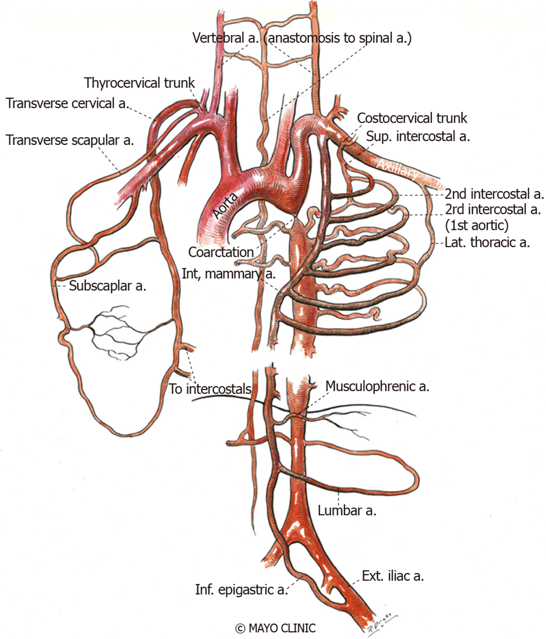
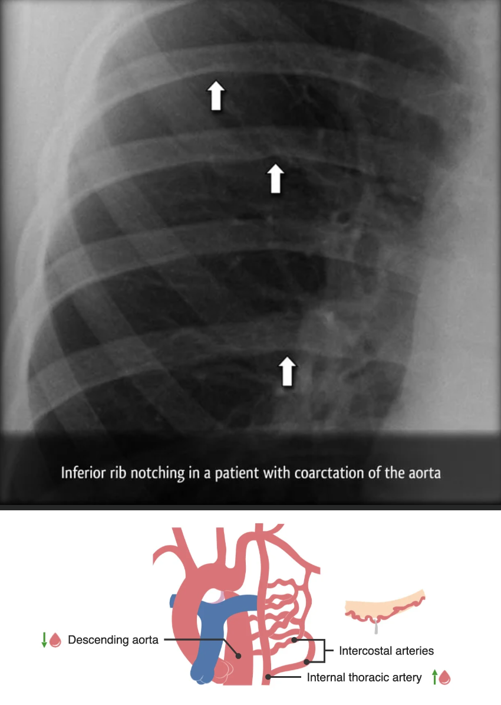

### Koarktaation echo -tutkimus

Itse koarktaation visualisaatio ja sen läpi virtaavan veren mittaukset tehdään useimmiten **suprasternaali-ikkunasta.** Usein voidaan nähdä ns. "posterior shelf", joka työntyy aorttaan ja aiheuttaa kaventuman. Virtaukset sen läpi voidaan visualisoida väridopplerilla (nähdään turbulenttia värikästä virtausta veren kiihtyessä koarktaation kohdalla) ja mitata CW-dopplerilla. 

<li>**Klassinen CW-aaltomuoto on ns. sahalaitapatterni eli todetaan korkeanopeuksisia systolisia huippuja ja jatkuvaa diastolista virtausta ("diastolic tail").** Normaalistihan virtauspatterni olisi pulsatiili ja systolisten huippujen jälkeen palattaisiin baselinelle takaisin. Varsinkin hemodynaamisesti merkittävässä koarktaatiossa kuitenkin tapahtuu jatkuvaa diastolista virtausta, koska korkearesistenttisen choke-pointin proksimaalipuolelle kertyy verta systolessa, kun vain fraktio verestä ehtii puristumaan koarktaation läpi. Tästä johtuva korkea paine proksimaalisesti koarktaatiosta pyrkii tasapainottumaan kehon alapuoliskon kanssa ennen seuraavaa sydämen lyöntiä. Paineet eivät ehdi tasoittumaan, mutta korkea gradientti koarktaation proksimaalipuolelta distaalipuolelle työntää verta jatkuvasti diastolessakin ahtauman läpi.</li>
<li>Kannattaa kuitenkin huomioida, että diastolinen virtaus liittyy vahvasti aortan komplianssiin, ei pelkästään koarktaation vakavuuteen. Jos proksimaalinen aortta on hyvin elastinen, se säilöö systolessa hyvin verta ja diastolessa tämän potentiaalienergian vapautuessa työntää verta koarktaation läpi paremmin kuin jos proksimaalinen aortta olisi jäykkä ja ei pystyisi venymään systolessa. Tämän takia **koarktaation vaikeusastetta ei voi suoraan päätellä diastolisen hännän olemassaolosta tai sen kestosta.**</li>

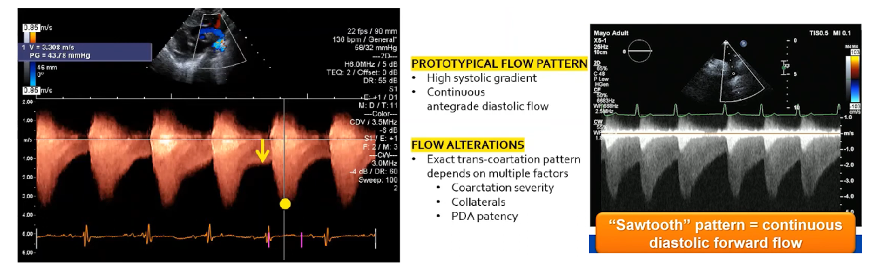

---

**Gradienttien mittaaminen** dopplerkäyrästä voidaan tehdä parilla eri tavalla: 

<li>Aluksi tulee tunnistaa aaltomuoto. Jos on ns. normaali pulsatiili virtaus, niin voi aika simppelisti piirtää käyrän ja sitä kautta saada sen maksimaalisen gradientin ja keskigradientin. Kannattaa myös mitata PW-dopplerilla virtausnopeudet aortassa proksimaalisesti koarktaatiosta. Jos virtausnopeus on korkeintaan 1 m/s, niin CW-käyrän voi piirtää normaalisti.</li>
<li>Jos taas on koarktaatiolle tyypillisempi sahalaitavirtaus tai PW-dopplerilla mitattu nopeus proksimaalisemmassa aortassa on yli 1m/s (usein koarktaatiossa on muitakin vasemmanpuoleisia leesioita (esim. stenoosi, BAV), jotka nostavat nopeuksia ennen koarktaatiota), niin sinänsä tulisi laskea modifoidun Bernoullin yhtälön kautta korjattu MIG (Maximum Instantaneous Gradient). Usein ilmoitetaan myös korjaamaton maksimigradientti. Keskigradientin saa laskettua piirtämällä käyrä niin, että visualisoi paraabelimaisen virtauksen käyrän huipusta eikä seuraa diastolista häntää.</li>
  <ul>
    <li>Korjattu MIG = 4(V2^2 - V1^2)</li>
    <li>Merkittävä kollateraalivirtauksen kehittyminen pitkäaikaisessa koarktaatiossa voi johtaa siihen, että huippugradientti voi olla suhteellisen matala, vaikka koarktaatio olisikin merkittävä.</li>
    <li>Merkittävä kollateraalivirtauksen kehittyminen pitkäaikaisessa koarktaatiossa voi johtaa siihen, että huippugradientti voi olla suhteellisen matala, vaikka koarktaatio olisikin merkittävä. Gradientti voi myös olla hämäävän matala esim. matalassa minuuttitilavuudessa, PDA:ssa tai obstruktion ollessa merkittävän pitkä anatomisesti.</li>
  </ul>

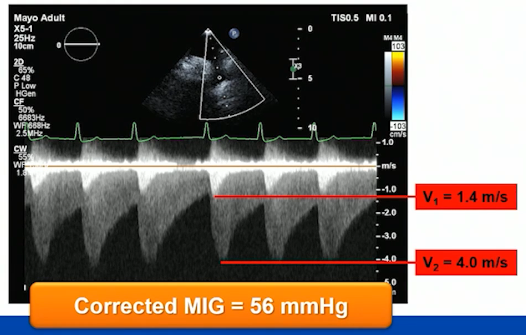

---

Virtauksia kannattaa tutkia myös **vatsa-aortasta dopplerilla.** Vatsa-aortta voidaan siis hakea subkostaali-ikkunasta ja sitten asettaa sen päälle dopplerboksi. Sitten voi asettaa PW-samplegaten virtaukseen. Normaalisti virtauskäyrässä nähdään terävä aikainen systolinen deflektio, joka myös laskee (downstroke) nopeasti loppusystolessa. Aikaisdiastolessa nähdään yleensä pieni virtauksen kääntyminen, kun sepelvaltimot täyttyvät. Loppudiastolessa sitten virtausta taas tapahtuu hieman eteenpäin johtuen verisuonten elastisiteetista. 

Koarktaatiossa kuitenkin nähdään usein hidas systolinen downstroke ja virtauksen kääntymisen puuttuminen eli jatkuvaa virtausta diastolessa. 

Tässä alla näkee vasemmalla normaalin vatsa-aorttavirtauksen ja oikealla koarktaatiossa todettavan tyypillisen käyrän. Alemmassa kuvassa samoin vasemmalla on normaali ja kaksi oikeanpuoleista kuvaa osoittavat virtausta kahdessa erilaisessa koarktaatiossa. 

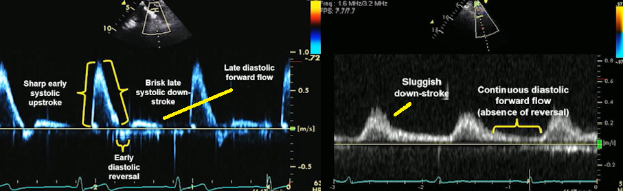
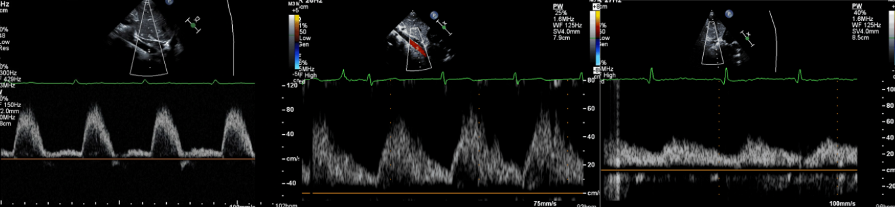

---

**Muista myös arvioida aorttaläppä tarkasti: suurimmalla osalla koarktaatiopotilaista on kaksikuspinen aorttaläppä!** Samoin jos potilaalla on kaksikuspinen aorttaläppä, niin tulisi muistaa etsiä koarktaation merkkejä.

### Koarktaation vaikeusaste ja hoitovaihtoehdot

Kajoavan hoidon käyttöaihe kaikenikäisillä potilailla on **anatominen osoitus koarktaatiosta + yli 20 mmHg:n painegradientti oikean yläraajan ja alaraajojen välillä verenpainemittauksissa/katetrisaatiossa tai keskigradientti yli 20 mmHg dopplerilla** tai vähintään 50 %:n ahtauma koarktaatiokohdan läpimitassa verrattuna aortan leveyteen palleatasolla. Valtimotiehytvirtauksesta riippuva koarktaatio, tai mikäli koarktaatioon liittyy sydämen vajaatoiminta, hoidetaan herkästi kirurgisesti.

Dopplermittaukset eivät usein ole riittävän tarkkoja, minkä takia aortta kuvataan lisäksi yleensä CT- tai MR-angiografialla. Usein myös tehdään katetrisaatio, jonka yhteydessä voidaan hoitaa perkutaanisestikin esim. pallolaajennuksella tai stenttauksella. Varhaislapsuudessa aortan koarktaatio korjataan pääsääntöisesti kirurgisesti tekemällä suora (pää päätä vasten) liitos tai harvemmin subclavian flap -tekniikalla, mutta yli 1 vuoden ikäisillä potilailla jo noin 80 %:ssa tapauksia käytetään pallolaajennusta. Jos potilas painaa yli 30 kg, käytetään jo natiivikoarktaatiossa peittostenttiä pallolaajennuksen tukena. 

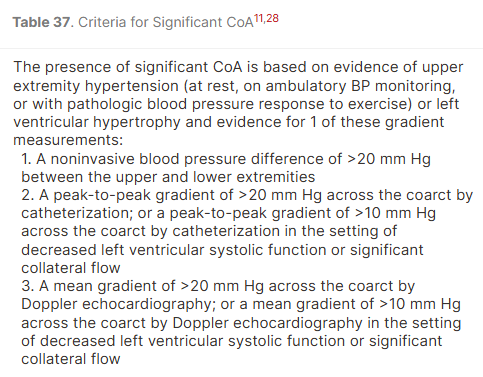
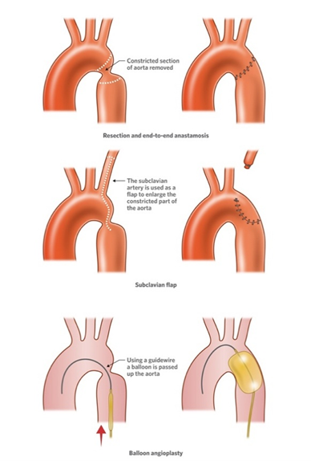
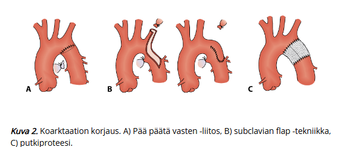

#### Myöhäisongelmat ja liitännäisviat {#Myohaisongelmat-ja-liitannaisviat}

**Leikatun aortan koarktaation ennuste ja myöhäisongelmat riippuvat leikkausajankohdasta, leikkaustekniikasta ja liitännäisvioista.** Lapsena tehdyn korjauksen jälkeen 83 % potilaista on elossa 35 vuoden kuluttua leikkauksesta, kun 20–40 vuoden iässä leikatuilla vastaava elossaololuku on 75 %. Myöhäiskuolleisuus on pienempi, jos koarktaatio on korjattu pää päätä vasten -liitoksella (9 %) verrattuna muihin menetelmiin (> 20 %).

Tällä hetkellä Suomessa on noin 800 aikuisikäistä potilasta, joille on lapsuudessa tehty korjausleikkaus aortan koarktaation vuoksi. **Kaikki potilaat vaativat jatkuvaa seurantaa vähintäänkin yleiskardiologisissa yksiköissä,** mutta jopa 60 % suomalaisista koarktaatiopotilaista ei ole säännöllisessä seurannassa.

**Yleisin myöhäisongelma on kohonnut verenpaine.** Jos koarktaatio on korjattu vasta yli 5 vuoden iässä, peräti 75 %:lla potilaista on hoitoa vaativa korkea verenpaine aikuisena. Kliininen rasituskoe tai ambulatorinen verenpainemittaus tulee uusia muutaman vuoden välein, sillä osalla potilaista verenpaine nousee poikkeavasti rasituksessa (systolinen paine > 220 mmHg), vaikka lepoverenpaine olisi normaali tai vain lievästi kohonnut. Verenpaineen myöhäisen kohoamisen syyksi arvellaan aortan seinämän jäykistymistä leikkausalueella ja baroreseptorien poikkeavaa toimintaa.

**Koarktaatiokohta ahtautuu uudelleen noin 5–10 %:lla vastasyntyneenä leikatuista potilaista, muilla lapsuusiässä leikatuilla vielä harvemmin.** Imeväisiän jälkeen tehdyn palolaajennuksen jälkeinen riski on 7–12 %. Stentillä hoidetun koarktaation uudelleenahtauman riski on pidemmässä seurannassa noin 7 %. Jatkuvalla dopplerkuvauksella kaulakuopasta mitatut huippugradientit yliarvioivat ahtauman vaikeusastetta. Esimerkiksi korjausleikkauksen jälkeen aortan komplianssin heikentyminen voi johtaa korkeisiin huippugradientteihin ilman ahtaumaa. Todennäköisesti diastolinen antegraadinen virtaus on luotettavin kaikukuvauksella saatava viite merkittävästä koarktaatiosta tai rekoarktaatiosta. Uudelleenahtauman hoidon aiheet ovat samat kuin korjaamattomassa viassa. Uudelleenahtauma hoidetaan nykyisin useimmiten pallolaajennuksella, jonka yhteydessä yhä useammin asennetaan stentti tai peittostentti. Peittostenttiä käytetään, jos laajennetaan hyvin tiukkaa ahtaumaa, johon liittyy aneurysman tai aortan repeämän riski. Uudelleenahtauman leikkaushoidossa aikuisiässä tarvitaan useimmiten putkiproteesia. Katetritoimenpide on vakiintunut uudelleenahtauman hoidossa ja uusintaleikkaus tehdään potilaille, joille suonensisäinen toimenpide ei ole anatomisista syistä mahdollinen. Katetritoimenpide onnistuu suurimmalle osalle potilaista ja vakavat komplikaatiot ovat harvinaisia. Koarktaation ja uusinta-ahtauman kirurginen sekä perkutaaninen hoito on Suomessa keskitetty HUSiin.

**Noin 9 %:lle kehittyy aneurysma koarktaation kirurgisen tai perkutaanisen korjauksen jälkeen.** Erityisesti jos koarktaatioaluetta on primaarileikkauksessa laajennettu paikkalapulla tai on käytetty subclavian flap -tekniikkaa ja leikkaus on tapahtunut 5–7 ikävuoden jälkeen, on aortan tilaa seurattava magneettikuvauksella muutaman vuoden välein aneurysman ja sen repeämisvaaran vuoksi. Veriyskä voi olla pseudoaneurysman ja siihen liittyvän aortobronkiaalisen fistelin ensimmäinen oire ja on aihe päivystysluonteiseen tietokonetomografiakuvaukseen sekä tarvittaessa kiireelliseen kirurgiseen hoitoon (ennen keuhkoputkien tähystystä!). Korjatun koarktaatioalueen proksimaali- tai varsinkin distaalipuolella aortta voi laajentua ja joskus myöhemmin dissekoitua.

Seurantaa edellyttävistä koarktaation **liitännäisvioista kaksiliuskainen aorttaläppä on tavallisin.** Se esiintyy jopa 80 %:lla koarktaatiopotilaista. Harvinaisempia liitännäisvikoja ovat aorttaläpän alapuolinen ahtauma, mitraaliläpän viat ja endokardiaalisen fibroelastoosin aiheuttama restriktiivinen kardiomyopatia. Lisäksi sekä varhaisen sepelvaltimotaudin että aivoverenvuodon vaara (aivovaltimoiden aneurysmat 10 %:lla) ovat koarktaatiopotilailla suuremmat kuin muulla väestöllä.

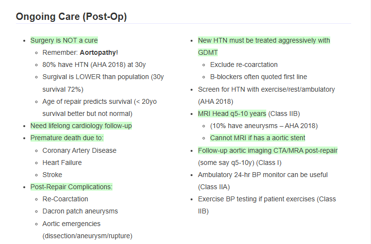
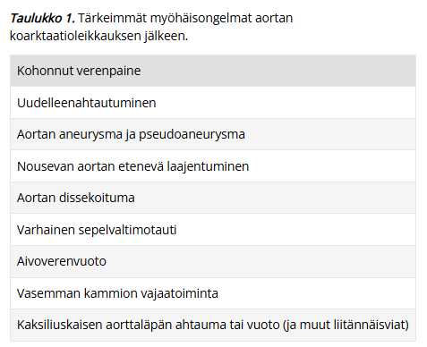

## Akuutit aorttaoireyhtymät (AAS) {#AAS}

Äkilliset aortan sairaudet ovat usein hätätilanteita, joissa ennuste on huono, ellei oikeaan diagnoosiin ja hoitoon päästä ajoissa. 

<li>**Akuutti aorttaoireyhtymä (AAS)** on vakiintunut käsitte, joka käsittää seuraavat tilanteet:</li>
  <ul>
    <li>dissekoituma</li>
    <li>intramuraalihematooma (IMH)</li>
    <li>penetroiva ateroskleroottinen ulkus (PAU)</li>
    <li>traumaattinen aortan seinämän laseraatio (ei tosin aina osa AAS:n tyypillistä määritelmää)</li>
  </ul>

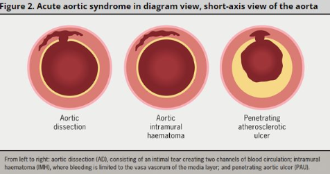
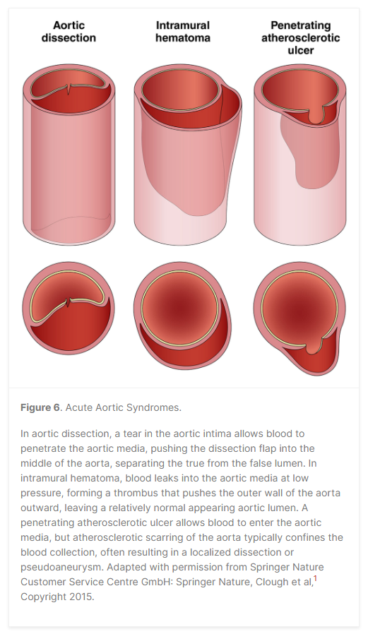

---

Akuutti dissekoituma on yleisin näistä. **Aortan dissekoituma tarkoittaa pitkittäistä intiman repeämää, jossa verta virtaa median läpi repien sitä auki.** Virtaus muodostaa kerroksien erottuessa oikean luumenin ja pseudoluumenin (false lumen), joka tarkoittaa mediakerrokseen muodostunutta veren kulkureittiä. Tämä väärä käytävä voi joko hyytyä umpeen eli trombosoitua (intramuraalihematooma, IMH); IMH voi syntyä myös vasa vasorum -suonien ruptuurasta seinämän sisällä. Penetroiva ateroskleroottinen ulkus (PAU) taas kuvaa tilaa, jossa aortan ateroskleroottinen plakki ulseroituu ja syntyy avoin reitti suonen seinämään -- PAU voi johtaa intramuraaliseen hematoomaan, dissekoitumaan tai jopa aortan repeämiseen (yleensä todetaan laskevan aortan alueella (eniten ateroskleroottista rasitusta siellä)). 

Dissekoituman ilmaantuvuus on 2–10 tapausta/100 000 henkeä/vuosi. Esiintymishuippu nousevan aortan dissekoitumassa on noin 50–60 vuoden iässä ja laskevan aortan dissekoitumassa 60–70-vuotiailla. Kroonisesta dissekoitumasta on kyse, kun dissekoituma on yli kolme kuukautta vanha. Valtaosa potilaista on miehiä, ja dissekaatioriski suurenee iän myötä. **Tavallisin riskitekijä on hypertensio** (vasa vasorumin hyaliininen arterioloskleroosi hypertension aiheuttamana johtaa aortan median atrofiaan ja seinämän heikentymiseen, mikä lisää riskiä aortan dissekoitumiselle ja aneurysmille
; hypertensio myös suoraan altistaa ateroskleroosille). Lisäksi aortan dissekaatiolle altistavia tekijöitä ovat **muut aortan tai aorttaläpän sairaudet,** tupakointi, aikaisempi sydänkirurgia, rintakehän vammat ja suonensisäisten huumeiden käyttö. Perinnölliset aortan sairaudet ovat varsinkin nuorissa ikäryhmissä merkittävä dissekaatiolle altistava tekijä. 

Dissekoituma etenee tyypillisimmin anterogradisesti, mutta joskus myös retrogradisesti. Dissekoituma voi edetä aortan sivuhaaroihin ja huonontaa niiden virtausta. Silloin sydämeen, aivoihin (jopa 20 %:lla potilaista pääasiallinen oire voi olla äkillinen tajunnanmenetys), selkäytimeen, viskeraalielimiin tai alaraajoihin voi tulla kohtalokkaita iskeemisiä pääte-elinkomplikaatioita. Klassinen oire on äkillisesti alkava **repivä rinta-selkäkipu,** joka voi muuttaa paikkaa dissekoituman edetessä. Aortan sivuhaarojen malperfuusio voi aiheuttaa monenmuotoisia oireita kohde-elimestä riippuen, esim. neurologisia oireita ja/tai vatsakipuja. **Oireet voivat joskus olla hyvinkin epätyypillisiä ja moninaisia.** On arvioitu, että jopa 30 %:lla potilaista, joilla myöhemmin todetaan aortan dissekoituma, on aluksi epäilty jotain muuta tautia. **Potilas voi olla hyvinkin oireeton** ja potilaan saattaa vahingossa lähettää päivystyksestä kotiin kuolemaan. Potilaalla voi esim. esiintyä vain ohimenevää kipua tai neurologinen oire, ja statuksessa todetaan pulssipuutos esim. toisessa nivusvaltimossa. Pulssipuutokset ovatkin jokseenkin tyypillisiä, samoin **verenpaine-ero >20 mmHg käsien välillä.** 

---

Aortan dissekoitumilla on kaksi luokittelutapaa: Stanford (A ja B ja non-A-non-B) ja Debayke (I-III) -- **toimivin ja käytetyin kliininen luokittelu on Stanfordin mukainen.**

<li>**Stanford A -tyyppi = dissekoituma affisioi ainakin nousevaa aorttaa** (voi olla myös laskevassa osassa)</li>
  <ul>
    <li>Tyypin A dissekoituman mahdollistama intiman repeämä sijaitsee missä tahansa</li>
    <li>Yleensä repeämä lähtee nousevasta aortasta, mutta tyypin A määritelmä on, että dissekoituma affisioi vähintään aortan nousevaa osaa (voi siis olla lähtöisin vaikka laskevasta aortasta ja kulkea retrogradisesti nousevaan aorttaan)</li>
    <li>Yleisin dissekoituman lähtökohta on ensimmäiset pari senttiä nousevasta aortasta ja näin **tyypin A on yleisin dissekoitumatyyppi**</li>
  </ul>
<li>**Stanford B -tyyppi = dissekoituma affisioi vain laskevaa aorttaa**</li>
  <ul>
    <li>Intiman repeämä sijaitsee a. subclavia sinistrasta distaalisesti. Dissekoituma myös pysyy a. subclavia sinistrasta distaalisesti eikä kulje retrogradisesti kaareen (non-A-non-B) tai nousevaan aorttaan (Stanford A)</li>
  </ul>
<li>**Stanford non-A-non-B -tyyppi = dissekoituma affisioi vähintään aortan kaarta, mutta ei nousevaa aorttaa**</li>
  <ul>
    <li>Intiman repeämä sijaitsee joko distaalisesti vasemmasta solisvaltimosta (veri virtaa retrogradisesti aortan kaareen, mutta ei nousevaan aorttaan) tai truncus brachiocephalicuksen ja vasemman solisvaltimon välissä (veri voi edetä kaarta ja laskevaa aorttaa eteenpäin)</li>
  </ul>

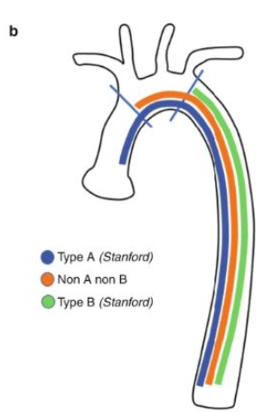

**Tyypin A dissekoitumassa on korkein kuolleisuus,** koska siinä nouseva aortta vaurioituu (nouseva aortta on ehjä tyypin B (ja tyypin non-A-non-B) dissekoitumassa). Nousevan aortan eheys on merkittävää sen vuoksi, että se sijaitsee sydänpussin sisällä, sen tyvestä lähtevät koronaariostiumit ja sen tyveen kiinnittyy aorttaläppä. A-tyypin dissekoituma voi sen vuoksi aiheuttaa sydänpussin tamponaation, aorttaläpän pettämisen, koronaariostiumien ahtautumisen tai kaikki edellä mainitut.

<li>Verta voi kulkea siis perikardiumiin asti ja aiheuttaa tamponaatiota, joka on joidenkin lähteiden mukaan yleisin kuoleman mekanismi dissekoitumassa</li>
<li>Aorttaläpän akuutti vuoto on yleistä tyypin A dissekaatiossa ja sen syntymekanismeja on useita:</li>
  <ul>
    <li>Aortan juuren dilataatio johtaa epätäydelliseen aorttaliuskojen koaptaatioon</li>
    <li>Kuspien prolapsi (asymmetrinen dissekoituma painee kuspeja annuluksen alle)</li>
    <li>Annuluksen tukirakenteiden häiriintyminen ja flail leaflet</li>
    <li>Intimakielekkeen (dissection flap) prolapsi aorttaläpän läpi diastolessa</li>
    <li>Aorttaläppä voi olla jo alkujaan epänormaali (esim. bikuspidi läppä -- on riskitekijä dissekoitumalle ja niiden yhteydessä on muutenkin usein aorttavuotoa)</li>
  </ul>
<li>Koronaariostiumien ahtautuminen voi aiheuttaa sydäniskemiaa, koska sepelvaltimoiden täyttyminen estyy; yleisin obstruktoituva sepelvaltimo on oikea päähaara. Jos sepelvaltimo on täysin tukossa, kliininen ilmenemismuoto voi olla myös ST-nousuinfarkti.</li>

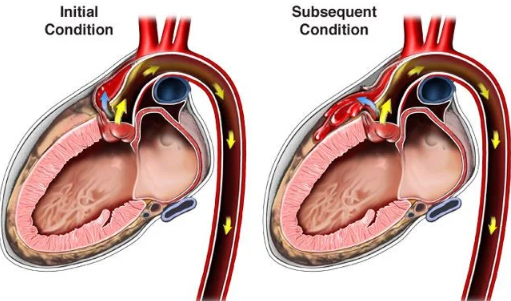

### Dissekoituman diagnostiikka 

Ensisijainen kuvantamismenetelmä aortan dissekoitumaa epäiltäessä on yleensä mahdollisimman nopeasti suoritettava **varjoainetehosteinen TT-kuvaus,** jonka avulla voidaan varmistaa diagnoosi, nähdä koko aortta ja selvittää dissekoituman laajuus ja sivuhaarojen tila varsin tarkasti; sensitiivisyys ja spesifisyys ovat yli 95 %. Usein kuitenkin potilas oireilee ei-niin-selkeällä tavalla ja muitakin tutkimuksia tehdään sitä ennen. 

<li>EKG kuuluu yleensä muutenkin potilaan ensimmäisiin tutkimuksiin. Sydänfilmi on yleensä normaali, noin 20 %:lla potilaista, joilla on tyypin A dissekoituma, on merkkejä sydänlihasiskemiasta. Jos rintakipuisella potilaalla on ensisijaisesti iskemiaan viittaavat EKG-löydökset, mutta oireet tai löydökset herättävät epäilyn aortan dissekoitumasta, aortta kuvannetaan ennen sepelvaltimotoimenpiteitä. Trombolyyttinen hoito on myös tietysti vasta-aiheista, jos epäilee dissekoituman mahdollisuutta iskemialöydösten taustalla.</li>
<li>Thoraxkuva on poikkeava jopa 90 %:lla aortan dissekoitumapotilaista. Välikarsina voi olla laajentunut tai aortan varjo poikkeava, tai kuvasta voidaan todeta keuhkopussinestettä.</li>

---

Itse aortan kuvantamismenetelmistä TT:n lisäksi on käytössä MRI ja UÄ. Magneettikuvauksen käyttöä diagnostiikassa rajoittavat huono saatavuus päivystysaikana ja soveltumattomuus kriittisesti sairaiden potilaiden hoitoon. Se on kuitenkin hyvä kroonisten dissekoitumien diagnostiikassa ja hoidon suunnittelussa sekä aortan sairauksien seurannassa.

UÄ:n käyttö akuuteissa dissekoitumissa on taas yleistä. Rintakehän päältä tehtävä sydämen ultraäänitutkimus (TTE) voidaan tehdä heti päivystyspoliklinikalla huonokuntoiselle, rintakipuiselle potilaalle. Dissekoitumassa nähdään laajentunut, poikkeava aortan tyvi, aorttaläpän mahdollinen vuoto ja sydänpussin nestekertymä luotettavasti. Jos näkyvyys nousevaan aorttaan on hyvä ja tekijä on kokenut, oikea ja väärä luumen sekä sisäkerroksen repeämä voidaan löytää kohtuullisen hyvin. Nousevan aortan osalta menetelmän sensitiivisyys on 77–80 % ja spesifisyys noin 95 %. Ruokatorven kautta tehtävä sydämen ultraäänitutkimus (TEE) on parempi tutkimus, ja sillä saavutetaan kaikissa aortan dissekoitumissa keskimäärin 89–99 %:n sensitiivisyys ja 89 %:n spesifisyys, vaikkakin nousevan aortan yläosa jää usein katveeseen. Seinämänsisäinen verenpurkauma, haavauma ja vamma voidaan useimmiten nähdä varsin hyvin. Joissakin sairaaloissa on suoraan leikkaussaliolosuhteissa tehtävä TEE-tutkimus onkin ensisijainen tutkimus kriittisesti sairaille potilaille aortan dissekoitumaa epäiltäessä. TEE:n tärkein käyttöaihe on kuitenkin toimenpiteiden ohjaaminen leikkaussalissa. 

**TTE ei voi siis poissulkea dissekoitumaa,** mutta rule-in-tutkimuksena se on hyvä diagnoosin nopeassa saamisessa sekä myös auttaa epäselvien dissekoitumien kiinni nappaamisessa (varsinkin A-tyypin; B-tyypissä sensitiivisyys on matalampi). Jos TTE-tutkimuksella saa definitiivisen A-tyypin dissekoituman diagnoosin, niin on mahdollista sairaalan toimintatavoista riippuen siirtää potilas suoraan leikkaussaliin ilman CT-tutkimusta, kunhan vain intraoperatiivinen TEE saadaan järjestettyä.  

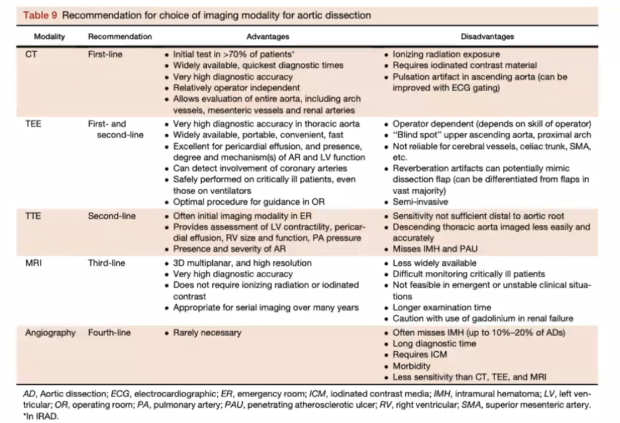
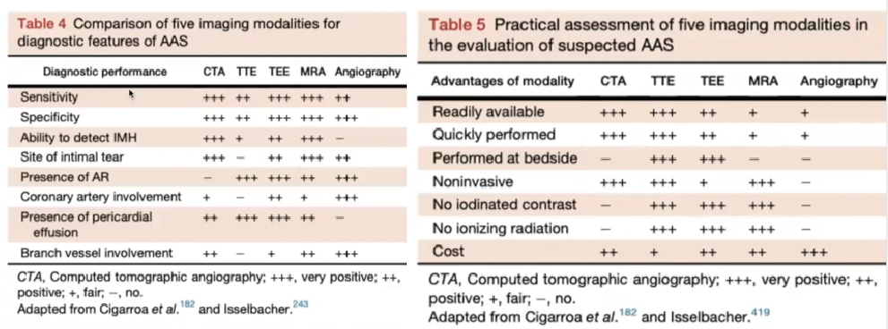
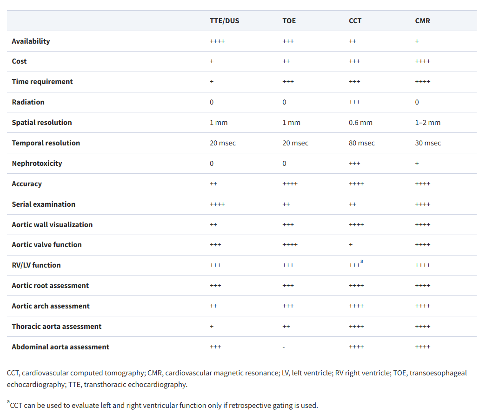

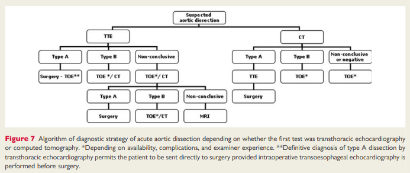

### Echo-arvio 

Klassisen aortan dissekoituman diagnoosi yleensä perustuu siihen, että voidaan osoittaa **intimakieleke (dissection flap, intimal flap), joka jakaa aortan oikeaan luumeniin ja pseudoluumeniin.** Tämä voidaan osoittaa niin CT:llä, MRI:llä kuin UÄ:lläkin. Tämä opas keskittyy nyt ultraäänilöydöksiin ja spesifimmin transtorakaalisen UÄ:n käyttöön. 

TTE mahdollistaa erityisesti aortan proksimaalisten osien tarkastelun -- varsinkin aortan tyvi visualisoituu yleensä hyvin. Myös proksimaalinen nouseva aortta, aortan kaari ja proksimaalinen laskeva aortta sekä myös vatsa-aorttakin ovat usein nähtävissä aika hyvin. 

Aortan tyvi ja proksimaalinen nouseva aortta visualisoituvat parhaiten yleensä PLAX-projektiossa. Alla olevissa videoissa ja kuvissa voidaan nähdä esimerkkejä dissekoitumista. 

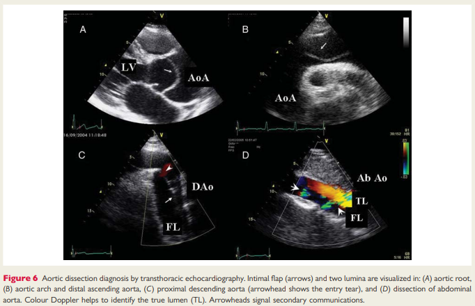

---

Nuoli osoittaa intimakielekkeen.

---

---

Seuraavat kolme videota samalta potilaalta, jolla vatsakipua ja sekavuutta. Ensimmäisessä näkyy intimakieleke proksimaalisessa aortassa PLAX:ssa ja toisessa supresternaalisti. Kolmannessa näkyy flap vatsa-aortassa asti. Kyseessä oli pitkä aortan A-tyypin dissekoituma.

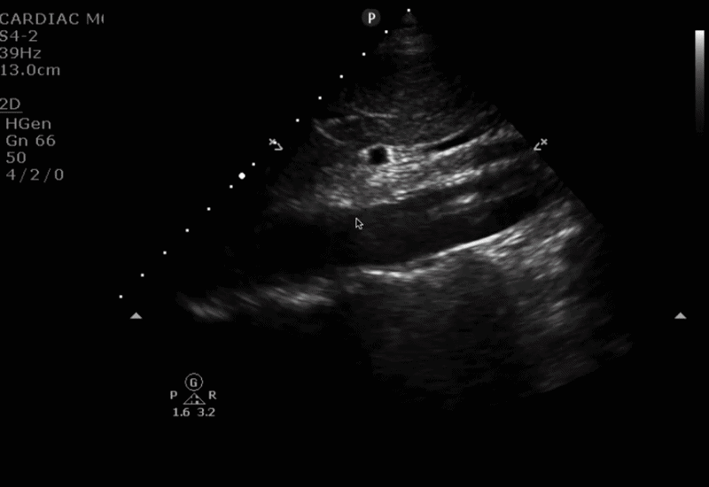

---

Tässä PLAX-projektiossa nähdään tyypin A dissekoituma, jossa intimaan virrannut veri on trombotisoitunut. 

---

Tyypin B dissekoitumat ovat vaikeampia havaita, mutta suprasternaalisesti voidaan usein nähdä varsinkin doppleria hyödyntämällä false ja true lumen -- true luumenin virtaus on selkeämpää. Tässä alla esimerkki.

---

Tässä vielä koostettuna echo-löydökset dissekoitumassa. 

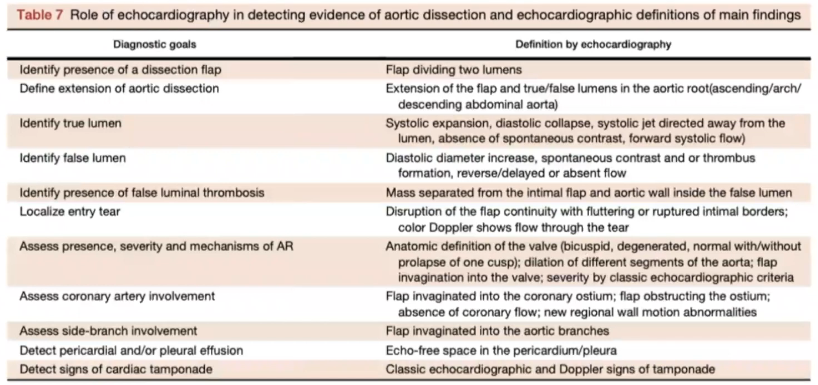
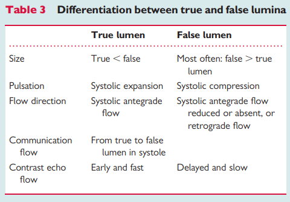

### Dissekoituma vs artefakta 

Kaikki "ekstralinjat" aortassa eivät ole dissekoituma. Joskus intimakielekkeen kaltainen linja voi olla ihan vain artefaktaa eikä kuvasta mitään "oikeaa" rakennetta. Yleinen artefakta on ns. **simple reverberation artifact,** joka johtuu siitä, että aortan anteriorisesta seinämästä heijastuva ultraääniaalto heijastuu paluumatkallaan taas anterioriseen seinämään ja näin aalto tekee käytännössä kahden reissun pituisen matkan. Anturi luulee, että toisen kerran seinämästä heijastuva palaava aalto on tehnyt vain yhden reissun ja arvioi paluuajasta, että tuleva aalto tuli oikeaa rakennetta syvemmältä. Tämän takia nähdään artefakta aortan sisällä n. 2 kertaa syvemmällä kuin anteriorinen seinämä. 

Erityisen hyvä työkalu erottamaan tämä artefakta oikeasta intimakielekkeestä on väridoppleri, jolla nähdään normaalit homogeeniset virtaukset eikä "rakenne" häiritse virtauksia.

