# Vasen eteinen

Vasen eteinen (LA) on merkittävän altis monenlaisille akuuteille ja kroonisille stressitekijöille, sillä muutokset niin esikuormassa kuin jälkikuormassa johtavat herkästi eteisen remodelaatioon. Vasemman eteisen arvioiminen onkin tärkeää monissa sydänperäisissä ja myös ei-sydänperäisissä sairauksissa. 

LA on anatomialtaan kompleksi (esim. vino eteisväliseinä, neljä keuhkolaskimoa posteriorisessa seinämässä sekä pitkä ja kapea vasen eteiskorvake (LAA)), mikä tekee sen ekokardiografisesta arvioimisesta haastavaa. Yleensä **arvion tärkein osa on vasemman eteisen koko** (läpimitta ja usein myös tilavuus), mutta uudet kuvantamismenetelmät (esim. strain) ovat mahdollistaneet LA:n funktionkin mittaamisen. Käsitellään tässä kappaleessa pääasiassa vasemman eteisen ulottuvuuksien mittaamista. Periaatteessa diastoliikan mitat (transmitraalivirtaukset ja annuluksen kudosnopeudet) myös kuvastavat vasemman eteisen toimintaa, mutta ne käsitellään omassa kappaleessaan.

## LA:n läpimitta {#LA-lapimitta}

Yleisin mitta, joka otetaan vasemmasta eteisestä on sen **läpimitta,** joka mitataan ensisijaisesti PLAX-projektiosta (on myös kiva tietää, että TEE ei ole hyvä kuvantamiskeino LA:n suhteen, koska koko LA ei mahdu sektoriin TEE:ssä). LA mitataan **loppusystolessa eli silloin, kun eteinen on suurimmillaan.** Ei siis tarvitse liikaa miettiä, missä osassa sydämen sykliä ollaan, vaan voi vain kelata pysäytettyä kuvaa ja etsiä hetken, jolloin eteisen läpimitta on leveimmillään.

**Mittaus kannattaa suorittaa suoraan B-kuvasta (2D-kuvasta).** Jotkut ovat vanhastaan oppineet käyttämään M-moodia tähänkin (samoin kuten aortan tyveen), mutta nykyään suositellaan suoraan pysäytetystä kuvasta tehtäviä mittauksia, koska ne mahdollistavat paremmin oikean mittauskulman. 

Mittaukset tehdään aortan takaseinämän sinus valsalvan keskiosasta eteisen takaseinämään. M-moodilla mittaukset on historiallisesti tehty leading-edge-to-leading-edge, mutta suurimmassa osassa lähteitä 2D-kuvassa kursori asetetaan inner-edge-to-inner-edge. Tärkeintä on se, että **mittauslinja on kohtisuorassa LA:n pitkittäisakseliin nähden.** 

Mittauksen voi suorittaa yksinkertaisesti UKG-laitteen Caliper-painikkeella, koska yleensä läpimitasta ei tehdä mitään jatkolaskelmia -> koneen ei tarvitse tietää, mitä mitattiin. 

Vasemman eteisen koko riippuu tutkittavan koosta. Nyrkkisääntönä voi kuitenkin painaa mieleensä, että poikkimitan **karkea viiteyläraja on 4 cm.** Lisää viiterajoista ja eteisen laajentumasta kohta.

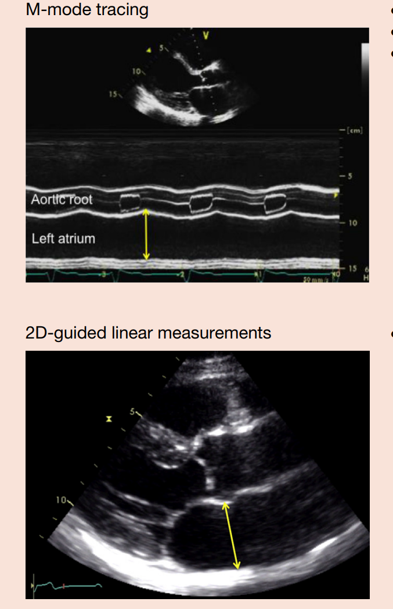
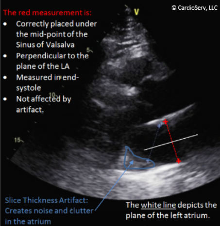

## LA:n tilavuus ja LAVi

LA:n läpimitta antaa monimutkaisesta vasemmasta eteisestä vain yhden kaksiulotteisen mitan eikä siten kuvasta vasemman eteisen kokoa kovinkaan hyvin. Nykysuosituksissa AP-lineaariulottuvuutta ei tulisikaan käyttää LA:n koon ainoana mittarina, vaan nykyisin **paras 2D-echolla kerättävä arvio saadaan LA:n tilavuusmittauksilla.** LA:n laajeneminen ei tietystikään tapahdu yleensä symmetrisesti kaikkiin suuntiin, mutta AP-läpimitasta arvioitu LA:n koko olettaa, että laajeneminen olisi symmetristä. Periaatteessa nykysuositusten mukaan LA:n läpimittaa ei edes tarvitsisi mitata, mutta koska läpimitta on paljon nopeampaa mitata ja monet kliinikot ovat tottuneet sen arvoihin, niin todellisuudessa sekä PLAX:n läpimitta että LA:n tilavuus kannattaa mitata.  

Eteisen tilavuus lasketaan nykysuositusten mukaan ns. **"biplane disk summation"-tekniikalla (Simpsonin metodi),** koska sitä pidetään tarkimpana metodina eikä se tee geometrisia oletuksia LA:n muodosta. Täten se mahdollistaa tarkemman tilavuusarvion, vaikka vasen eteinen olisikin remodeloitunut asymmetrisesti. 

Biplane disk summation-tekniikassa vasemman eteisen tilavuus (LAV) lasketaan niin, että **vasemman eteisen pinta-ala ja pitkittäisakselin pituus piirretään vuorotellen A4C- ja A2C-projektioissa loppusystolessa (eli silloin, kun LA on suurimmillaan).** 

<li>Trace kannattaa aloittaa mitraaliläpän annulustasolta ja piirtää endokardiumin rajaa seuraten toiselle annulukselle asti</li>
<li>Vasemman eteisen pitkittäisakselin pituuden tulisi olla kohtisuorassa annulustasoon (aina ei saa ihan kohtisuoraksi); oikea mittauslinja on annulustason keskikohdasta superiorisen seinämän keskitasoon</li>
<li>Älä ota mukaan lisärakenteita, kuten eteiskorvaketta tai keuhkolaskimoita tai pulmonaalitrunkkia</li>
<li>Vältä vasemman eteisen lyhentymistä (foreshortening)</li>
  <ul>
    <li>Ei tarvitse keskittyä LV:n tasoon vaan tulisi yrittää avata vasen eteinen sen maksimaaliseen kokoon niin A4C:ssa kuin A2C:ssa</li>
    <li>Tulisi myös pyrkiä pitämään suunnilleen sama leikkaustaso projektioiden välillä vaihtaessa -- LA:n pituuden ei tulisi muuttua yli 5mm A4C:n ja A2C:n välillä</li>
  </ul>
<li>Kaikissa UÄ-koneissa ei ole mahdollisuutta eteisen tilavuuden biplane disk summation -laskelmille, mutta jos on, niin tulisi tarkistaa, että koneen default on biplane disk summation (Simpsonin metodi) eikä area-length -metodi. Lisäksi joissain koneissa on mahdollisuus syöttää potilaan pituus ja paino, jotta se voi laskea potilaan kokoon suhteutetun tilavuusindeksin eli LAVi:n (Left Atrial Volume index); LAVi = LAV/BSA. BSA tarkoittaa Body Surface Area:a.</li>
  <ul>
    <li>Yleensä lausunnoissa ilmoitetaan vain indeksöity arvo; itse tilavuudella ei ole merkitystä, jos ei ole huomioitu potilaan kokoa.</li>
    <li>**LAVi > 34 mL/m2 on epänormaali**</li>
    <li>Kannattaa tosin huomata, että merkittävän obeeseilla potilailla LAVi voi olla pseudonormaali, jolloin usein suositellaan indeksoimista pituuden neliöön verrattuna.</li>
  </ul>

---

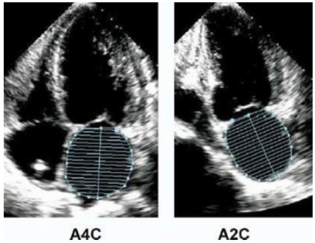
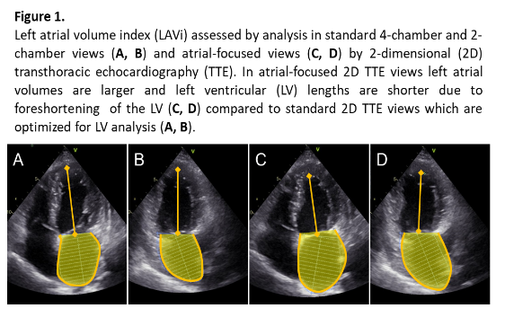
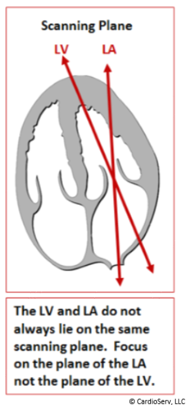
---

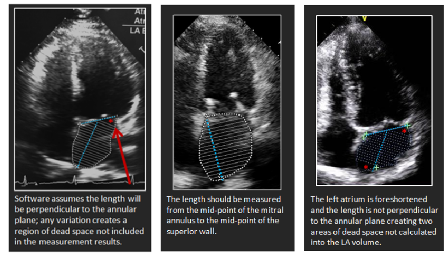
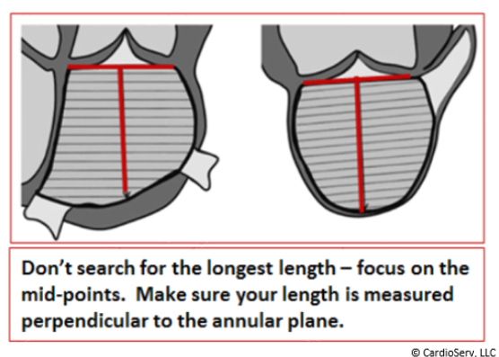

---

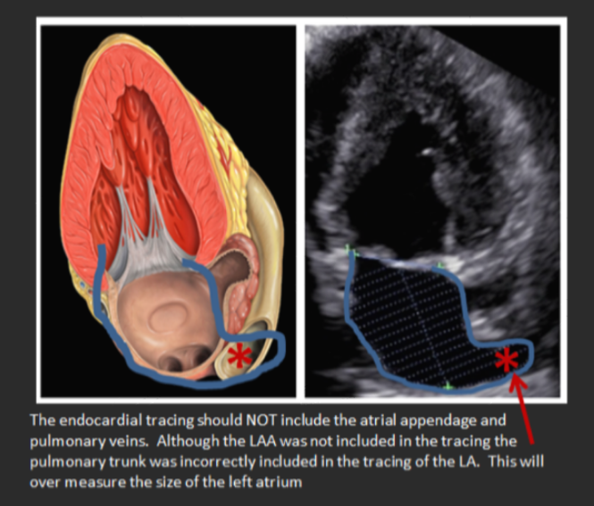
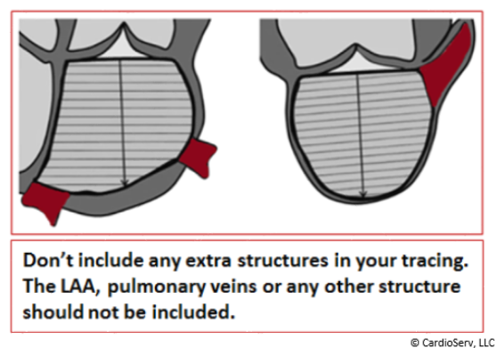

---

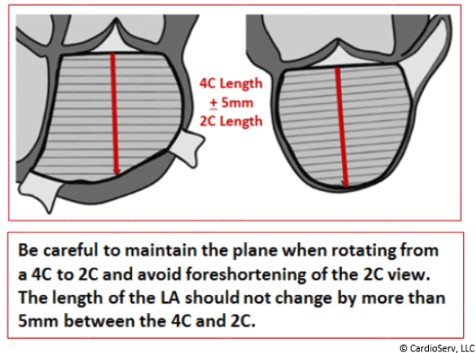

## Viitearvot koottuna

Kuten aikaisemmin mainittiin, niin PLAX-projektiosta mitatulla AP-läpimitalla voidaan saada nopea käsitys vasemman eteisen koosta, mutta sen rajoitteet tulee pitää mielessä -- vasen eteinen saattaa olla suurentunut sellaiseen suuntaan, ettei standardipaikasta suoritettu poikkimittaus tunnista lokeron suurentumaa.

<li>**Nyrkkisääntönä voi pitää, että LA:n läpimitta yli 40mm on epänormaali.** Naisilla raja voisi olla 38, mutta helpompaa on vain muistaa kaikille raja 40.</li>
  <ul>
    <li>Läpimitankin voi indeksöidä potilaan BSA:han, jolloin epänormaalin raja on >2.3cm/m2</li>
  </ul>
  
---

Kun indeksöidään BSA:n mukaan, niin sukupuolella ei pääasiassa ole väliä tilavuuden (tai läpimitankaan) dilatoitumisen arvioimisessa. Sukupuolella kyllä on myös itsenäinen vaikutus normaaleihin lokerokokoihin, mutta BSA:n mukaan arvioiminen ottaa suurimman osan tästä vaikutuksesta huomioon, minkä takia naisilla ja miehillä on samat viitearvot indeksöidyissä arvoissa. 

<li>**Nykyään LAVi > 34 mL/m2 on epänormaali** (joissain lähteissä on vielä >28 ml/m2, joka on vanha raja). Hyvin poikkeavasta koosta puhutaan, kun LAVi >48 ml/m2.</li>

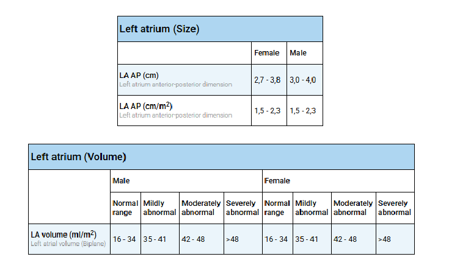

## LA:n laajeneminen ("sydämen pitkä sokeri")

**Vasen eteinen voi laajentua käytännössä mistä tahansa sydämen vasenta puolta rasittavasta stressitekijästä,** kuten kroonisesta paineesta tai volyymiylimäärästä. Tärkeimpiä esimerkkejä aiheuttajista ovat mm. krooninen hypertensio, mitraalistenoosi/-vuoto, vasemman kammion dysfunktio (esim. diastolinen vajaatoiminta, mutta kyllä systolinenkin vajaatoiminta, kun kammio ei tyhjene kunnolla ja veri patoutuu taaksepäin), aorttastenoosi/-vuoto ja eteisvärinä. 

<li>**Krooninen hypertensio** usein aiheuttaa vasemman kammion paksuuntumista ja jäykistymistä, jolloin vasemman eteisen on käytettävä paljon enemmän voimaa työntääkseen veren kammioon. Tämä jatkuva vastapaine venyttää eteistä vähitellen.</li>
<li>**Mitraalistenoosissa** veri ei pääse virtaamaan vapaasti kammioon, joten paine eteisessä nousee rajusti ja se laajenee suuren vastuksen vuoksi. **Mitraalivuodossa** taas systolessa osa verestä pääseekin karkaamaan takaisin vasempaan eteiseen. Eteinen saa siis samanaikaisesti verta sekä keuhkoista että takaisinvirtauksena kammiosta -> tämä aiheuttaa valtavan tilavuusylikuormituksen, joka venyttää eteisen seinämiä.</li>
  <ul>
    <li>Mitraalivuoto usein johtuu vasemman eteisen dilataatiosta (annulusdilataatio -> Carpentier I-mekanismin vuoto; kts. Mitraalivuoto-kappale) ja samalla se myös pahentaa siten itse itseään, kun vuoto pahentaa laajentumista entisestään.</li>
  </ul>
<li>Jäykkä ja heikosti relaksoituva LV **(diastolinen vajaatoiminta)** käytännössä mistä tahansa syystä tietysti johtaa vasemman eteisen dilataatioon, kuten jo käytiin yllä läpi. Sama kuitenkin pätee myös **systoliseen vajaatoimintaan,** jossa kammio ei tyhjene kunnolla ja veri patoutuu taaksepäin.** </li>
<li>**Aorttastenoosi** johtaa LV:n voimakkaaseen paksuntumiseen ja jäykkentymiseen (kuten hypertensiossa). **Aorttavuodossa** aortasta vuotaa verta takaisin kammioon sen lepovaiheen aikana -> vasen kammio venyy ja ylikuormittuu verimäärästä -> kun kammio on jo valmiiksi täynnä aortasta vuotanutta verta, vasemman eteisen on entistä vaikeampi tyhjentää omaa verikuormaansa sinne. Paine patoutuu eteiseen, ja se laajenee.</li>
<li>**Eteisvärinässä** eteisen seinämät eivät supistu synkronoidusti, vaan ne vain värisevät tehottomasti (jopa 300–600 kertaa minuutissa). Koska normaali supistustoiminta puuttuu, veri jää osittain seisomaan eteiseen, mikä nostaa painetta. Lisäksi jatkuva sähköinen kaaos aiheuttaa eteislihaksessa mikroskooppisia muutoksia ja arpikudoksen muodostumista. Tämä remodellaatio heikentää eteisen seinämän joustavuutta ja saa sen laajenemaan.</li>

---

Koska niin monet yleiset kardiovaskulaariset ongelmat voivat johtaa vasemman eteisen dilataatioon niiden ollessa kroonisia, **on vasen eteinen sydämelle hieman vastaava biomarkkeri kuin HbA1c eli “pitkä sokeri” diabeteksen diagnostiikassa.** Pelkästään vasemman eteisen kokoa vilkaisemalla voi siis saada nopeasti käsityksen sydämen vasemman puolen tilasta.

### Afib 

Eteisvärinän suhde vasemman eteisen dilataatioon on erityinen, sillä se toimii molempiin suuntiin ("flimmeri tekee flimmeriä" -ilmiö). Yllä mainitut tilat (kuten verenpaine tai läppäviat) laajentavat usein eteistä ensin, mikä laukaisee eteisvärinän – ja eteisvärinä puolestaan laajentaa eteistä entisestään. 

Eteisvärinäpotilaan UÄ-tutkimuksessa kannattaakin usein asettaa normaalia suurempaa huomiota vasemman eteisen kokoon, koska se on yksi asioista, joka vaikuttaa siihen, että päätetäänkö hoitolinjaksi rytminhallinta ja sykkeenhallinta välillä. 

---

Mitä enemmän muutoksia eteisvärinä on ehtinyt tuottaa myokardiumiin, sitä haastavampaa hoito ja sinusrytmin palauttaminen on. Eteisvärinän mekaaniset muutokset johtavat noidankehämäisesti lisääntyneeseen alttiuteen eteisvärinälle. Rakenteen muutokset heikentävät eteisten supistumisvireyttä, joten sydämen toimintaan voi jäädä pysyvää haittaa rytminsiirron jälkeenkin. Siten on loogista, että mitä pidempään eteisvärinä jatkuu, sitä enemmän muutoksia se saa myokardiumissa aikaan, ja sitä pidempään kestää eteisvärinästä toipuminen eli alkuperäisen eteisten supistumisvireyden palautuminen rytminsiirron jälkeen. Siten myös rytmi palaa herkästi eteisvärinään, jos sinusrytmistä poikkeavaan rytmiin sopivia muutoksia on jo ehtinyt tapahtua runsaasti. Käytännössä voidaan siis sanoa, että **kardioversio pettää tai eteisvärinä palaa sitä suuremmalla todennäköisyydellä mitä enemmän eteinen on laajentunut.**

<li>Joissain tutkimuksissa ([esim.](https://anatoljcardiol.com/storage/upload/pdfs/AnatolJCardiol_13_1_18_25.pdf) ja [esim.](https://pmc.ncbi.nlm.nih.gov/articles/PMC10902144/#:~:text=Increase%20in%20left%20atrial%20volume,AF%20post%20DCCV%20by%206%20%25.)) on todettu, että **LAVi:n ollessa >36-40 ml/m2 aletaan huomaamaan, että sähköinen kardioversio epäonnistuu tai eteisvärinä palaa nopeasti huomattavasti useammin kuin pienemmissä eteisissä.** Jokainen 1 yksikön nousussa LAVi:ssa nostaa eteisvärinän uusiutumisen riskiä 6-12%:lla ja LA:n ollessa laajentunut merkittävästi tulee keskustella potilaan kanssa tarkasti hoitolinjoista ja niiden järkevyydestä. </li>
<li>**LA:n läpimitan suhteen usein käytetään epäonnistumisriskiä huomattavasti nostavana rajana >50mm** (tosin myös >42.5mm jo nostaa riskiä ja jokainen 1mm nousu nostaa eteisvärinän uusiutumisen riskiä n. 7%). </li>

---

Epäonnistumisen ja uusiutumisen riskiin sekä hoitolinjan valintaan vaikuttavat myös monet muut asiat. Eteisvärinän hoito valitaan yksilöllisesti huomioiden eteisvärinän aiheuttamat oireet (EHRA-luokitus), muut sairaudet, rytmihäiriön kesto ja hoidon odotettavissa olevat hyödyt ja haitat sekä potilaan toiveet. 

Ensimmäisen oireisen eteisvärinäkohtauksen ilmaannuttua sinusrytmin palauttamista kannattaa useimmiten yrittää. Toisaalta useiden satunnaistettujen tutkimusten mukaan oireettomilla tai lieväoireisilla (EHRA 1–2) iäkkäillä potilailla ennuste on yhtä hyvä ja elämänlaatu keskimäärin samanveroinen kammiovasteen hidastamiseen tähtäävän sykkeenhallinnan ja sinusrytmin säilyttämiseen toistuvien rytminsiirtojen ja rytmihäiriölääkityksen avulla tähtäävän rytminhallinnan aikana. Näissä tapauksissa rytminsiirrosta voidaan perustellusti luopua ja keskittyä antikoagulaatiohoitoon ja sykkeenhallintaan, varsinkin jos rytmihäiriö on uusiutunut pian aiemman rytminsiirron jälkeen. 

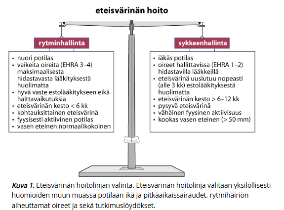

