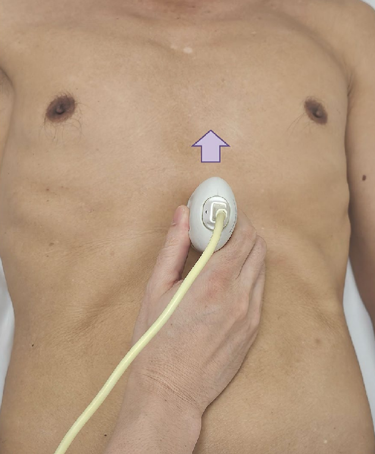
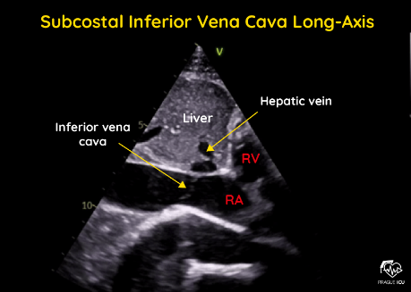
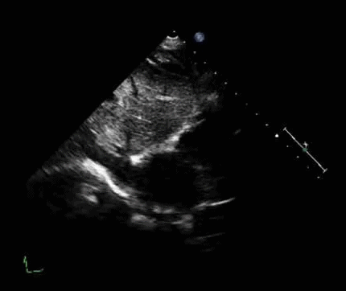
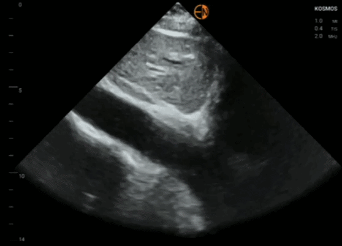
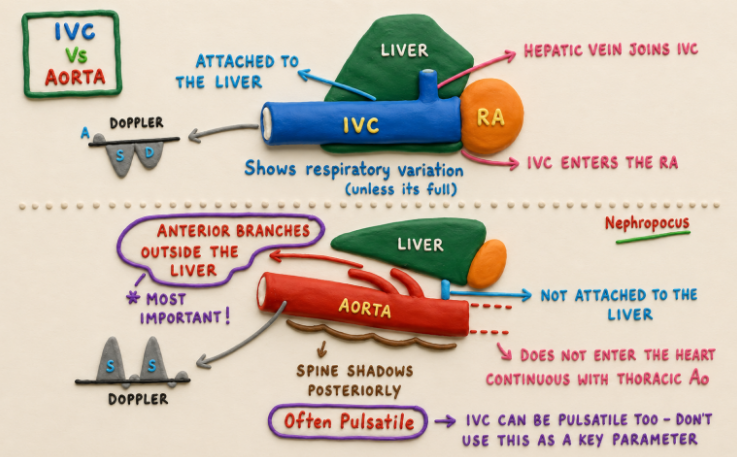
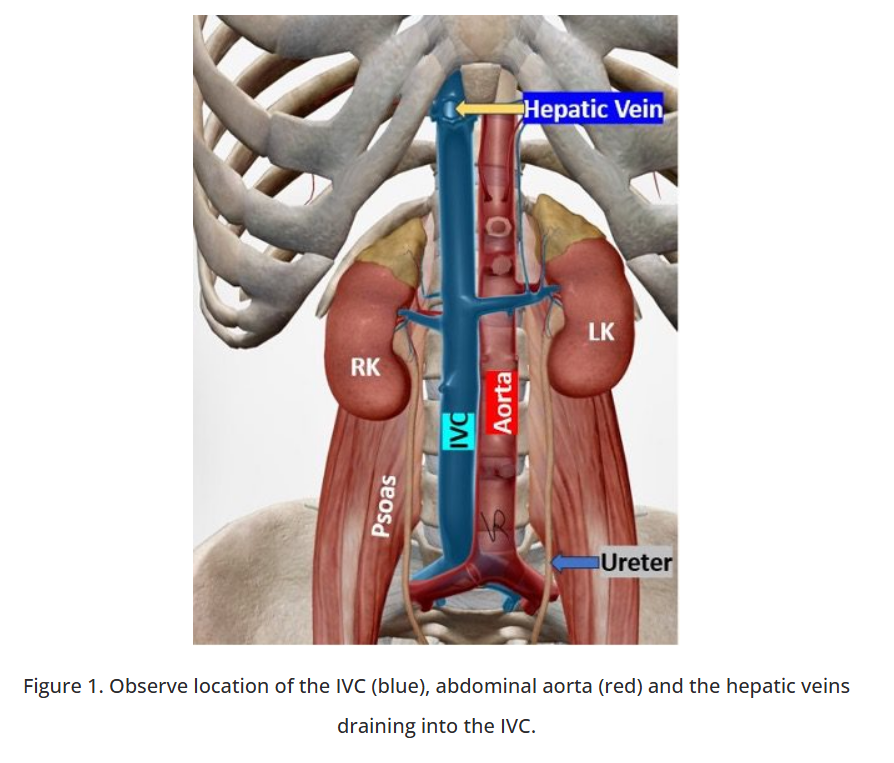
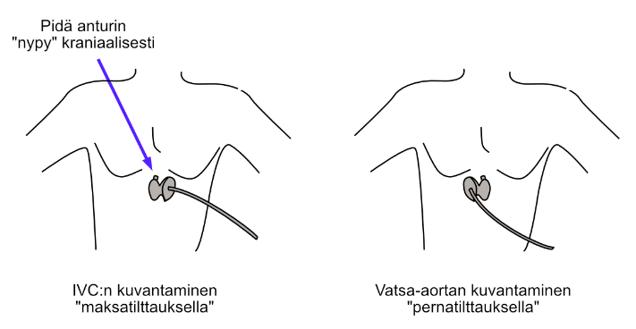
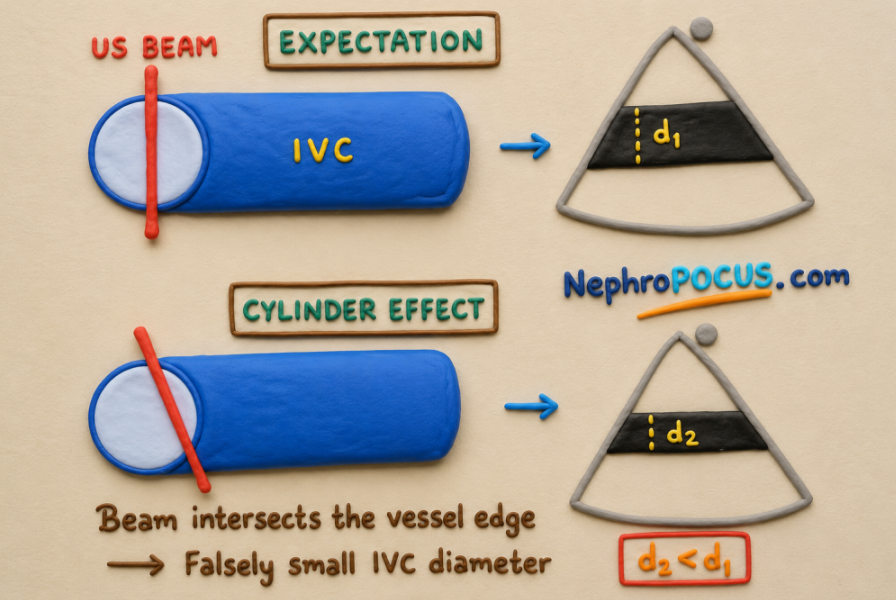
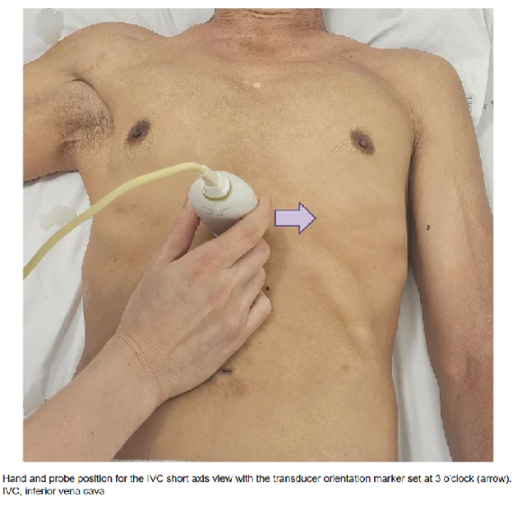
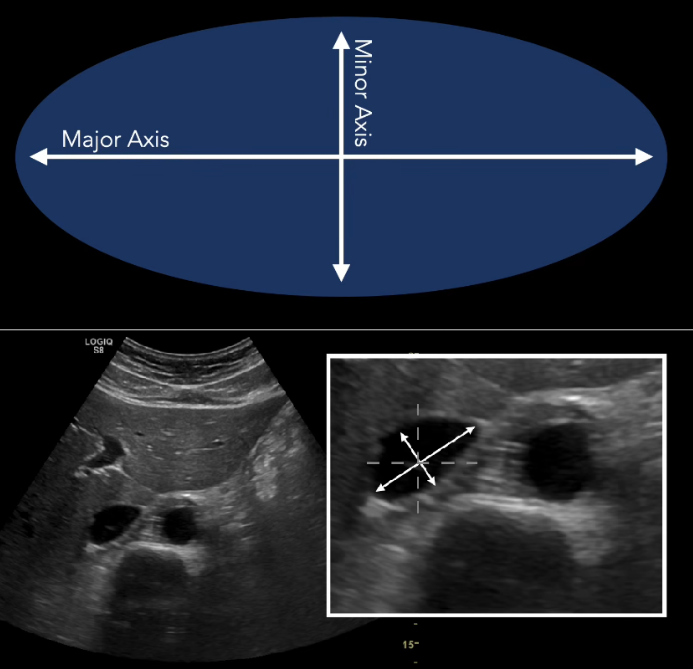

# Alaonttolaskimo (IVC, Inferior Vena Cava)

**Alaonttolaskimon UÄ-mittauksia käytetään runsaasti erityisesti oikean eteisen paineiden (RAP) ja nestevolyymistatuksen arvioimisessa.** IVC on (yleensä) aika helppoa löytää ja sen tutkiminen antaa paljon tärkeää informaatiota potilaasta, jonka takia sen mittaukset ja niiden tulkitseminen on järkevää opetella. 

## Subkostaalinen projektio

IVC kulkee maksasta posteriorisesti maksan depressiossa nimeltään fossa for the inferior vena cava (useasti IVC on oikein "intrahepaattinen", kun posteriorisestikin sitä ympäröi maksakudosta ja fossa onkin kunnon kanava) ja siihen yhdistyy maksalaskimoita ennen sen kulkua pallean läpi. 

IVC:n tutkiminen tehdään ensisijaisesti **IVC-subkostaaliprojektiosta.** Potilas siis makaa suoraan selällään ja anturi asetetaan rintalastan miekkalisäkkeen alapuolelle niin, että nypy osoittaa potilaan päähän päin. Näin saadaan IVC:sta pitkittäisakselileikkaus. 

### IVC:n erottaminen vatsa-aortasta

**Yleinen "rookie mistake" IVC:n mittauksissa on sen sekoittaminen vatsa-aorttaan.** IVC ja vatsa-aortta siis kulkevat vierekkäin vatsaontelossa -- IVC oikealla ja vatsa-aortta vasemmalla puolella. UÄ-aallot voivat helposti subkostaaliprojektiossa ensin leikata vatsa-aortan, jolloin on osattava tunnistaa, että nyt ei visualisoida IVC:tä ja tehdä tarvittavat peliliikkeet. Joskus kokeneillakin ultraajilla voi kylläkin tapahtua tunnistamisvirhe, jos kuvanlaatu on heikko.  

Vatsa-aortan ja IVC:n voi yleensä erottaa toisistaan suonen ulkonäköä, liikehdintää ja suhdetta muihin viereisiin rakenteisiin tarkastelemalla. 

<li>Vatsa-aortta on usein varsinkin ikääntyneemmillä potilailla kalkkeutunut ja sen seinämät näkyvät vaaleampina ja paksumpina UÄ:ssä kuin IVC:n</li>
<li>Liikehdintä voi olla hyvä tukipiirre: aortta tietysti sykkii systolen ja diastolen mukaan. IVC taas usein tekee hienovaraisempaa liikettä ja tekeekin enemmän lörpähtelevää lkiikettä hengityksen myötä</li>
  <ul>
    <li>Myös IVC voi kuitenkin olla usein pulsatiili, varsinkin erilaisissa stressitiloissa (esim. sepsis, nestevaje, kirroosi) ja trikuspidaalivuodossa. Tämän takia pulsatiliteettia ei tulisi käyttää ainoana parametrina IVC:n ja vatsa-aortan erottamisessa.</li>
  </ul>
<li>Ehkä tärkein metodi suonten erottamisessa on niiden sijainnin tutkiminen. IVC sijaitsee maksan "sisällä", kun taas vatsa-aortta kulkee maksan vierestä (=maksan ja aortan välissä on jonkin verran tilaa). Pienellä keinutusliikkeellä -- niin, että UÄ-aallot lähtevät enemmän päähän päin -- voi saada myös oikean eteisen visualisoitua ja nähdä sen junktion IVC:n kanssa. Tällöin voi olla varma, että tarkasteltu suoni on IVC. Samoin voi myös usein nähdä maksalaskimon, joka laskee IVC:hen. Vatsa-aortan tapauksessa voi nähdä sen anteriorisia haaroja maksan ulkopuolella -- näitä ei tule sekoittaa maksalaskimoiksi.</li>

Tässä alla on poikkileikkausprojektio, jossa näkyy erityisen hyvin tilanne, jossa IVC on pulsatiili.

---

Kun on tunnistanut, kumpaa suonta katsoo, niin voi anturin asentoa muokaten visualisoida haluamansa suonen.  

<li>IVC on vatsa-aortan oikealla puolella -> voi helposti muistaa, että **tilttaamalla anturia enemmän maksaan (eli oikealle) päin, saa alaonttolaskimoa enemmän esiin.** Vatsa-aortta taas tulee esiin tilttaamalla enemmän vasemmalle (eli pernaan päin).</li>

## 2D-kuvamittaus

Tärkeimmät alaonttolaskimosta otettavat mittaukset ovat sen **paksuus ja hengitysvaihtelu.** Nykysuositusten mukaan **kannattaa mitata alaonttolaskimo 2D-kuvasta** eikä M-moodista, jolla ei yleensä saa aivan kohtisuoraa leikettä IVC:stä. 

Keskuslaskimopaineen ja nestemäärän laskimostossa lisääntyessä IVC paksunee. Sen lisäksi arvioidaan IVC:n herkkyyttä kollapsoinnille sisäänhengityksen myötä. Sisäänhengitys siis laskee intratorakaalista painetta ja kannustaa alaonttolaskimon veren tyhjenemistä oikeaan eteiseen, jolloin IVC menee normaalisti hieman kasaan (kollapsoituu). 

Aluksi tulee siis hakea hyvä pitkittäisprojektio IVC:stä. **Oikea mittauspaikka on n. 1-2cm "jalkoihin päin" maksalaskimon junktiosta.** IVC:tä tulee kuvata sekä ekspiriumin ja inspiriumin aikana, jonka jälkeen pysäytetään kuva. Erikseen ei tarvitse pohtia kumpi hengityksen vaihe olikaan menossa: **tulee yksinkertaisesti mitata IVC samasta kohtaa laajimmillaan ja kapeimmillaan.**

<li>Virallisesti IVC:n kollapsoituminen tulisi arvoida ns. **"sniff-testillä",** jossa potilas ottaa voimakkaan, terävän ja nopean sisäänhengityksen nenän kautta. Testi pakottaa laskimon painumaan hetkellisesti kasaan niin paljon kuin mahdollista ja toimii standardoivana metodina kollapsoitumisen aiheuttamiselle.</li>
<li>Testi on hyvä, jos potilas ymmärtää mitä hänen pitää tehdä. Suuri osa varsinkin vanhuspotilaista ainakin päivystyksessä tai osastolla ovat kuitenkin deliriumissa/muuten huonosti ko-operoivia, jonka takia sniffaus ei aina onnistu. Tällöin tulee nojata pääasiassa vain normaalin sisäänhengityksen aikaisen kollapsoitumisen arvioon.</li>

## Tulkinta

21

## Toiset ikkunat 

Standardi subkostaalinen IVC:n pitkittäisakseli -projektio ei ole ainoa projektio, jota voi tai edes kannattaa käyttää IVC:n arvioimisessa. IVC ei yleensä ole täydellinen ympyrä ja sen mittaaminen vain yhdestä kuvakulmasta altistaa virheille.  

Toinen yleisistä ongelmista pelkän pitkittäisakselin kanssa on ns. cylinder effect, jossa UÄ-aallot eivät kulje IVC:n keskikohdan kautta -> läpimitta jää todellista pienemmäksi. 

### Subkostaalinen poikittaisakseli

Tyypillisen pitkittäisakselin lisäksi kannattaa oppia tarkistamaan myös **poikittaisakseli, joka saadaan rotatoimalla anturia 90 astetta subkostaalisesta pitkittäisakselista.** Tämän projektion etu on sylinterivaikutuksen minimointi. Poikittaisakseliprojektiossa IVC näkyy näytön vasemmalla puolella maksan ympäröimänä. Sen vieressä ja anteriorisesti nikamavarjosta näkyy aortta, joka voi tosin olla suolikaasujen hämärtämä.

Poikittaisakselissa voidaan myös paremmin arvostaa IVC:n elliptoidia -- joskus jopa kolmiomaista -- muotoa. **IVC:stä voidaan erottaa minor (short diameter) ja major (long diameter) axis** sen mukaan, kumpi leveydestä/korkeudesta on suurempi. Näistä voidaan myös laskea suhde (S/L-ratio tai sphericity index), josta lisää hieman alempana tulkinnan yhteydessä. 

---

Poikittaisakselinkin kanssa kannattaa muistaa 2D-ultraäänitutkimusten yleinen sääntö: aina kannattaa hakea useampi kuin yksi kuvakulma. Ei siis kannata nojata pelkästään poikittaisakseliprojektioonkaan, vaan hyödyntää pitkittäisakselia sen kanssa. Poikittaisakselin yleisin ongelma on väärä mittaustaso ja oikean tason löytämisen vaikeus.  

### Rescue view (right lateral transabdominal coronal approach / transhepatic view)

## Nestevolyymistatuksen kokonaisarvio 

### Sudenkuopat

Sylinteriefekti voi myös ihan staattisen mittausvirheen lisäksi aiheuttaa myös mediolateraalisen liikkeen seurauksena arviovirheen IVC:n kollapsiherkkyydestä.   