# Sydämen oikea puoli {#Oikea-puoli}

Sydämen vasen puoli tuppaa yleensä saamaan merkittävästi enemmän huomiota echoajalta kuin oikea puoli, mutta senkin tutkiminen on tärkeää. Sydämen oikean puolen rakenteisiin ja funktioon vaikuttaa laaja skaala fysiologisia ja patologisia tiloja. 

Käydään aluksi vain mekaaninen mittausten suorittaminen, sitten perehdytään vähän tarkemmin eri tautitiloihin ja erityisesti pulmonaalihypertensioon. 

## Oikean kammion ulottuvuudet

Oikea kammio (RV) on yleensä vaikeammin arvioitavissa kuin vasen (LV). Oikean kammion seinämät ovat yleensä ohuemmat ja RV:n muoto on enemmän sirppimäinen ja ympäröi luotimaista LV:tä. RV voidaan jakaa kolmeen erilliseen komponenttiin: inlet, trabecular apex ja infundibulum (outflow tract).  Kompleksista muodosta johtuen mikään kuvantamistaso ei täydellisesti visualisoi kaikki komponentteja.

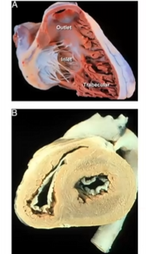

Oikean kammion arvioiminen tapahtuu yleensä parhaiten apikaalisesta nelilokerokuvasta -- mutta tällä kertaa RV:lle optimoituna. Yleensähän klassinen A4C on LV-sentrinen eli kuva optimoidaan LV:n suhteen ja ei haittaa, että RV on foreshortened. Jos haluaa visualisoida oikean kammion parhaiten, niin anturia tulisi hieman siirtää lateraalisesti, jotta RV saadaan kuvan keskelle ja **rotatoida normaalista A4C:sta hieman vastapäivään** ja tehdä pieniä peliliikkeitä alueella etsien leikkaustasoa, jossa RV on suurimmillaan.

Lisäksi on muitakin projektioita, joita käytetään muiden kuin sisämittojen arvioimiseen. 

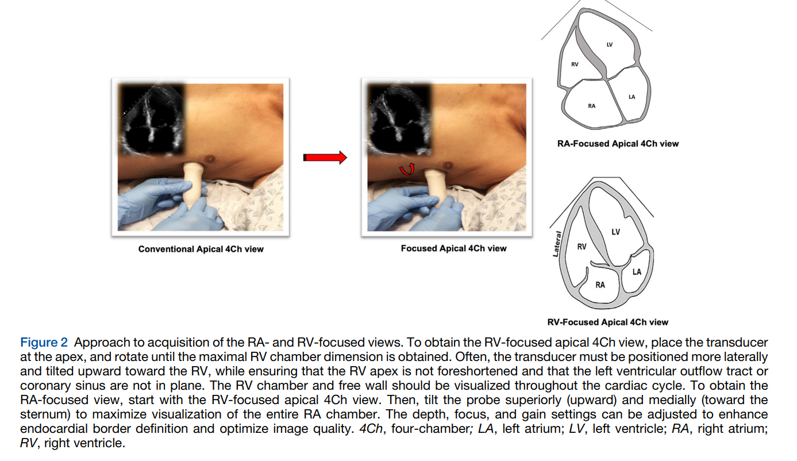
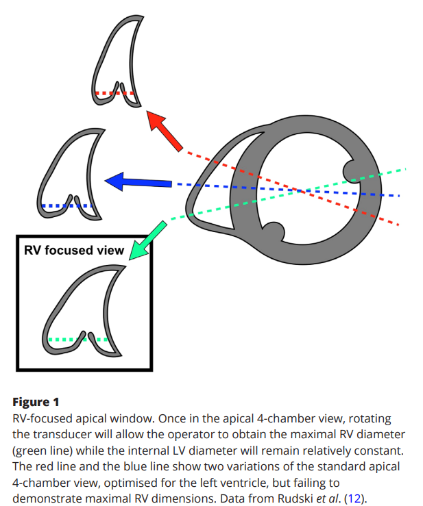

### Sisäulottuvuudet {#Sisaulottuvuudet}

Tästä **RV-focused-projektiosta mitataan RV:n sisäulottuvuudet.** Oikean kammion caliper-mitoista pääasiassa käytetään oikean kammion läpimittaa tyvitasolta (RVD1) ja joskus myös midventrikulaarisesti papillaarilihasten tasolta (RVD2). Näiden lisäksi voi mitata pitkittäisakselin pituuden (RVD3). 

Mittaukset voi tehdä ihan suoraan 2D-kuvasta caliperilla. Ajoitus on **loppudiastole** (eli silloin kun RV on isoimmillaan). 

RVD1 mitataan juuri trikuspidaaliläpän annuluksen päältä ja RVD2 kammion 1./2. kolmanneksen rajalla papillaarilihasten tasolta; mittauslinja tulisi asettaa inner-edge-to-inner-edge samansuuntaisesta trikuspidaaliläpän annuluksen kanssa. RVD3 saadaan, kun mitataan RV:n apeksin ja trikuspidaaliannuluksen välinen pituus. 

<li>Usein vain RVD1 mitataan ja lausutaan; muut mitat ovat selvästi harvinaisemmin käytettyjä kirjallisuudessa ja kliinisesti.</li>

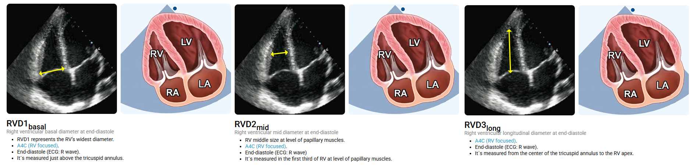
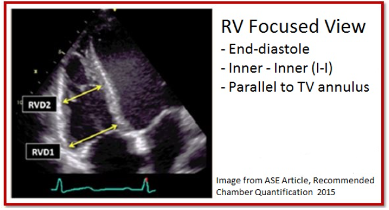

Lisäksi voidaan piirtää kammion pinta-alat loppudiastolessa (RVEDA) ja -systolessa (RVESA). Piirtäessä ei tule huomioida papillaarilihaksia tai trabekulaatioita tai moderator bandia (kts. LV-kappaleesta osio moderator band). Näiden suhteesta voidaan vielä laskea fraktionaalinen pinta-alan muutos (FAC = (RV EDA - RV ESA) / RV EDA x 100); ei siis ole ejektiofraktio (FAC on ejektiofraktiota pienempi). 

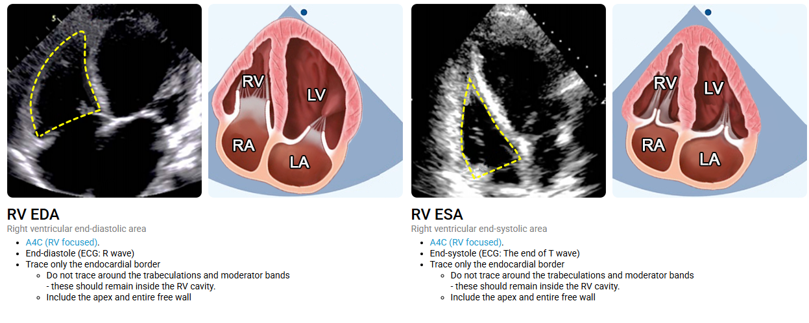
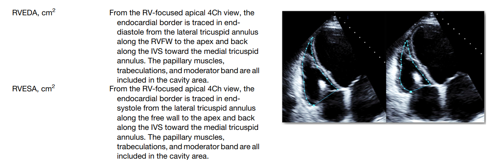

### RV Outflow (RVOT) -ulottuvuudet 

Kaikki RVOT:n mittaukset tehdään parasternaalisesti -- niin pitkittäisakselia (PLAX) kuin poikkileikkausta (PSAX) voidaan hyödyntää. 

Mittaukset suoritetaan **loppudiastolessa** (RV isoimmillaan) ja inner-edge-to-inner-edge. Koneelle ei sinänsä tarvitse kertoa mitä mittaa, joten caliper riittää. 

**Proksimaalinen RVOT** voidaan mitata PLAX:sta RV:n anteriorisesta seinämästä (vapaa seinämä, RVFW) kammioväliseinämään. Tästä projektiosta saatua mittaa kutsutaan myös oikean kammion sisäläpimitaksi diastolessa (RVIDD). Myös PSAX:sta voi mitata proksimaalisen RVOT:n ja tällöin mittaus tehdään vapaasta seinämästä aorttaläppään. Mittaukset voivat vaihdella jopa 40% tasojen välillä. 

**Distaalinen RVOT** mitataan PSAX:sta (tai tarkemmin ottan pulmonaaliläpän bifurkaatioikkunasta) pulmonaaliläpän annuluksesta hieman proksimaalisesti RV:n vapaasta seinämästä aortan lateraaliseinämään. 

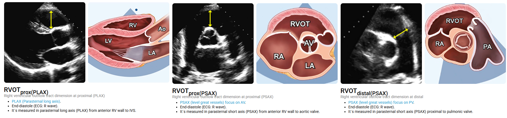
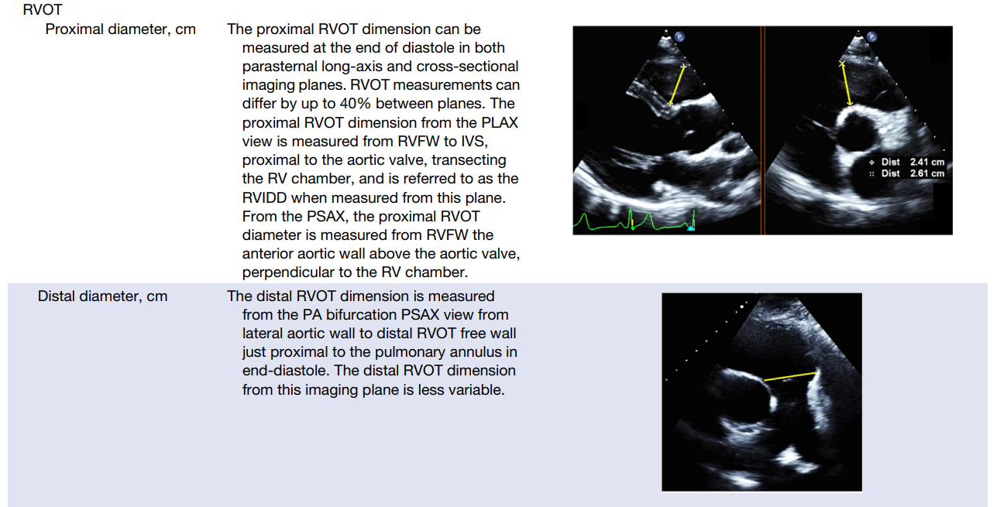

### Seinämät {#Seinamat}

Oikean kammion seinämien paksuuksilla yleensä tarkoitetaan vain **vapaan seinämän paksuutta,** koska kammioväliseinämä tulee mitattua yleisemmin suoritettavien LV:n mittausten yhteydessä. RV:n vapaa seinämä eli lateraaliseinämä on yleensä vasemman kammion vapaata seinämää ohuempi. 

Mittaus suoritetaan loppudiastolessa (kammio isoimmillaan) ensisijaisesti **subkostaalisesti** (joskus mahdollista PLAX:sta). Mittaustaso on RV-inflow eli basaalinen kolmannes trikuspidaaliannuluksen ja papillaarilihasten välillä. Mittauksessa ei oteta mukaan trabekulaatioita (RV:n seinämät usein hyvin trabekuloituneet), papillaarilihaksia tai perikardiaalista rasvaa. Mittaus voidaan suorittaa suoraan 2D-kuvasta tai M-moodilla, mutta nykyään suositellaan enemmän 2D-mittauksia. 

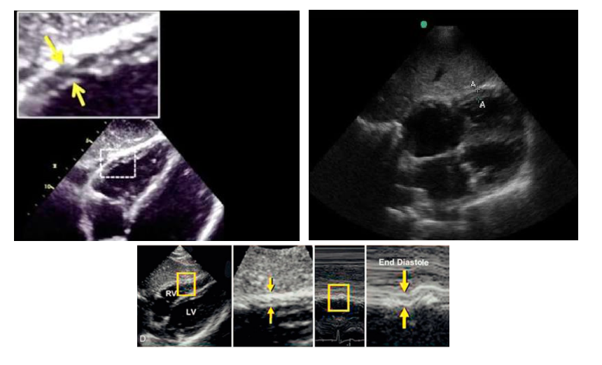

### Viitearvot

Tässä on 2D-kuvantamisessa nykyään käytettävät viitearvot. 3D-kuvantamista ei käsitellä tässä oppaassa.

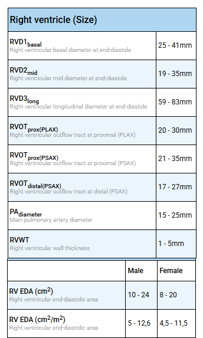

## Oikean kammion systoliikka

ASE:n suosituksien mukaan RV:n systolinen toiminta kannattaa arvioida multiparametrisesti eli monia eri mittareita hyödyntämällä. Useimmiten hyödynnettävät kvantitatiiviset metodit ovat: 

<li>TAPSE (Tricuspid Annular Plane Systolic Excursion)</li>
<li>S'-aalto (trikuspidaaliannuluksen kudosdopplerikuvantaminen)</li>
<li>FAC (RV:n pinta-alan fraktionaalinen muutos; fractional area change)</li>
<li>RIMP (Right Ventricular Index of Myocardial Performance)</li>
<li>RV:n vapaan seinämän longitudinaalinen strain-kuvantaminen (jos mahdollista käyttää)</li>
<li>3D RVEF (3D-kuvantamisella RV:n ejektiofraktio; ei yleensä käytettävissä oleva)</li>

---

Yleisimmät näistä ovat TAPSE ja S'-aalto. Jos aikoo jonkin näistä opiskella, niin kannattaa vähintään TAPSE ottaa haltuun; sen lisänä S'-aalto on myös yleisessä käytössä -- muut ovat harvinaisemmin käytettyjä. 

### TAPSE 

TAPSE (Tricuspid Annular Plane Systolic Excursion) kuvastaa oikean kammion pitkittäissupistuvuutta. Aikaisemmassa LV-luvussa käsiteltiin vasemman kammion basaalisen ejektiofraktion mittaamista PLAX:sta LVIDD- ja LVIDS -mittauksien kautta. Tämän EF-mittauksen yksi yksinkertaistuksista on se, että vasen kammio supistuu ennen kaikkea vaakasuunnassa.

Oikean kammion kohdalla hyödynnetään taas yksinkertaistusta, jonka mukaan oikea kammio supistuu ennen kaikkea pystysuunnassa. Tämän takia oikean kammion systolisesta funktiosta voidaan saada hyvä arvio sen perusteella, kuinka paljon trikuspidaaliläppärenkaan lateraalinurkka liikkuu kohti apeksia systolessa. 

Vakioitunut tapa mitata tämä liike on siis asettaa RV-focused A4C-projektiossa **M-moodikursori trikuspidaalin lateraalisen annuluksen läpi.** Projektio tulisi saada sellaiseksi, että kursorilinja olisi mahdollisimman paljon annulaarisen liikkeen suuntainen. Gainia kannattaa muokata sellaisesti, että annulaarinen liike saadaan M-moodissa parhaiten erotettua ilmaan liiallista häiriöääntä. 

Trikuspidaaliläppärengas alkaa piirtää M-moodia painamalla aaltomuotoa. Kerätty aallokko pysäytetään Freeze-napilla ja mitataan **Caliper-nappulamittauksella hypotenuusa aallon huipusta aallon pohjaan.** 

<li>**Huom! UKG-laite ei tällöin ilmoita hypotenuusaa vaan kateetin (aaltoliikkeen pystysuuntaisen liikkeen amplitudin) eli TAPSEn.** Hypotenuusa on sykeriippuvainen, koska M-moodin x-akselilla on aika, eikä hypotenuusan mittaa käytetä missään. Vain pystysuuntaisesta amplitudista välitetään.</li>

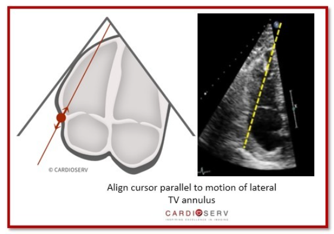
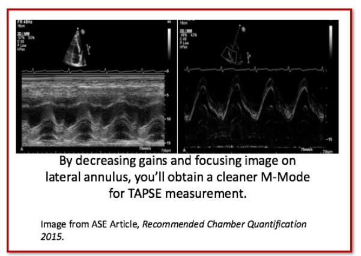
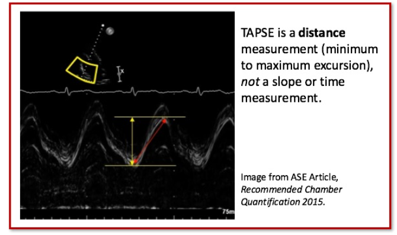

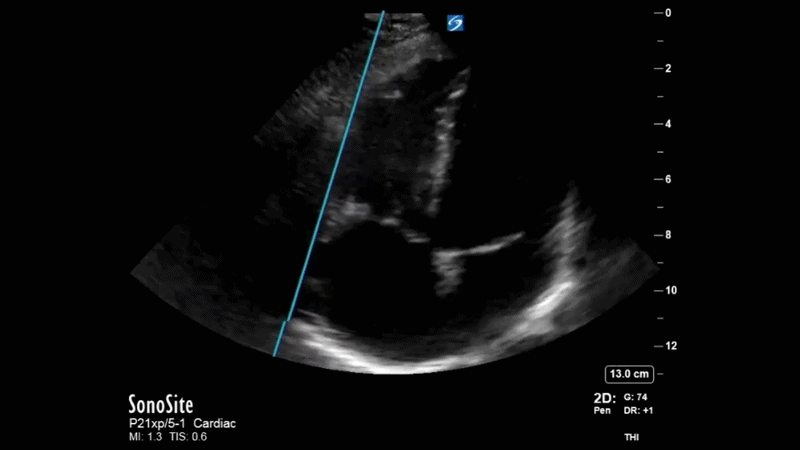

#### TAPSE:n viitealueet 

Aikaisemmin TAPSE:n perusteella RV:n funktio on jaettu dikotomisesti vain normaaliin ja heikentyneeseen, mutta [uudemmissa guidelineissa](https://www.asecho.org/wp-content/uploads/2025/03/PIIS0894731725000379.pdf) on esitelty gradeeratut vaikeusasteet, jotta epänormaalit löydökset voitaisiin raportoida tarkemmin

<li>**Normaali TAPSE on > 17 mm**</li>
<li>Lievästi alentunut on 13-17 mm</li>
<li>Kohtalaisesti alentunut on 11-12 mm</li>
<li>Vaikeasti alentunut on ≤ 10 mm</li>

#### TAPSE:n sudenkuopat

##### Väärän pohjan valitseminen {#Vaara-pohja}

Annuluksen liike ei aina ole täysin yksiaaltoinen, vaan siinä voi erottaa eri vaiheita. Tästä huolimatta haetaan aina aallon maksimaalisen pohjan ja maksimaalisen huipun välinen korkeusero.

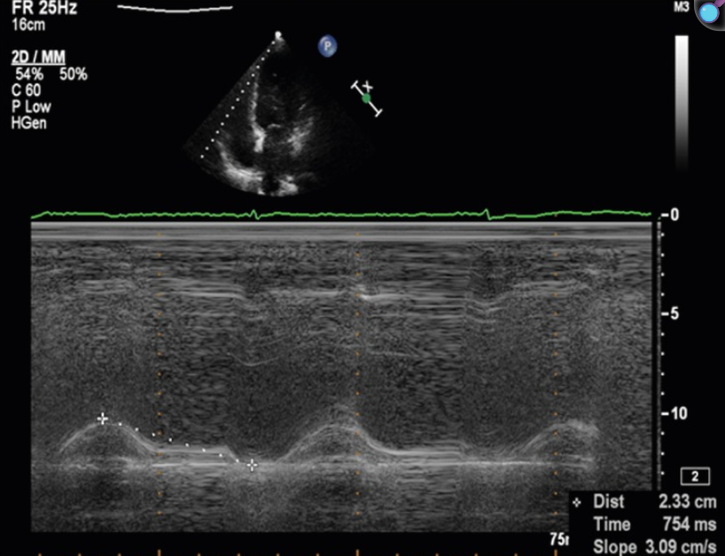

##### Ali- ja yliarviointi

Monet tekijät voivat johtaa TAPSE:n aliarvioimiseen. Yleisimpiä syitä ovat: 

<li>Suboptimaalinen kuvanlaatu</li>
<li>Sydämen vino asento ja heikko M-moodin suuntaus</li>
<li>Konstriktiivinen perikardiitti (vapaa seinämä liikkuu huonosti, vaikka itse sydänlihaksen funktio on säilynyt)</li>

---

TAPSE voidaan myös yliarvioida, esimerkiksi vaikea-asteinen funktionaalinen trikuspidaalivuoto voi aiheuttaa annuluksen distortiota ja siten TAPSE:n yliarviointia. 

Tulee myös tiedostaa, että TAPSE kuvastaa vain basaalista longitudinaalista liikettä, eikä siten ole täydellinen globaalin RV:n funktion markkeri.

##### Vaihtelevuus rasituksessa 

Muutokset pre- tai afterloadissa voivat merkittävästi affisoida TAPSE:a. Esimerkiksi jälkikuorman merkittävä nousu (esim. koembolia, keuhkoverenpainetauti tai ARDS) nostattaa oikean kammion seinämän jännitystä ja jarruttaa pituussuuntaisten lihassäikeiden lyhenemistä. Seurauksena TAPSE (ja s') laskee merkittävästi. Akuutissa tilanteessa matala TAPSE voi siis kertoa siitä, että kammio taistelee liian suurta painevastusta vastaan, eikä välttämättä siitä, että itse sydänlihas olisi vaurioitunut.

Esikuorma taas vaikuttaa Frank-Starlingin mekanismin kautta siihen, kuinka voimakkaasti lihassäikeet supistuvat. Esikuorman noustessa (esim. yllä mainittu trikuspidaalivuoto) kammion seinämät venyvät ja voi aiheuttaa anukselle poikkeuksellisen suuren liikeradan systolessa. Tällöin TAPSE voi olla virheellisen korkea tai normaali, vaikka oikean kammion todellinen pumppauskyky olisi jo alkanut pettää. Merkittävä esikuorman lasku (esim. vaikea hypovolemia) voi taas johtaa siihen, että kun kammiossa ei ole riittävästi verta venyttämässä lihassäikeitä, trikuspidaalianuluksen liike jää vajaaksi. Tällöin TAPSE voi näyttää matalalta puhtaasti tyhjän kammion vuoksi.  

---

Koska TAPSE reagoi herkästi kuormitusmuutoksiin, nykyiset hoitosuositukset korostavat, ettei sitä pitäisi koskaan tulkita täysin erillään muista löydöksistä. Oikean kammion todellista tilaa arvioitaessa TAPSE kannattaa suhteuttaa esimerkiksi keuhkovaltimopaineeseen (ns. RV-PA-kytkentä eli esim. TAPSE/PASP-suhde) sekä muihin ultraääniparametreihin, kuten kudosdopplerilla mitattavaan S'-nopeuteen tai kammion visualisointiin. Lisää näistä tulossa.   

### S'-aalto 

S'aalto eli kudosdopplerilla (TDI) kerätty lateraalisen trikuspidaaliannuluksen systolinen nopeus on konseptiltaan aika samanlainen kuin TAPSE -- arvioidaan siis basaalisella vapaan seinämän toiminnalla RV:n yleistä systoliikkaa. Se on myös yhtä helppo ja toistettavissa oleva kuin TAPSE. 

## Oikean kammion diastoliikka

## Pulmonaalihypertensio 

## Trikuspidaaligradientti ja keuhkovaltimopaineet

## Oikea eteinen 

## Pulmonaaliläppä {#Pulmonaalilappa}

## Vasemmalta-oikealle-shuntit 

### ASD