# Mitraalivuoto

Hiippaläppävuoto on länsimaisessa väestössä yleisin läppävika ja toiseksi yleisin läppäkirurgian aihe aorttastenoosin jälkeen. Yli 75-vuotiaasta väestöstä jopa vajaalla 10 %:lla on keskivaikea tai vaikea hiippaläppävuoto, ja onkin ilmeistä, että se on alihoidettu sairaus.

## Läppävuodon anatomia {#Lappavuodon-anatomia}

Läppävuodoilla (ei siis pelkästään mitraalivuodolla) on tyypillinen rakenne, joka on hyvä tunnistaa, koska sen osien mittaamiseen perustuu monet vaikeusasteen määrittämisessä käytettävät arvot. 

**Vuodot koostuvat siis kolmesta osasta: virtauksen kiihtyvyysalue (konvergenssialue, the flow convergence zone), vuodon kaula (vena contracta, VC) ja vuotosuihkun pinta-ala (jet area).**

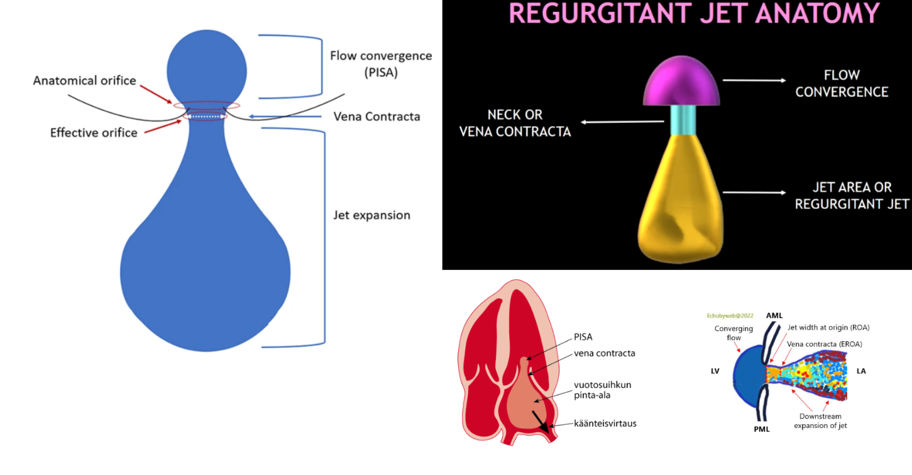
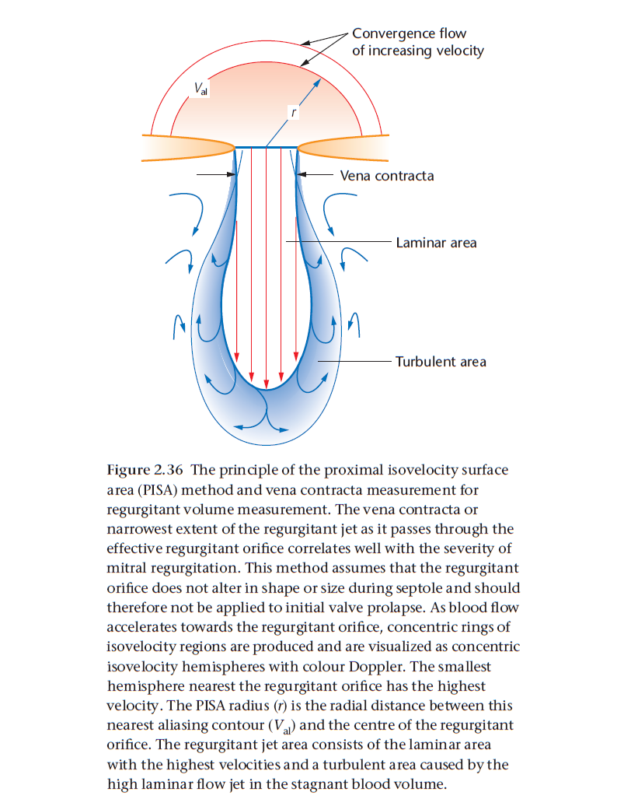

### Virtauksen kiihtyvyysalue (Konvergenssialue), PISA

Vuotovirtauksen konvergenssialue perustuu hemodynaamiseen periaatteeseen, jonka jokainen on varmasti nähnyt toiminnassa jossain muodossa omassa elämässään. Kuvittele tilanne, jossa lavuaari tai kylpy on täynnä vettä ja vedät tulpan pois. Vesi ei liiku vain suoraan alaspäin, vaan suppilomaisesti joka puolelta kohti viemäriaukkoa, ja virtauksen vauhti kiihtyy mitä lähemmäs aukkoa tullaan. Virta siis suuntautuu samaan pisteeseen ja tätä konvergenssi juuri tarkoittaa (konvergenssi = yhteen suuntautuminen, lähentyminen, sulautuminen yms.). 

Sydämessä tapahtuu sama asia verelle vuotavien läppien kanssa kuin lavuaarissa vedelle. Kun veri virtaa laajasta sydänlokerosta (esim. vasemmasta kammiosta) kohti kapeaa vuotoaukkoa (esim. vuotavaa hiippaläppää), virtausnopeus kiihtyy asteittain. Tämä kiihtyvyys muodostaa vuotoaukon ympärille samankeskisiä, puolipallon muotoisia vyöhykkeitä, joissa kaikissa on sama virtausnopeus. Näitä kutsutaan isovelositeettipinnoiksi. Tästä tuleekin konvergenssialueen toinen nimi, jota käytetäänkin ensisijaisena nimityksenä kliinisessä työssä: **PISA eli Proximal Isovelocity Surface Area.** 

<li>PISA-periaate sisältää kaksi ajatusta: 1) Virtauksen nopeudet ovat samoja samalla etäisyydellä vuodon aukosta ja 2) Mitä suurempi vuotoaukko on, sitä korkeampia virtaukset ovat tietyllä etäisyydellä aukosta</li>
  <ul>
    <li>Vuodon maksiminopeuden määrää pääasiassa paine-ero niiden kahden lokeron välillä, joiden välillä vuoto tapahtuu. Tätä kuvastaa fysiikassa Bernoullin yhtälö: ΔP = 4v^2. Esimerkiksi jos vasemman kammion paine on sydämen supistuessa 120 mmHg ja vasemman eteisen paine on 20 mmHg, lokeroiden välinen paine-ero eli ΔP on 100 mmHg. Tämä 100 mmHg paine-ero pakottaa veren liikkumaan aina noin 5 m/s nopeudella – oli läpässä oleva reikä sitten nuppineulan pään kokoinen tai peukalon paksuinen (kunhan sydänlihas vain jaksaa ylläpitää tuon paineen).</li>
      <ul>
        <li>UÄ-laitteella tosin kylläkin mitataan vuodon nopeus ja siitä kone laskee gradientin -- ei toisinpäin.</li>
      </ul>
    <li>Vaikka suuriaukkoisessa vuodossa suihkun maksiminopeus aukon kohdalla pysyy samana, suuri aukko muuttaa tilanteen täysin sen ympärillä eli juuri kiihtyvyysalueella (PISA). Tämä johtuu parista syystä:</li>
      <ul>
        <li>Suurempi tilavuus vaatii tilaa: Koska aukko on suuri, sen läpi täytyy mahtua sekunnin murto-osassa suurempi tilavuus verta</li>
        <li>Imu ulottuu kauemmas: Jotta tämä suuri määrä verta ehtii suppilomaiseen aukkoon, imuvaikutus ulottuu paljon laajemmalle ja kauemmas sydänlokeroon</li>
      </ul>
    <li>**Iso vuotoaukko ei siis tee itse vuotosuihkun huipusta nopeampaa, vaan se laajentaa kiihtyvyysaluetta. Koska veri alkaa kiihtyä kohti aukkoa paljon kauempana, virtaukset ennen vuotoaukkoa ovat mitattuna nopeampia kuin pienessä vuodossa.** Juuri tämän vuoksi doppleria käyttämällä voi tietää jo jotain vuodon vaikeusasteesta pelkästään kiihtyvyysalueen (PISA) kokoa katsomalla. Tarkempi arvio vuodon vaikeudesta saadaan myös muita vuodon osia tarkastelemalla.</li>
  </ul>
  
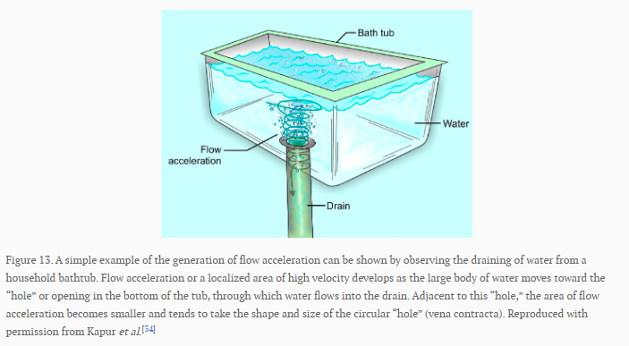
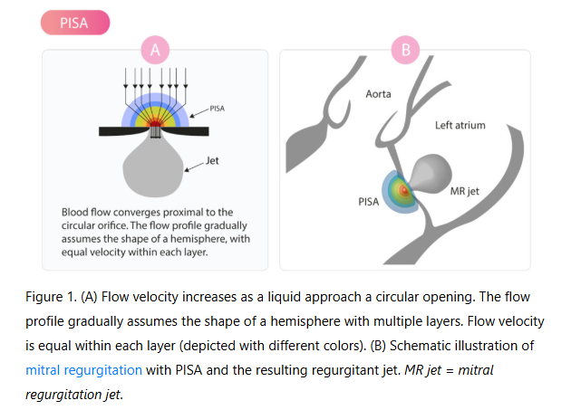

### Vuodon kaula (vena contracta)

Vuodon kaula (vena contracta) on kiihtyvyysalueen (PISA) ja vastaanottavaan sydänlokeroon leviävän varsinaisen vuotosuihkun väliin jäävä vuotosuihkun kapein kohta. Moni pohtii, miksi ei mitata vain itse fyysistä reikää läpän rakenteesta. Se on kuitenkin usein anatomisesti niin epäsäännöllinen, että sitä on äärimmäisen vaikea erottaa luotettavasti perinteisessä ultraäänikuvassa.

Vena contracta kuvaa vuotoaukon jälkeistä nopea- ja laminaarivirtauksista vuodon osaa. Virtaus siis jatkaa lähentymistä vielä pienen hetken senkin jälkeen, kun veri on jo fyysisesti ohittanut mekaanisen läppäaukon, koska virtaavalla verellä on sisäänpäin viettävää liikemäärää eikä sitä pystytä inertian takia heti lopettamaan. Tästä syystä vuotosuihkun kapein kohta muodostuu vasta hitusen aukon jälkeen. Tämä kohta vastaa yleensä lähes täydellisesti läpän tehokasta vuotoaukkoa (EROA, Effective Regurgitant Orifice Area), koska sisäänpäin suuntautuva virtauksen liike aukon jälkeen on todella pientä; vuodon muoto kylläkin vaikuttaa korrelaation vahvuuteen. Ongelmakohtia ovat myös monet vuotosuihkut ja esim. mitraalivuodon tapauksessa non-holosystoliset vuodot.  

<li>On siis hyvä tiedostaa, että läppävuoto voi olla mm. pyöreä tai elliptinen</li>
  <ul>
    <li>Primaarinen mitraalivuoto on yleensä sirkulaarinen ja tällaisessa tilanteessa vena contracta yleensä kuvastaa vuotoaukon aluetta tarkasti</li>
      <ul>
        <li>Primaarinen mitraalivuoto tarkoittaa rakenteellista vuotoa, joka johtuu läppäliuskojen, jännerihmojen tai papillaarilihasten rakenneviasta. Yleisimmät syyt ovat mitraaliläpän prolapsi (kehittyneissä maissa) ja reumaattinen mitraalivuoto (kehitysmaissa). Myös mm. endokardiitti kannattaa pitää mielessä ja etsiä vegetaatioita.</li>
      </ul>
    <li>**Sekundaarinen mitraalivuoto taas on useimmiten elliptinen (slit-shaped) ja tämä johtaa siihen, että vena contracta aliarvioi vuodon vaikeuden.**</li>
      <ul>
        <li>Sekundaarinen vuoto tarkoittaa toiminnallista vuotoa ja on seurausta vasemman kammion toimintahäiriöstä tai epänormaalista rakenteesta, joka häiritsee läpän toimintaa; esim. dilatoiva kardiomyopatia tai iskeeminen sydänsairaus (papillaarilihasiskemia)</li>
      </ul>
    <li>Vaikka monissa lähteissä sanotaan, että mitraalivuodon VC voitaisiin mitata vain PLAX-ikkunasta, niin vuodon kaula kannattaa kylläkin arvioida myös vähintään A4C-projektiosta, jotta saa paremman arvion siitä, vaihteleeko kaulan leveys kuvausakselin muuttuessa (viittaa siihen, että vuotoaukko ei ole täysin ympyrämäinen). Eri mittaukset voi sitten dokumentoida lausuntoon ja antaa paremman arvion aukon oikeasta koosta.</li>
      <ul>
        <li>Vuotoaukon ei-ympyrämäiset muodot häiritsevät myös PISA:a, koska ei-ympyrämäinen aukko johtaa ei-ympyrämäiseen PISA:an.</li>
      </ul>
  </ul>

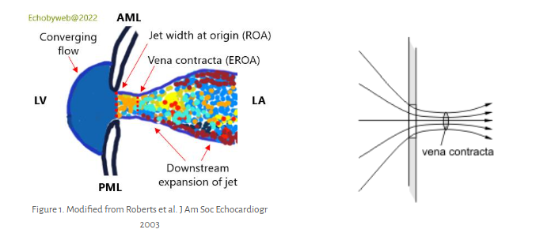
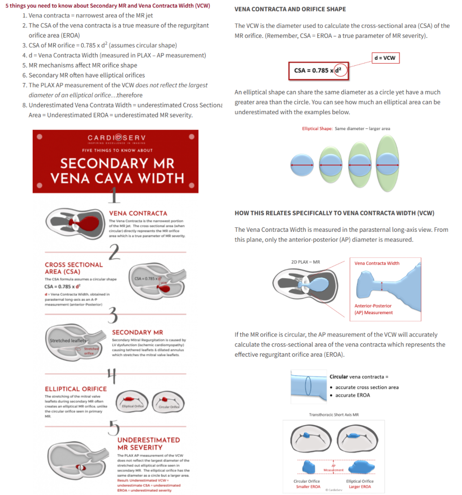

### Vuotosuihku

Vuotosuihkulla tarkoitetaan itse vuotoaukon jälkeistä turbulenttia virtausta. Tärkein mitta kerätä vuotosuihkusta on vuodon maksimaalinen nopeus (Vmax), sillä sitä tarvitaan EROA:n laskemiseen. Voi myös olla järkevää mitata vuodon VTI (velocity time integral), jonka avulla voidaan laskea vuodon tilavuus. Vuotokäyrän tiheyttä ja muotoa voi myös arvioida. 

Vuotoa kannattaa myös arvioida visuaalisesti. Ainakin kannattaa arvioida, onko vuoto sentraalinen (suoraan eteiseen) vai eksentrinen (enemmänkin eteisen seinämiin kohdistuva). Vuodon pinta-alan suhde vasemman eteisen pinta-alaan (visuaalisesti) on monesti käytetty tapa nopeasti arvioida vuodon vaikeutta, mutta se ei ole kovinkaan suositeltu (ainakaan ainoana arviona), koska sen antama arvio riippuu pitkälti koneen asetuksista, vuotomekanismista, hemodynaamisesta tilasta ja vuodon suunnasta. 

<li>Eksentrisistä vuodoista on hyvä tiedostaa se, että vuodon läheisyys seinämään voi johtaa Coandăn ilmiöön (virtauksen pyrkimys kääntyä kohti sitä lähellä olevaa pintaa) ja siten vuotosuihku voi näyttää pienemmältä kuin se oikeasti on.</li>
<li>Sentraalisten vuotojen kanssa voi vieläkin joidenkin guidelinejen mukaan periaatteessa hyödyntää vuotosuihkun pinta-alan ja vasemman eteisen välistä suhdetta päättelyn tukena, kun arvioi onko vuoto vaikea-asteinen. Tälle ei kuitenkaan tulisi antaa liikaa painoarvoa.</li>

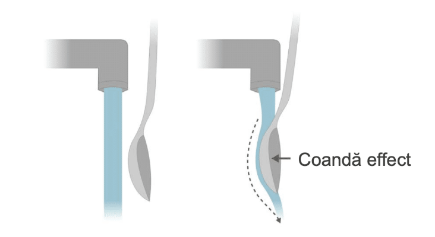
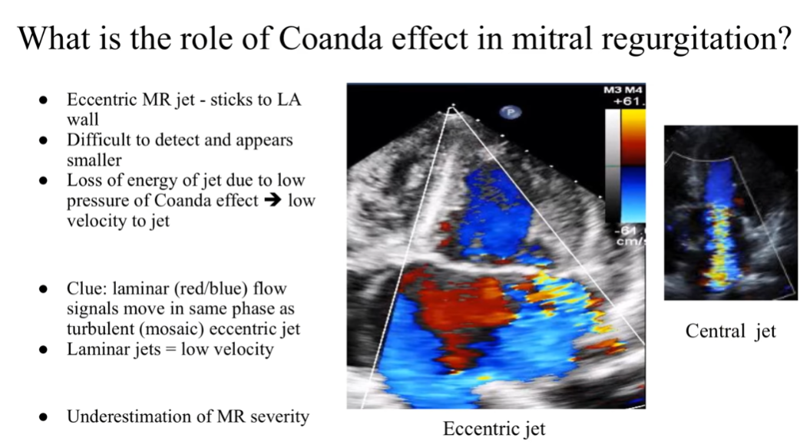

## Vuodon mekanismi 

Mitraalivuodon mekanismin arvioiminen on tärkeä osa ultraäänitutkimusta ja mekanismi ohjaa merkittävästi mahdollisia hoitovaihtoehtoja. Mekanismit jaetaan Carpentierin luokituksessa kolmeen pääluokkaan sen mukaan onko läppäpurjeiden liike normaalia (I), liiallista (II) vai rajoittunutta (IIIa ja IIIb). Arvioiminen on mahdollista transtorakaalisesti, mutta TEE tietysti mahdollistaa paljon paremman läppävisualisaation. 

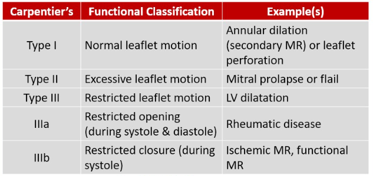
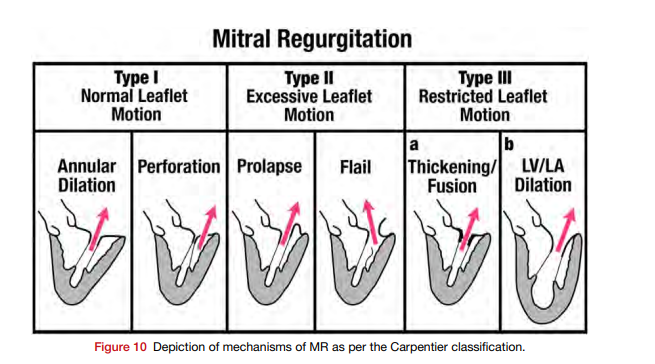
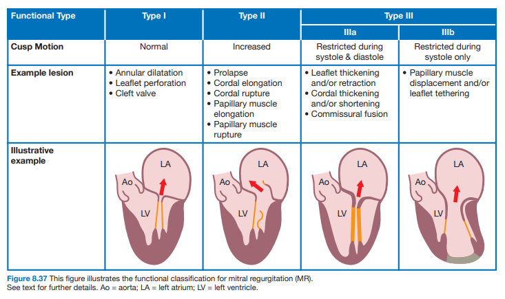

### Carpentier I 

Luokan I vuodossa läppäpurjeet liikkuvat aivan kuten kuuluukin, mutta läpässä on silti reikä tai vuoto jostain muusta syystä. Vuoto johtuu yleensä siitä, että läppäpurjeet eivät ylety kohtaamaan toisiaan keskellä (koaptaatio on heikkoa). 

Tyypillisin syy on läppärenkaan laajentuma (annuluksen dilataatio) johtuen eteisen laajentumasta. Dilataatio vetää purjeita kauemmas toisistaan ja estää niiden koaptaation systolessa -> vuoto, joka on yleensä sentraalinen. 

Toinen syy on läppäperforaatio esimerkiksi endokardiitista johtuen (yleensä anteriorinen purje); tämä näkyisi vuotona "purjeen läpi". Läpässä voi olla myös synnynnäinen halkio (cleft), joka aiheuttaa läppään vuodon.

Tässä on videoita Carpentier I -luokan vuodoista:

TEE:ssä vasemman eteisen laajentuman aiheuttama annulusdilataatio -> sentraalinen vuoto

Tässä on anteriorisen purjeen perforaatio, joka näkyy vuotona suoraan purjeen läpi (näkyy myös aorttavuotoa)

Tässä saman perforaation kohta piirrettynä

### Carpentier II 

Tyypin II vuodossa läppäpurje tai sen osa pääsee liikahtamaan liikaa eli se pullottaa vasemman eteisen puolelle systolen aikana, minkä vuoksi läpän reunat eivät tiivisty vastakkain, vaan veri pääsee suihkuamaan ohi. 

Tyypillisin syy on mitraaliläpän prolapsi (MVP), joka on yleisin mitraalivuodon syy ylipäätään. Mitraaliläpän prolapsi johtuu läpän myksoidista degeneraatiosta, mikä tekee läpästä pehmeän ja purjeet pääsevät pullottamaan eteiseen annulustason toiselle puolelle (joissain lähteissä rajana >2mm). Etiologia ei ole selvää, mutta joskus voi olla geneettisiä sairauksia taustalla (esim. Marfanin tai Ehlers-Danlosin oireyhtymät). MVP:stä käytetään usein myös nimitystä Barlowin oireyhtymä. 

Luokkaan kuluu myös jännerihmarepeämät (kordaruptuurat) ja papillaarilihasrepeämät, jotka voivat aiheuttaa vaikeaa ja akuuttia mitraalivuotoa ns. flail leafletin (vapaasti heiluva läppäprolapsi) takia. 

Tässä näkyy mitraaliläpän purjeiden pullistuminen eteiseen (mitraaliläpän prolapsi, MVP). Samalla näkyy myös mitraaliannuluksen disjunktio (MAD), joka on rakenteellinen häiriö, jossa mitraaliläpän posteriorisen purjeen saranakohta erkanee kammion myokardiumista (käytännössä siis purje kiinnittyy korkeammalle eteiseen). MAD on usein yhteydessä prolapsiin (ja voi pahentaa sitä, koska stabiilia kammioankkurointia ei ole ja annuluksen lisääntynyt liike aiheuttaa lisääntynyttä stressiä purjeisiin ja jännerihmoihin) ja on yleensä synnynnäinen ongelma. Sen aiheuttama mekaaninen stressi myös ärsyttää sydänlihasta ja johtaa myös paikalliseen lihasvaurioon (ja lopulta arpeutumiseen, joka voidaan nähdä sydämen MRI:ssä) -> alttius rytmihäiriöille on korkeampi (arytmogeeninen mitraaliläpän prolapsi, AVMP).

Alla vielä MAD:sta havainnollistavampi kuva

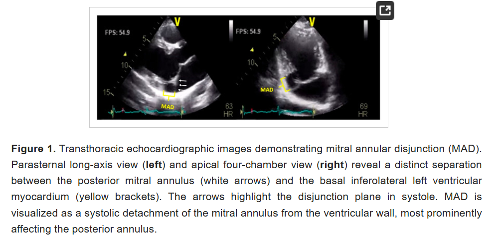

### Carpentier IIIa

Luokka III eli rajoittunut liike jaetaan kahteen alaluokkaan sen mukaan, missä vaiheessa liike on rajoittunutta. Tyyppi IIIa kuvastaa rajoittunutta liikettä sekä systolessa että diastolessa. Läppäpurjeet ja niiden alla olevat jännerihmat ovat kauttaaltaan paksuntuneet, jäykistyneet ja usein kasvaneet toisiinsa kiinni. Läppä ei aukea kunnolla (aiheuttaa myös stenoosia) eikä mene kunnolla kiinni. Tyypillisin syy klassisesti on reumakuumeen aiheuttama läppäsairaus (krooninen reumaattinen sydänsairaus), mutta sen yleisyys on vähentynyt Suomessa merkittävästi ja nykyään ikääntymisen aiheuttama kalsifikaatio on yleisempää. Muut syyt ovat harvinaisia, mutta niitä ovat esim. tietyt lääkkeet (esim. vanhat fenfluramiinia sisältäneet laihdutuslääkkeet), säteily ja systeemiset autoimmuunisairaudet.  

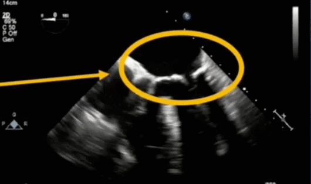

### Carpentier IIIb

Tyypin IIIb-vuodossa liike on rajoittunut vain systolessa eli sulkeutumisvaiheessa. Läppäpurjeet itsessään voivat olla aivan terveen näköiset, mutta niitä vedetään alaspäin kammion pohjaa kohti (ilmiötä kutsutaan nimellä tethering). Kun kammion seinämä venyy ulospäin, papillaarilihakset siirtyvät ja jännelangat vetävät läppää tiukasti alas, jolloin se ei pääse nousemaan ylös sulkeutuakseen. Tyypillisimpiä syitä ovat infarktin jälkitila (infarktialueen seinämä pullistuu) tai dilatoiva kardiomyopatia. 

Tyypin I ja IIIb Carpentier eroavat siten, että tyypissä I läppäliike ei ole rajoittunutta ja purjeet nousevat ylös läppätasoon asti. Ne vain eivät yletä sulkemaan aluetta johtuen eteisen dilataatiosta. Carpentier IIIb:ssa purjeiden liike on rajoittunut ja ne jäävät kammion puolelle johtuen pääasiassa vasemman kammion dilataatiosta. Nykyään käytetään usein termejä **atrial MR** (annulusdilataatiosta johtuva koaptaatiovaje = carpentier I) ja **ventricular MR** (kammiolaajentumisesta johtuva koaptaatiovaje = carpentier IIIb)

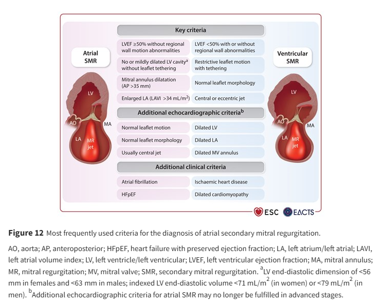

Tässä videossa on tyypillinen tyypin IIIb mitraaliläpän funktio, joka aiheuttaisi funktionaalista mitraalivuotoa. Papillaarilihasten siirtyminen on johtanut jännerihmojen jännittyneisyyteen, mikä vetää anteriorista purjetta lentävän lokin muotoiseksi ("seagull sign"). Posteriorista purjetta vedetään vahvasti seinämää pohti ja se onkin tässä pääasiallinen koaptaatiovajeen ja vuodon aiheuttaja. Joskus kuvaaja voi mennä harhaan ja luulla tätä tilaa anteriorisen purjeen prolapsiksi, jos vain katsoo anteriorisen ja posteriorisen purjeen suhdetta toisiinsa, mutta tulee huomata, että purje ei pullistu kammioon (ei ylitä annulustasoa eteisen puolelle).

## Vuodon gradeeraus 

Mitraalivuodon gradeeraus voidaan toteuttaa monella eri metodilla ja onkin yleensä hyvä hyödyntää monia eri tekniikoita, jotta saa paremmin hajautettua arvion eikä se nojaa yhteen ainoaan arvoon. Vuotoaukon pinta-alan (EROA) laskeminen on usein kuitenkin paras yksittäinen mitraalivuodon vaikeusasteen määritysmenetelmä. Myös mm. vena contractan leveyttä voi käyttää. Molempien luotettavuus usein laskee toiminnallisessa vuodossa epäsymmetrisen vuotoaukon vuoksi. 

### Vena contractan leveys (VCW)

Ennen EROA:n laskemista yleensä kyllä mitataan vuodon kaulakin (vena contractan leveys), koska sen merkkaaminen auttaa taas PISA:n säteen mittaamisessa (lisää tästä kohta). Vuodon kaulan mittaaminen on myös hyvä ja nopea tapa saada arvio vuodon vaikeudesta. 

Vuodon kaula kannattaa mitata niistä projektioista, joista kaikki vuodon kolme anatomista osaa ovat nähtävissä. Nyquistin rajan (aliasing velocity) tulisi olla yleensä standardi (unshifted) eli n. 50-60(-70)m/s. Mitatessa kannattaa zoomata lähelle vuotoa. 

Mittaus suoritetaan silloin, kun vuotosuihku on suurimmillaan eli mitraalivuodon suhteen yleensä keskisystolessa (tosin prolapsissa maksimivuoto on usein myöhäissystolessa). Itse mitta on siis vuodon kapein kohta, jonka voi visualisoida olevan juuri pisan puolikaaren alapuolella. Tämän voi mitata ihan vain caliperilla, koska tästä ei tehdä itse ultraäänilaitteen sisällä jatkolaskelmia.

Kannattaa ottaa keskiarvo kahdesta tai kolmesta lyönnistä ja myös kahdesta ortogonaalisesta suunnasta (yleensä siis PLAX ja A4C).

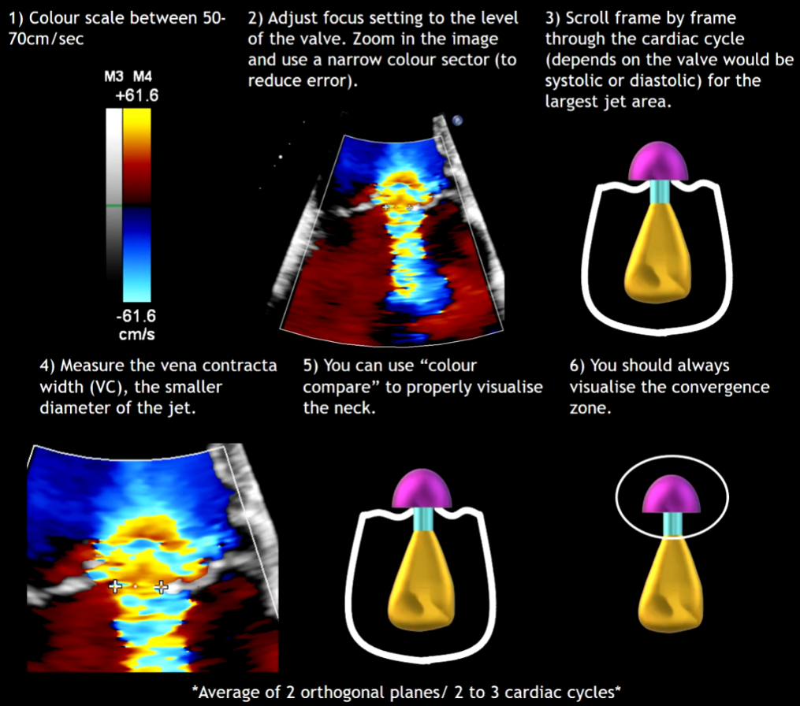

### EROA

EROA eli Effective Regurgitant Orifice Area tarkoittaa käytännössä vuotoaukon pinta-alaa; "efektiivinen" -osa vain tulee siitä, että nestefysiikan takia itse vuotavan veren pinta-ala on pienempi kuin anatomisen vuotoaukon. EROA ajatellaan hydrodynaamisesti samaksi kuin vena contractan kautta lasketun ympyrän pinta-ala. 

**EROA lasketaan kahdesta arvosta: PISA:n säde ja vuotosuihkun maksimaalinen nopeus.**

#### PISA:n säde (PISA radius)

PISA:n säde mitataan EROA:sta eli käytännössä vuodon kaulasta PISA:n värireunaan (point of colour aliasing). 

Aliasing eli käänteisilmiö on artefakta, jota voi tapahtua doppler-UÄ:ssä, kun virtauksen nopeus ylittää Nyquistin rajan. Nyquistin raja on se korkein virtausnopeus, jonka ultraäänilaite pystyy vielä mittaamaan oikein. Mittaaminen perustuu siihen, että laite lähettää ultraäänipulsseja tietyllä taajuudella (PRF, Pulse Repetition Frequency). Jotta laite pystyisi laskemaan veren virtausnopeuden oikein, sen täytyy "ottaa näytteitä" (eli lähettää pulsseja) vähintään kaksi kertaa nopeammin kuin mikä on mitattavan virtausliikkeen aiheuttama taajuusmuutos. Nyquistin raja on aina tasan puolet laitteen pulssintoistotaajuudesta (PRF) eli Nyquistin raja = PRF/2. 

Käänteisilmiö voidaan havaita dopplerkuvauksessa niin aaltokäyristä kuin värispektridopplerissa. Väridopplerissa nopeasti virtaava veri (esimerkiksi ahtauman kohdalla) muuttuu yhtäkkiä yksisuuntaisesta väristä (esim. kirkkaanpunainen) vastakkaiseksi väriksi (siniseksi), ja värit ikään kuin sekoittuvat mosaiikkimaiseksi pyörteeksi (myös siis turbulenssista johtuen). PW-dopplerissa doppler-käyrän huippu taas voi leikkautua poikki asteikon yläreunasta ja ilmestyä näkyviin asteikon pohjalle (ikään kuin virtaus olisi muuttanut suuntaa). 

<li>Oikean elämän esimerkki aliasingista on autojen renkaat elokuvissa. Kun auto kiihdyttää, kameran kuvanopeus (frames per second) ei enää riitä tallentamaan pyörän liikettä oikein. Pyörä voi ehtiä pyörähtämään lähes täyden kierroksen kahden kuvan välissä ja silmille syntyy illuusio, että pyörä pyöriikin taaksepäin (jos ehtisi pyörähtämään täydellisen kierroksen, niin rengas vaikuttaisi olevan paikallaan).</li>

---

Mitraalivuodon PISA-sädettä mitatessa Nyquistin raja tulee asettaa tasolle 30-40 cm/s vuodon suuntaan (eli siis jos vuoto on negatiivinen, niin silloin nyquist esim. -38.5 cm/s), koska se auttaa rajaamaan konvergenssialuetta ja tekemään siitä selkeälukuisen. Standardirajoilla (n. 60-70 cm/s) aliasing tapahtuu liian lähellä pientä vuotoaukkoa; tällaista pientä aluetta on vaikea mitata ja koska EROA:n laskelmissa käytetään pisa-säteen neliötä, on pienikin mittausvirhe suuri lopputuloksen kannalta. Pakottamalla aliasingin tapahtuvan aikaisemmin, tehdään PISA-säteestä suurempi ja siten helpotetaan mittausta. 

Mittaus suoritetaan siis näin (kannattaa olla zoomattuna, niin on helpompaa ja tarkempaa): 

<li>0 - Mittaa vuodon kaula (Nyquist 50-60 cm/s)</li>
<li>1 - Vaihda Nyquist tasolle 30-40cm/s vuodon suuntaan</li>
<li>2 - Etsi kohta, jolloin vuotovirtaus on nopeinta (VMax, yleensä keski- tai myöhäissystolessa); tämä siis vastaa stabiileinta (ei siis sinänsä suurinta; liian aikaisin mitattuna PISA voidaan mitata liian isona) hemisfeeristä PISA-puolikaarta</li>
<li>3 - PISA:n säde on alue ensimmäisestä värimuutoksesta (yleensä siis sinisestä keltaiseksi, jos vuoto poispäin anturista) vena contractaan</li>

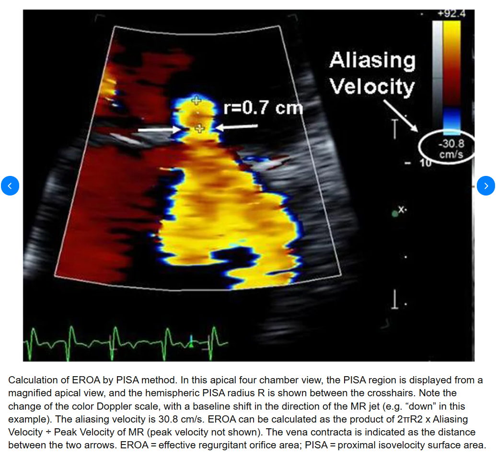
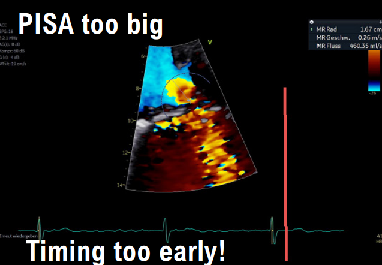

#### CW Dopplerilla vuodon nopeus (ja VTI) 

Periaatteessa EROA voidaan laskea pelkästään vuodon maksiminopeudesta (VMax) eikä vuodon nopeus-aika-integraalia (VTI) tarvitse piirtää, mutta VTI:n mittaaminen mahdollistaa samalla myös vuodon tilavuuden arvioimisen, mikä taas auttaa vuodon gradeerauksessa sekä sen mittausluotettavuuden arvioinnissa. Kannattaakin siis rutiinisti piirtää vuodon VTI. 

EROA lasketaan (kone laskee automaattisesti tai voi halutessaan laskea nettilaskureilla), kun tiedetään vuotoaukon saama virtaama (flow rate (ml/s)) ja vuodon maksiminopeus. Tämä perustuu siihen, että kaikki veri, joka virtaa PISA-puolipallon läpi, on samaa verta, joka puristuu myöhemmin läpän vuotoaukon läpi. EROA siis lasketaan kaavasta:

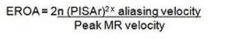

Yhtälön osoittaja siis laskee vuodon virtaaman eli sen, kuinka paljon verta (millilitroina sekunnissa) virtaa kohti vuotokohtaa. 2πr^2 on PISA-puolipallon pinta-ala, joka lasketaan, kun tiedetään PISA-radius. Aliasing velocity on asettamasi Nyquistin raja, joka kuvastaa sitä, että puolipallon pinnalla kaikki veri liikkuu sillä nopeudella. Voi siis ajatella näin: Jos tietää, kuinka leveä paloletku on ja kuinka lujaa vesi siinä virtaa (Nyquist limit), tietää montako litraa vettä letkusta tulee sekunnissa.

Kun tämä määrä vettä (nyt sydämessä verta) suppenee ja puristuu systolessa läpän pienen vuotoreiän läpi, sen virtausnopeus lähtee nousemaan. Koska verta ei katoa minnekkään PISA:n ja vuotoaukon välillä (jatkuvuusyhtälö), niin virtaus PISA-puolipallossa on sama kuin virtaus vuotoaukossa. Täten voi ajatella, että EROA (vuotoaukon pinta-ala) x VMax = PISA:n virtaama. Tästä vain ratkaisemalla EROA saadaan yllä oleva kaava. 

---

VTI:n mittaaminen on myös tärkeää vuodon gradeerauksessa ja on vain seuraava laskutoimitus EROA-kaavassa. Kun tiedetään vuotoaukon pinta-ala (EROA), niin voidaan laskea myös vuodon tilavuus, jos tiedetään vuodon muodostaman sylinterin pituus. Kuten käytiin jo aorttastenoosin yhteydessä läpi, niin VTI (velocity time integral; aika kertaa nopeus = etäisyys) kuvastaa sitä matkaa, jonka verisolut kulkevat yhden sydämenlyönnin aikana. Kun tiedetään vuodon alun pinta-ala ja tiedetään "vuodon kulkema etäisyys", niin tiedetään vuodon tilavuus. Voi siis ajatella ruiskua: EROA on ruiskun sylinterin poikkipinta-ala. VTI puolestaan on se matka, jonka verran ruiskun mäntää painetaan sisään yhden lyönnin aikana. Pinta-ala kertaa matka kertoo, kuinka monta millilitraa nestettä ruiskusta pursuaa ulos. 

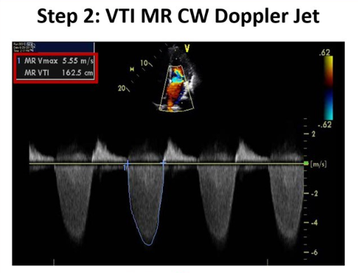
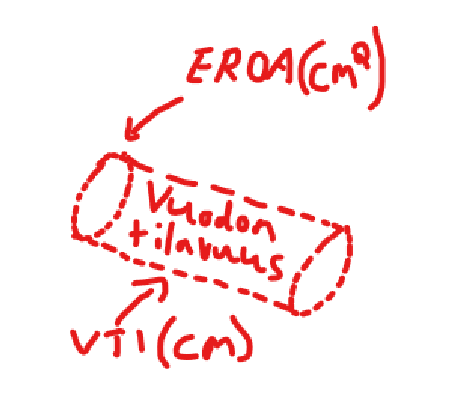
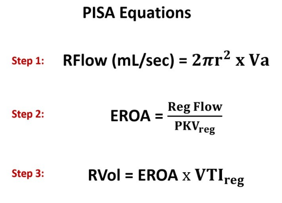

### Muut gradeeraustavat 

Usein jo pelkästään EROA:lla ja vuodon tilavuudella saadaan hyvä arvio vuodon vaikeusasteesta ja nämä ovatkin käytetyimmät arvot gradeerauksessa. Kuitenkin on todella järkevää vahvistaa arviota multiparametrisesti eli keräämällä muutakin dataa (niin kvalitatiivisia, semi-kvantitatiivisia ja kvantitatiivisia), kuten vena contractan leveys, RF%, keuhkolaskimoiden virtaus, LA:n / LV:n koko, diastoliset mitraalivirtaukset ja keuhkovaltimopaine. 

Vena contractan leveys onkin jo käyty läpi: se käytännössä siis kuvastaa EROA:a (ainakin yleensä rakenteellisessa vuodossa). Miten nämä muut sitten soveltuvat mitraalivuodon gradeeraukseen? 

#### RF%

Vuodon osuus (regurgitant fraction, RF%) lasketaan vuodon tilavuuden ja diastolisen mitraalivirtauksen tilavuuden suhteena. Vuodon tilavuuden voi tässä yhteydessä periaatteessa laskea jo aikaisemmin osoitetulla tavalla vuodon VTI:n ja EROA:n kautta, mutta vuodon tilavuuden voi myös arvioida toisella tavalla. Tämä metodi myös mahdollistaa EROA:n laskemisen ilman PISA:a (ja toimii taas yhtenä tapana saada luotettavampaa dataa multiparametrisesti).

Voidaan siis mitata aikaisemmin opetettuun tapaan vasemman kammion systeeminen iskutilavuus (LVOT SV; aortic outflow). Sitten jos lasketaan myös mitraaliläpän iskutilavuus eli se määrä verta, jota mitraaliläpän läpi kulkee diastolessa kammioon (MV SV; mitral inflow), niin saadaan näiden erotuksesta laskettua mitraalivuodon tilavuus (MV RV = MV SV - LVOT SV).

Mitraaliläpän iskutilavuus saadaan laskettua samalla periaatteella kuin LVOT SV: mitataan aluksi läpän annuluksen läpimitta ja sen jälkeen piirretään sen läpi virtaavan veren VTI. 

<li>Läpän annulus mitataan apikaalisessa nelilokerokuvassa (tai kaksilokerokuvassa; aorttaa ei kuitenkaan saisi siis näkyä joten ei 3- tai 5-lokerokuvaa) keskidiastolessa (mitraaliläppä auki).</li>
<li>Mitral inflow kerätään samalla tavalla kuin diastoliikassa, mutta tällä kertaa piirretään E- ja A-aaltojen muodostama VTI. </li>
  <ul>
    <li>**Eroten diastoliikkamittauksista, niin siirretään sample gate samalle tasolle, kuin mistä läpän annuluksen läpimitta otettiin** (ei siis diastoliikan tapaan mitraaliläpän kärkien kohdalle) ja mitataan pulssiaaltodoppleri (PW).</li>
    <li>Sitten tulee piirtää nopeuskäyrän pinta-ala (MV VTI); tietysti jos on vain E-aalto esillä, niin sitten vain se piirretään</li>
  </ul>
<li>MV SV lasketaan kaavasta π × d²/4 × MV VTI = 0.785 × d² × MV VTI (useimmat koneet toteuttavat laskun suoraan, jos on tehnyt calc:n kautta mittaukset).</li>

---

Kun on myös mitannut LVOT VTI:n ja LVOT Diam kautta aorttaan kulkevan stroke volumen (LVOT SV), niin voi arvioida, että se veri, joka ei kulje systolessa aorttaan, kulkee mitraaliläpän läpi vuotona. Täten MV SV - LVOT SV on MV RV (regurgitant volume). 

Tästä voi sitten laskea vuodon fraktion eli RF = vuodon tilavuus / vasemman kammion totaali-iskutilavuus = (Mitraaliläpän iskutilavuus - systeeminen iskutilavuus) / mitraaliläpän iskutilavuus 

<li>RF = (MV SV - LVOT SV) / MV SV</li>

---

Samalla voidaan taas laskea EROA, mutta tällä kertaa ilman PISA:n mittaamista. Tätä tulosta voi sitten verrata PISA-metodilla saatuun tulokseen.

<li>EROA = MV RV / MR VTI = mitraalivuodon tilavuus / mitraalivuodon VTI</li>
  <ul>
    <li>Eli siis tulee mitata lisäksi vielä vuodon VTI. Kun tietää vuodon tilavuuden (juuri laskettu MV SV - LVOT SV) ja vuodon VTI:n (vuotosylinterin pituuden), voi tästä laskea vuotosylinterin pohjan pinta-alan eli vuotoaukon koon.</li>
  </ul>

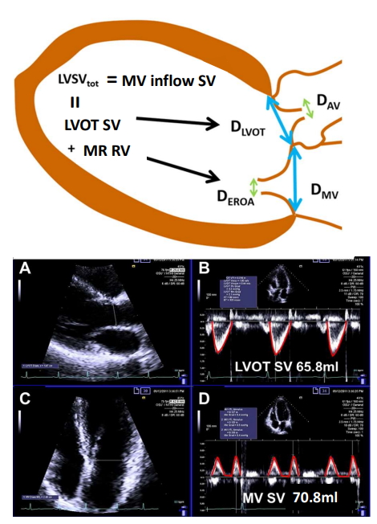
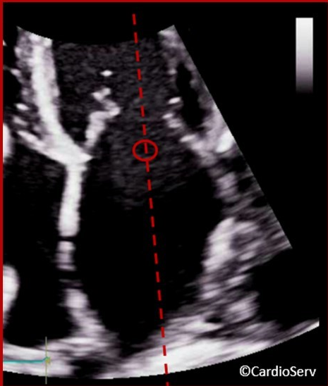
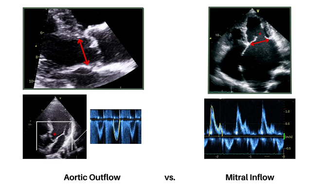
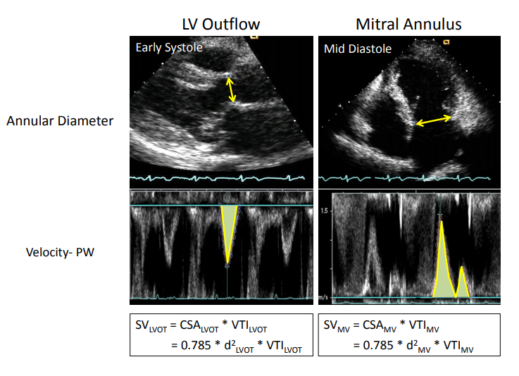
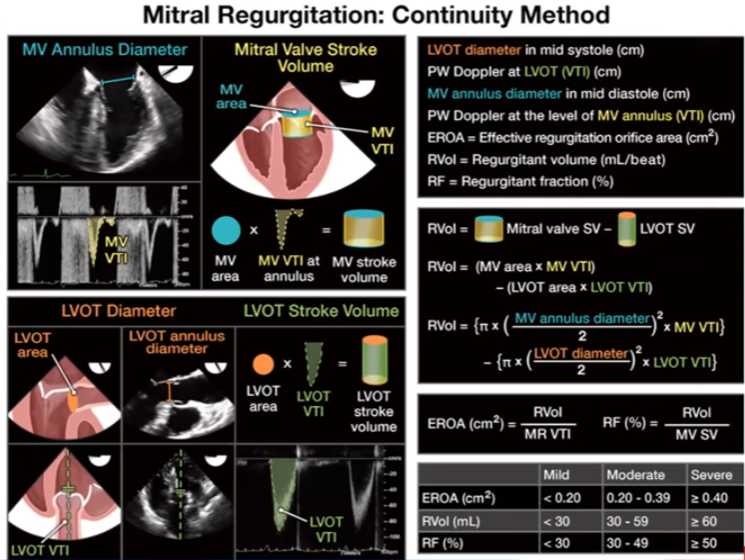
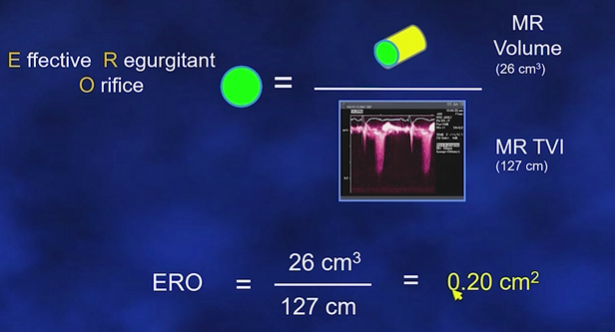

#### Diastoliset mitraalivirtaukset

Kannattaa myös arvioida diastoliikkaa; erityisesti mitraaliläpän diastolisten virtausten nopeuksia.

Mitraaliläpän alkudiastolinen virtausnopeus (E-aalto) kiihtyy vääjäämättä merkittävässä mitraalivuodossa, koska vuototilavuuden verran "ylimääräistä" verta palaa seuraavan diastolen aikana takaisin kammioon ja diastolen alussa paine-ero lokeroiden välillä on suurentunut. Yleensä E-aalto on ≧ 1.2 m/s (tosin nopeita E-aaltoja voidaan nähdä myös mm. diastolisessa vajaatoiminnassa; ei siis ole täysin spesifinen). E/A-suhde myös tietysti tästä johtuen laskee ja dominantti A-aalto poissulkee vaikean mitraalivuodon (ei tosin pysty hyödyntämään tätä tietoa, jos potilas on eteisvärinässä, koska A-aaltoja ei ole). 

---

Samalla voidaan myös mitata E-aallon puoliintumisaika ja deceleration time ja näistä vielä mitraaliläpän avautumispinta-ala (MVA). Tästä enemmän mitraalistenoosin yhteydessä. 

#### Keuhkolaskimovirtaukset

Keuhkolaskimoiden visualisoimisesta ja myös niiden virtausten mittaamisesta ollaan jo puhuttu. Keuhkolaskimovirtausten mittausta voi myös hyödyntää mitraalivuodon vaikeusasteen arvioimisessa. 

Nopea kertaus keuhkolaskimoista ja niiden virtausaalloista: 

<li>Mittaukset suoritetaan yleensä apikaalisesta nelilokerokuvasta ja yleisimmin kuvannetaan ylempää oikeaa keuhkolaskimoa (RUVP). Pulssiaallot mitataan n. 0.5-2cm proksimaalisesti laskimon junktiosta vasemman eteisen kanssa. </li>
<li>PW-dopplerin piirtämä virtauskäyrä koostuu S-, D- ja Ar-aalloista; S-aalto (joskus voi erottaa S1 ja S2) syntyy eteisen täyttyessä kammiosystolen aikana. D-aalto syntyy keuhkolaskimoveren virratessa eteiseen eteisen tyhjentyessä aikaisdiastolessa. Ar-aalto syntyy eteissystolessa eteisen puristaessa loputkin veret eteisestä kammioon (supistumisen aiheuttama paine aiheuttaa hieman retrogradista virtausta keuhkolaskimoon).</li>

---

Mitraalivuodon pahentuessa voidaan todeta progressiivista S-aallon amplitudin laskua ja D-aallon korostumista. Vaikeassa mitraalivuodossa tyypillinen löydös on S-aallon kääntyminen (SR, systolic reversal). 

<li>S-aallon heikentyminen johtuu siitä, että mitraalivuoto on systolinen tapahtuma. Normaalisti systolessa verta virtaa vapaasti keuhkolaskimoista vasempaan eteiseen, mutta mitraalivuodossa eteiseen suihkuaa kuitenkin samanaikaisesti verta suurella paineella vasemmasta kammiosta. Tämä vuotosuihku nostaa eteisen painetta nopeasti, mikä luo vastapaineen keuhkolaskimoista tulevalle normaalille virtaukselle. Koska virtaus edellyttää paine-eroa (korkeammasta matalampaan), vastapaine jarruttaa eteenpäin suuntautuvaa S-aaltoa, jolloin se madaltuu.</li>
  <ul>
    <li>D-aalto taas korostuu, koska diastolen alkaessa eteinen on ylitäyttynyt kammiosta vuotaneen veren takia. Kun mitraaliläppä vihdoin aukeaa, tämä korkeapaineinen verimäärä purkautuu paineella takaisin vasempaan kammioon. Tämän virtauksen aiheuttama tilavuusmuutos ja imu vetävät laskimoista nopeasti suuren määrän uutta verta, mikä näkyy korkeana ja terävänä D-aaltona.</li>
  </ul>
<li>Kun S-aalto kääntyy nollatason alapuolelle (systolic flow reversal), se on vaikea-asteisen mitraalivuodon klassinen tunnusmerkki. Tässä tilanteessa regurgitaatiosuihku on niin voimakas ja volyymi niin suuri, että se ei enää pelkästään jarruta keuhkolaskimoista tulevaa verta, vaan vuotavan veren paine ylittää keuhkolaskimoiden paineen kokonaan. Tämän seurauksena veri iskeytyy eteisen läpi ja työntyy fyysisesti taaksepäin keuhkolaskimoihin.</li>
  <ul>
    <li>Kääntyminen tapahtuu klassisesti keski- tai myöhäissystolessa, jonka takia S1-aalto voi vielä olla todettavissa (tai olla poissa), vaikka S2 olisikin käänteinen. Holosystolinen kääntyminen on harvinaisempaa, mutta joskus todettavissa todella vaikeassa vuodossa.</li>
  </ul>

---

On hyvä tiedostaa, että normaali keuhkolaskimovirtausprofiili ei poissulje vaikeaa mitraalivuotoa. Jos potilaan mitraalivuoto on krooninen ja kompensoitu (vasen eteinen dilatoitu ja komliantti) ja LV:n systolinen funktio on normaali, niin virtausprofiilit voivat hyvinkin olla normaaleja tai voi olla todettavissa vain S-aallon tylpistymistä. 

<li>S-aallon lasku ei myöskään ole kovinkaan spesifinen löydös mitraalivuodolle (käytännössä mikä tahansa syy LA:n paineen nousulle voi aiheuttaa S-aallon tylpistymistä) eikä siitä voi suoraan päätellä vuodon vaikeusastetta.</li>
<li>S-aallon kääntymistä (SR) taas pidetään vaikean mitraalivuodon suhteen epäsensitiivisenä, mutta spesifisenä löydöksenä. Kannattaakin siis vaikeaa mitraalivuotoa epäillessä mahdollisuuksien mukaan nopeasti vilkaista keuhkolaskimovirtaukset.</li>

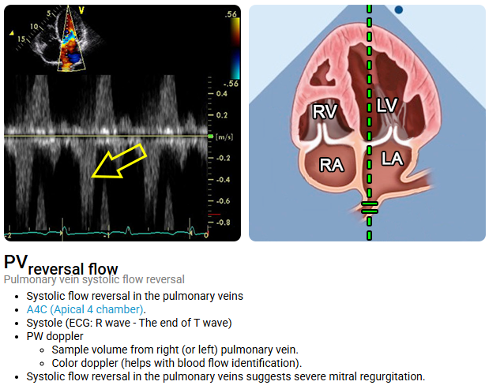
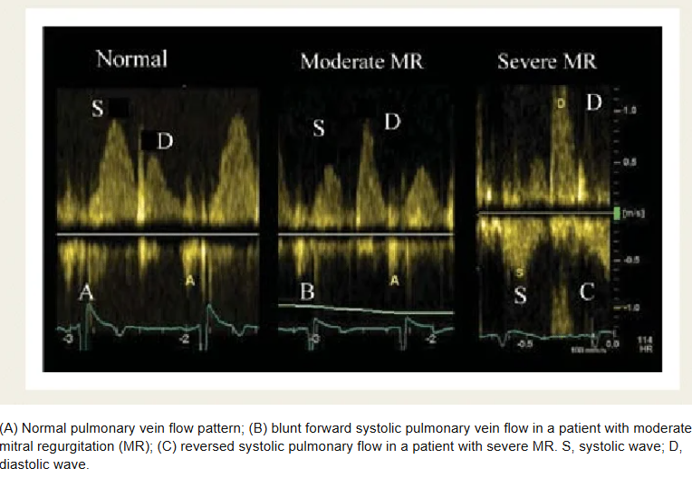
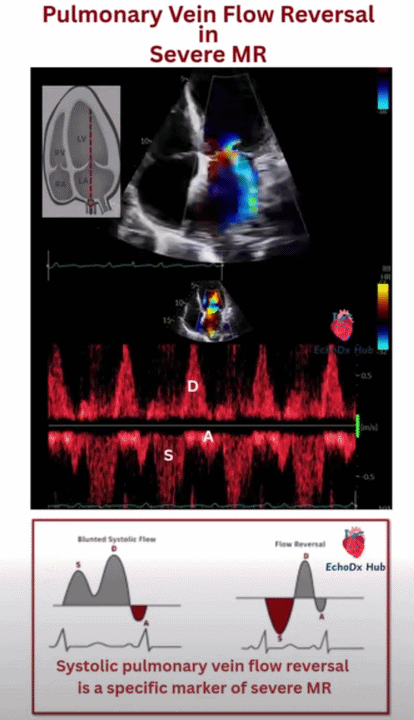
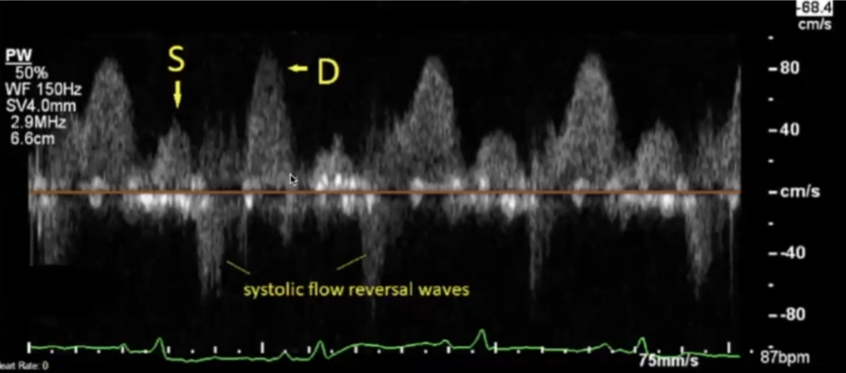

#### LA:n / LV:n koko

Kroonisessa mitraalivuodossa eteisen ja kammion välillä virtaava veri johtaa ennen pitkään molempien lokeroiden laajenemiseen volyymiylikuormituksen takia. LA:n ja LV:n tilavuuksien arvioimien on usein hyödyllistä mitraalivuodon vaikeusasteen ja sen vaikutuksien arvioimisessa. 

Lievässä mitraalivuodossa koot voivat olla vielä normaalit, mutta ajan kuluessa ja vuodon vaikeutuessa lokerot laajentuvat etenevästi. Vaikeassa kroonisessa mitraalivuodossa vasen kammion on lähes poikkeuksetta laajentunut, tosin pienikokoisilla potilailla (varsinkin naisilla) laajentunut lokero voi vielä olla "normaalirajojen" sisällä, vaikka laajentumista olisikin tapahtunut merkittävästi. Tämän takia **lokeroiden koot tulisi suhteuttaa kehon pinta-alaan (body surface area, BSA);** esimerkiksi LAV:n suhde BSA:han on nimeltään LAVi eli Left Atrial Volume Index (normaali on ≤ 34ml/m2). Kammionkin koon voi suhteuttaa BSA:han, mutta usein se vain ilmoitetaan absoluuttisena kokona (normaali LVEDV miehillä on ≤ 150 ml ja naisilla ≤ 106 ml). 

<li>Akuutissakin vuodossa (esim. papillaarilihasruptuura) lokeroiden koot ovat tyypillisesti normaalikokoisia, vaikka vuoto olisikin vaikea, koska lokeroiden remodelaatiota ei ole ehtinyt tapahtumaan. Jos potilaalla on siis olevinaan muiden mittausten perusteella "vaikea" krooninen mitraalivuoto, mutta vasemman puolen lokeroiden mitat ovat täysin normaalit, vuodon aste on todennäköisesti yliarvioitu tai kyseessä on vasta hiljattain alkanut tilanne.</li>
<li>Kroonisessa vuodossa normaalit LV/LA-mitat ovat epätyypillisiä ja herättävät epäilyn siitä, onko vaikeusaste arvioitu oikein.</li>

---

Mitat voi ottaa tyypilliseen tapaan. Kammiosta voi siis mitata PLAX:ssa loppudiastolisen (LVEDD, LVIDd)ja loppusystolisen (LVESD, LVIDs) läpimitan ja A4C:ssa piirtäen loppudiastolisen (LVEDV) ja loppusystolisen (LVESV) tilavuuden. Näistä kone sitten laskee automaattisesti ejektiofraktion, joka myös tulisi aina selvittää mitraalivuotopotilailta, koska EF vaikuttaa leikkauspäätökseen. Kammion loppusystolinen läpimitta on myös monissa kriteeristöissä erillinen arvioitava kriteeri leikkauksen suhteen. Eteisestä voi mitata eteisen läpimitan PLAX:ssa ja eteisen tilavuuden (LAV) voi piirtää A4C:sta; mittaukset tehdään eteisen ollessa suurimmillaan. 

<li>Ejektiofraktio siis on usein vaikeassakin vuodossa ja sen aiheuttamassa kammion dilatoivassa remodelaatiossa normaali, vaikka perfuusio eteenpäin olisikin heikkoa. Mitraalivuoto siis ryöstää suuren osan kammion pumppaamasta verestä ja tämä näkyy valheellisen korkeana ejektiofraktiona, joka yliarvioi oikeasti aorttaan kulkevan veren ja siten elimiä perfusoivan pumppaustoiminnan määrän.</li>
<li>Tämän takia jos vaikeaa mitraalivuotoa sairastavan potilaan EF putoaa 60% tai sen alle, se on huono merkki ja usein merkitsee, sitä, että kammion todellinen kyky perfuusiolle eteenpäin on jo heikentynyt merkittävästi. Oireettomankin rakenteellisen vaikean mitraalivuodon leikkaushoito on siis yleensä aiheellista, kun vasemman kammion ejektiofraktio (LVEF) on < 60 % (tai mm. jos vasemman kammion systolinen poikkimitta on ≥ 40 mm).</li>

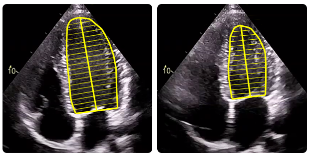
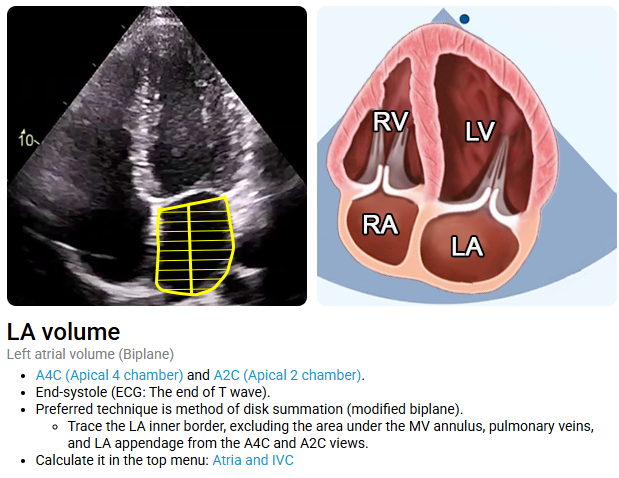
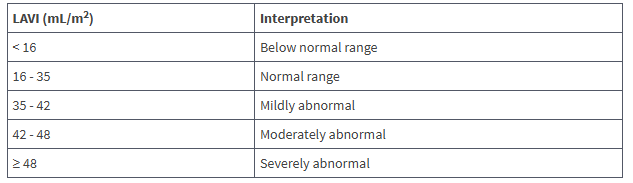

#### Vuotosuihkun pinta-ala 

Kuten mainittiin aikaisemmin, niin sentraalisten vuotojen kanssa voidaan vieläkin guidelinejen mukaan hyödyntää gradeerauksessa vuotosuihkun pinta-alan ja vasemman eteisen välistä suhdetta. Painoarvoa tulokselle ei kuitenkaan tulisi antaa liikaa, koska vuotosuihkun pinta-alaan liittyy monia ongelmia.

Varsinkin eksentriset vuodot ja Coandan efekti on yksi yleisimmistä ongelmista, joka johtaa vuodon vaikeuden aliarvioimiseen pinta-alan perusteella. Vuotosuihkua voi taas suurentaa esim. kohonneet vasemman kammion paineet (esim. hypertensio, aorttastenoosi) ja pienentää pienet paineet esim. hypotensiossa. Pinta-alaan vaikuttaa myös mm. gain- ja velocity scale-settingit (yleensä suositellaan nyquistin rajaksi 40-50 cm/s). 

Mittaukset suoritetaan yleensä loppusystolessa vuotosuihkun ollessa suurimmillaan. 

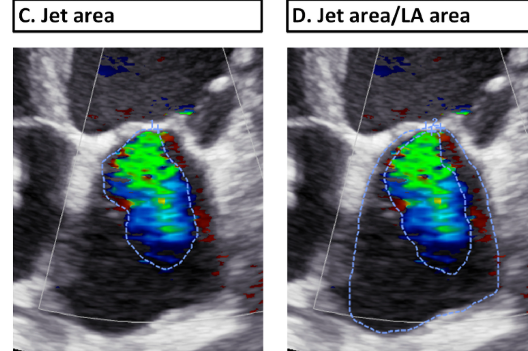

#### Keuhkovaltimopaine (PAP, PASP)

Keuhkovaltimopaineita ei useimmissa guidelineissa käytetä suorana spesifisenä tai edes tukevana kriteerinä mitraalivuodon vaikeusastetta päätellessä, mutta se kuitenkin toimii epäsuorana työkaluna, joka on järkevää mitata monissa tilanteissa (ei siis pelkästään mitraalivuodossa). Keuhkovaltimopaineen nousemista >50 mmHg käytetään joskus myös indikaationa läpän korjaukselle, jos kyseessä on matalan leikkausriskin potilas ja läpän korjauksen onnistumisen arvioidaan olevan todennäköistä.

Keuhkovaltimopaine nousee johtuen vasemman puolen paineiden nousun takia, jonka takia verta pakkautuu keuhkolaskimoihin ja paineen nouseminen lopulta heijastuu valtimoihinkin. Tällä samalla mekanismilla muutkin vasemman puolen pumppaustoimintaa häiritsevät ongelmat johtavat keuhkovaltimopaineen nousemiseen.

Keuhkovaltimopaineiden epäsuora arviointi tapahtuu tyypilliseen tapaan trikuspidaalivuodon gradientin (TR PG) ja keskuslaskimopaineen (eli oikean eteisen paineen, RAP) mittausten kautta: PASP = TR PG + RAP 

<li>RAP siis mitattiin IVC:n paksuuden ja lyttääntymisherkkyyden kautta (kts. IVC-osio)</li>

#### Flail leaflet 

"Flail leaflet" eli vapaasti heiluva läppäprolapsi on vaikea mitraaliläpän prolapsin muoto, jossa läpän kärki (ja joskus jopa runko) liikkuvat vapaasti eteiseen ja tämä aiheuttaa yleensä vaikeaa akuuttia vuotoa. Useimmiten taustalla on chordae tendinae -ruptuura (jännerihmarepeämä), mutta joskus jopa papillaarilihasruptuura. Jännerihmojen repeämisen taustalla voi olla mm. läpän myksomatoottinen rappeuma (usein mitraaliläpän prolapsin yhteydessä), infektiivinen endokardiitti tai reumakuumeen komplikaatio. Endokardiitti voi myös suoraan vaurioittaa läppärakenteita ja siten aiheuttaa ei-iskeemistä akuuttia vuotoa. Papillaarilihasruptuura on taas tyypillisesti iskeeminen etiologialtaan ja syntyy useimmiten n. 3-5pv infarktin jälkeen. 

Useimmiten flail leaflet on posteriorinen purje ja vielä tarkemmin P2 johtuen sen korkeasta mekaanisesta stressistä ja jännerihmayhteyksistä.

Kannattaa mitata mahdollisuuksien mukaan flail gap (vaikuttaa leikkauksen aiheellisuuteen).

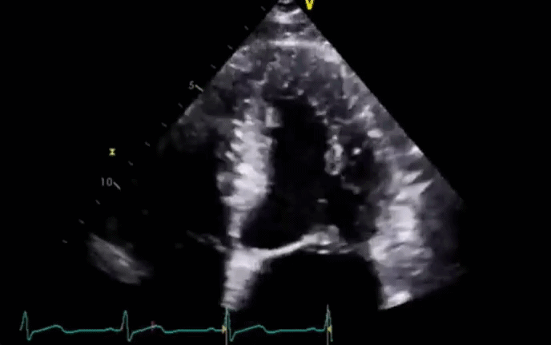
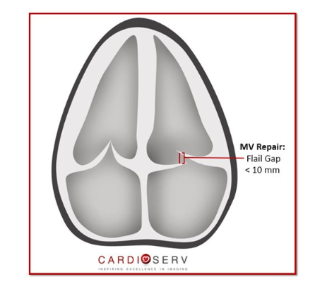

### Vaikeusasteet

Mitraalivuodon gradeerauksessa nykyään yleisin luokittelu on lievään, keskivaikeaan ja vaikeaan. Joskus graduksen voi myös ilmoittaa numeerisella skaalalla gr I - IV, jossa gr III voi olla joko keskivaikea tai vaikea. 

ASE:n ja ESC:n guidelinet ovat pääasiassa samanlaiset ja ne perustuvat niin kvalitatiiviset, semikvantitatiiviset kuin kvantitatiiviset parametrit integroivaan lähestymistapaan. Tärkeimmät kvantitatiiviset mitat ovat EROA, vuodon tilavuus (RVol) ja vuotofraktio (RF). Ennen niidenkin laskemista tai mittausarvoja kerätessä voi jo nopean algoritmin perusteella sulkea pois tai todeta lievän tai vaikean vuodon. Kannattaakin mitraalivuotoa arvioidessaan seurata tyypillistä järjestystä tutkimuksessaan: 

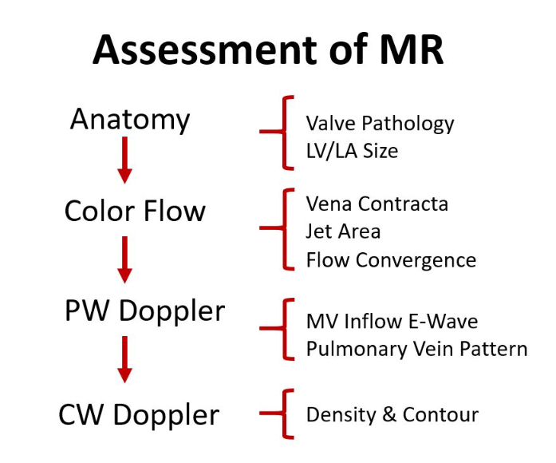

Tätä "algoritmia" seuraten tulee mitattua tärkeimmät asiat ja alla kuvassa olevien kriteerien mukaan voi poissulkea tai todeta lievän tai vaikean vuodon. Jos kriteerit ei täyty eli tulokset ovat varmasti lievän ja varmasti vaikean välissä, niin kvantitatiivisilla mittauksilla saa tarkemman arvion vaikeusasteesta. Kvantitatiiviset mittaukset on kuitenkin hyvä muutenkin ottaa aina mahdollisuuksien mukaan. 

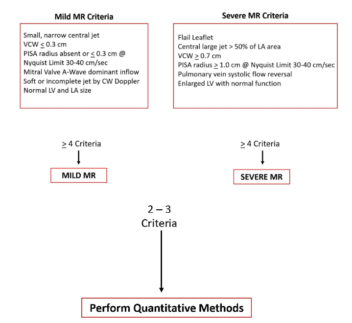

Kvantitatiivisista metodeista saa siis aikaisemmin mainittuun tapaan arvot EROA, RVol ja RF. Monesti voi tehdä vaikeusasteen lausunnon jo pelkästään näiden perusteella. Simppelissä lähestymistavassa jako voi olla pelkästään lievään, keskivaikeaan ja vaikeaan, mutta tarkemmassa gr I - IV -jaottelussa gr III voi sisältää myös vaikean vuodon. Jos siis on 3 spesifistä keskivaikean vuodon rajojen yläpäähän sijoittuvaa tulosta (EROA 0.3-0.39, RVol 45-59 ml ja RF 40-49%), niin vuoto voi olla gr III (severe) ja jos taas tulokset ovat enemmänkin rajojen alkupäässä niin gradus on III (moderate). Nämä ovat myös vaikean vuodon kriteerit sekundaariselle (toiminnalliselle) vuodolle, koska mittaukset usein aliarvioivat sekundaarisen vuodon vaikeusastetta.

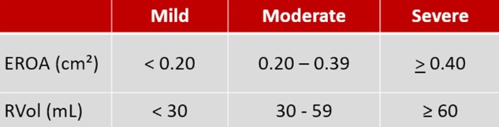
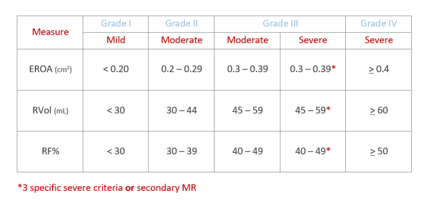
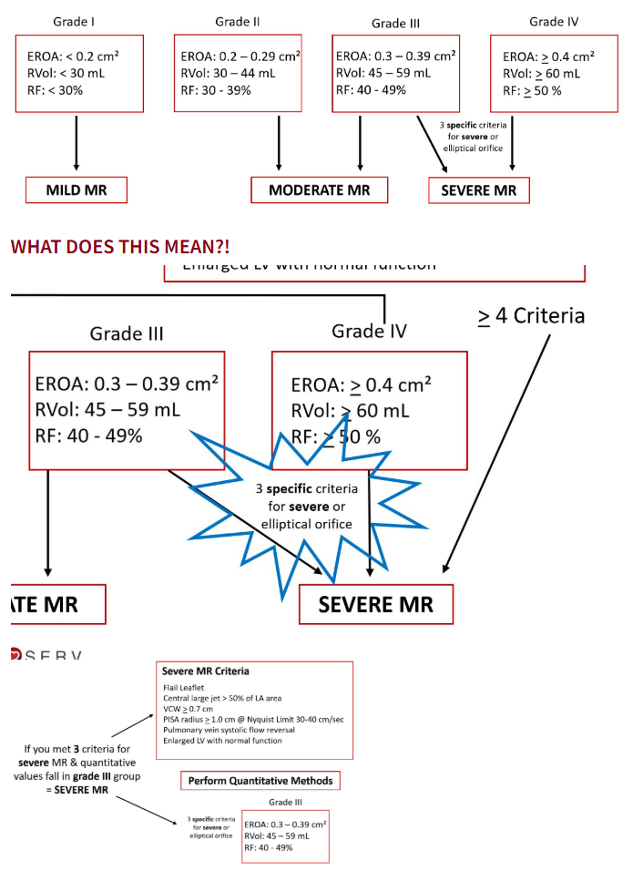

Tässä vielä kokonaisuudessaan ASE:n algoritmi:

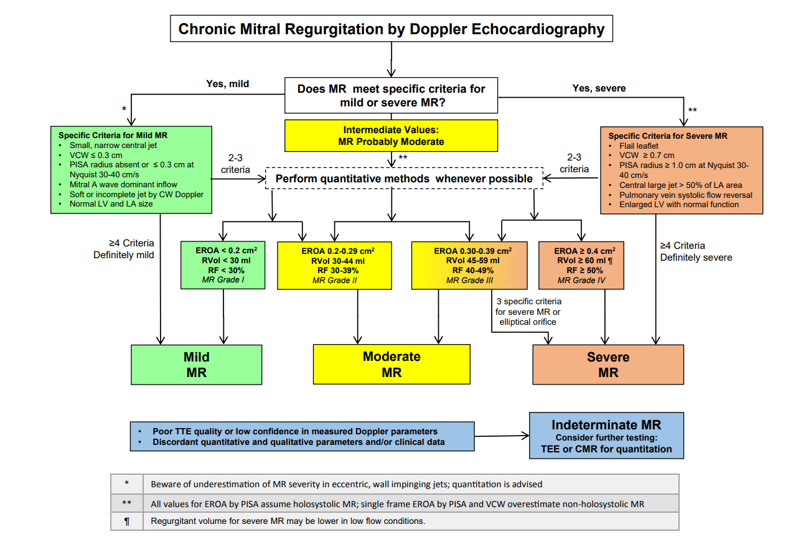

## Muuta huomioitavaa

Vaikeusasteen arvioinnissa on monia huomioitavia asioita, jotka voivat ohjata tutkijan harhaan. Tässä on pari tärkeintä jo aikaisemmin mainittujen lisäksi.

### Vuodon kesto

Mitraalivuodon kesto on tärkeää ottaa huomioon. Jos MR rajoittuu myöhäissystoleen (kuten yleensä mitraaliläppäprolapsissa (MVP)) tai aikaissystoleen (esim. kammiodyssynkronia), niin vuoto ei ole yleensä vaikea-asteinen. Usein kuitenkin näissä tilanteissa tulee tehtyä virhearvio, jos pohjustaa arvion vain yksittäisiin väridopplerin freeze frame -mittauksiin, kuten vuodon kaulaan tai PISA:an. 

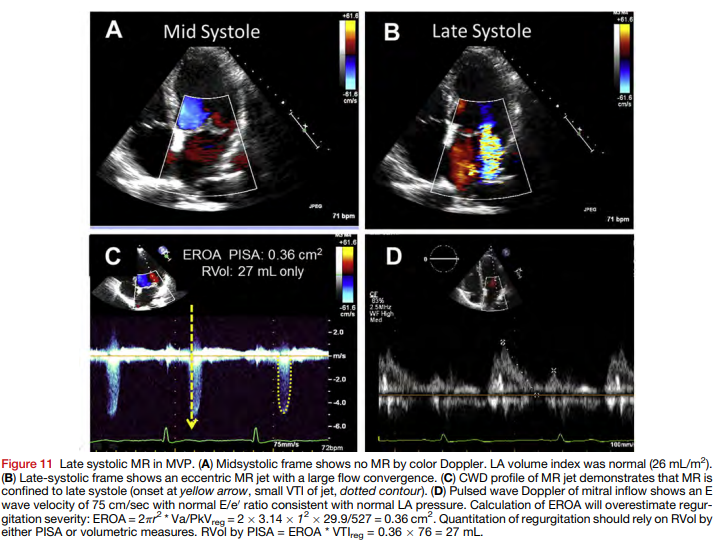

### Paineiden vaikutus

Hemodynaamiset muutokset, varsinkin verenpaine, voivat vaikuttaa merkittävästi MR:n vaikeusasteen arvioon. Korkea verenpaine tarkoittaa sitä, että vasemman kammion paineiden on pakko nousta systolessa myös korkealle (esim. jos systolinen verenpaine on 170 mmHg, niin vasemman kammion on pakko supistua niin kovaa, että sen sisäinen paine nousee vähintään arvoon 170mmHg (jotta aorttaläppä edes aukeaisi)). Tästä johtuen paine-ero kammion ja eteisen välillä on suuri ja koska paine-ero puristaa verta vuotoaukon läpi suurella voimalla, on vuotovirtaus todella nopea. 

Nopeat virtaukset (esim. >6 cm/s) voivat näyttää merkittävänkin suurilta väridopplerissa, vaikka EROA tai RVol olisivatkin pienet. Tällainen tilanne on siis usein esim. hypertensiossa, vaikeassa aorttastenoosissa tai merkittävässä LVOT-obstruktiossa. Hypotensiossa taas vuotosuihku voi näyttää suhteellisen pieneltä, vaikka vuoto olisikin todellisuudessa vaikea. 

Älä siis tee päätöksiä vuodon vaikeudesta pelkästään silmämääräisen vuotosuihkun suuruuden (tai edes vuotosuihkun ja eteisen pinta-alojen suhteen) tai CW-dopplerin virtausnopeuksien perusteella! 

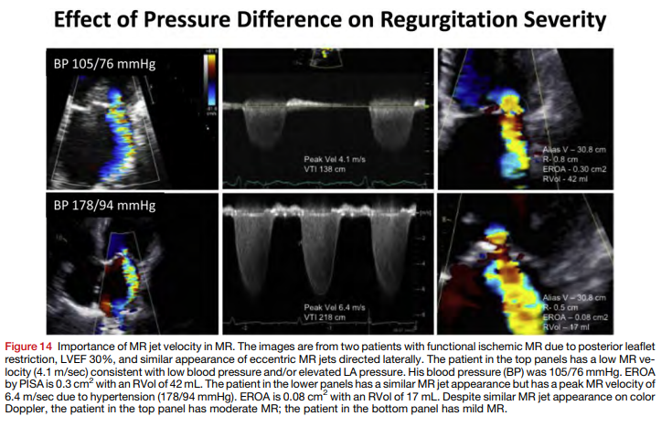

## Hoito 

Nykyiset hoitosuositukset jakavat mitraalivuodon hoidon kahteen eri polkuun sen mukaan, onko vika rakenteellinen itse läpässä (primaarinen) vai onko vika toiminnallinen (sekundaarinen). Tässä on molempien hoitolinjojen algoritmit:

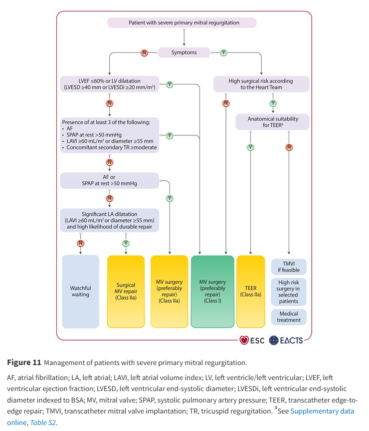
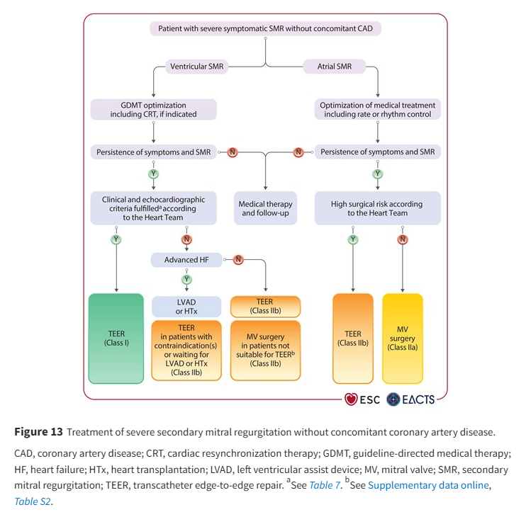

### Primaarisen mitraalivuodon operatiivisen hoidon indikaatiot 

Primaarisessa vuodossa ongelma on rakenteellinen, joten hoitokin keskittyy pääasiassa rakenteelliseen korjaukseen. Lääkkeillä ei voida korjata perforoitunutta läppää tai revenneitä kordia, vaan ne auttavat ainoastaan oireiden (kuten nesteen kertymisen) hallinnassa leikkausta odotellessa. 

Kirurginen hoito on yleensä aiheellista _vaikeassa_ mitraalivuodossa oireiden ilmestyessä. Oireettomillakin potilailla leikkaus on yleensä aiheellinen, jos LVEF laskee alle 60%:iin tai kammio dilatoituu (LVESD ≥ 40mm tai LVESDi ≥ 20 mm/m2; LVESDi on siis Left Ventricular End-Systolic Dimension Indexed to body surface area). 

Mitraalivuodon gradeerauksen lisäksi tulisi myös muistaa arvioida myös aina mahdollisuuksien mukaan mm. ejektiofraktio, lokeroiden (LA ja LV) mitat ja keuhkovaltimopaineet mahdollisimman hyvin, koska niitä käytetään leikkauksen aiheellisuutta arvioitaessa. Oireettomillakin potilailla leikkaus voi hyvinkin olla kannattavaa, jos todetaan huonon prognoosin merkkejä, joita ovat esimerkiksi kohonneet keuhkovaltimopaineet (>50 mmHg levossa), vähintään keskivaikea sekundaarinen trikuspidaalivuoto, eteisvärinäjaksot ja vasemman eteisen huomattava laajeneminen (LAVi ≥ 60ml tai läpimitta ≥ 55mm).

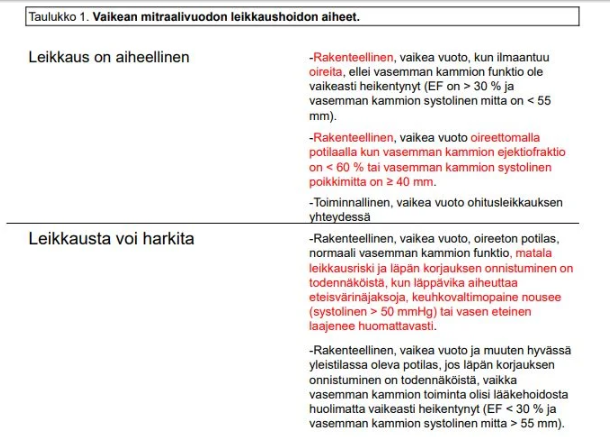
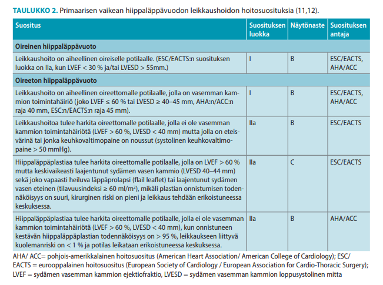

### Sekundaarinen mitraalivuoto 

Sekundaarisessa vuodossa itse läppä on terve, mutta vasen kammio tai eteinen on laajentunut ja vetää läppäpurjeet erilleen (kuten aiemmin käsitellyt Carpentier I ja IIIb -luokat). Ongelma on sydänlihaksessa, joten hoidetaan ensin lihasta. Kirurgiaan suhtaudutaan paljon pidättyvämmin, koska pelkän läpän korjaaminen ei useinkaan paranna huonokuntoisen sydänlihaksen ennustetta.

Tämän takia sekundaarisen mitraalivuodon hoito perustuu ensisijaisesti optimaaliseen sydämen vajaatoiminnan ennusteelliseen lääkehoitoon (ACEi/ATRi (/ARNI) + beetasalpaaja + MRA + SGLT2i) ja tarvittaessa diureetteihin. Mahdollisesti voidaan myös käyttää iskeemisissä ongelmissa tietysti revaskulaarisaatiohoitojakin. Jos vajaatoimintatahdistinhoidon (CRT) kriteerit (optimaalisesta lääkehoidosta huolimatta sinusrytmissä olevalla potilaalla on oireita (NYHA II-IV), ja EF on ≤ 35 % ja EKG:ssä LBBB-konfiguraatio, jonka QRS-kesto on vähintään 150 ms) täyttyvät niin sekin tietysti voi olla indikoitua. 

Jos potilas on edelleen oireinen raskaasta lääkehoidosta huolimatta ja vuoto on vaikea, niin voidaan harkita toimenpiteellistä hoitoa, joka voi tilanteesta riippuen olla perkutaaninen hoito (MitraClip; etenevissä määrin) tai kirurgia (vieläkin ensisijaisempi atriaalisessa vuodossa eli carpentier I-tyypin vuodossa). Leikkaushoito tulee ensisijaisesti kyseeseen, jos avosydänleikkaukselle on muu aihe (esim. ohitusleikkaus sepelvaltimotaudin vuoksi), ja melko harvoin itsenäisenä toimenpiteenä (on vain niukasti näyttöä siitä, että kroonisen toiminnallisen hiippaläppävuodon leikkaushoidolla voitaisiin parantaa potilaiden ennustetta tai edes oireisuutta pitkän ajan seurannassa). 

---

LVEF:n arvio on tärkeää niin kirurgian kuin muiden toimenpiteiden aiheellisuutta ja vasta-aiheellisuutta mietittäessä (niin primaarisessa kuin sekundaarisessakin vuodossa). Jos LVEF tippuu alle 20-30%:iin (20-30%-väli on varsinkin mitraclipissä vielä ok; optimaalinen on 20-50%), niin sydänlihas on usein jo niin sanotusti "loppuunpalanut" ja pelkkä mitraaliläpän vuodon korjaaminen klipsillä tai leikkauksella ei yleensä enää auta potilasta, koska itse pumppu on liian heikko. Leikkausriski on myös merkittävän korkea. Kuitenkin jos potilas on muuten hyvässä yleistilassa ja läpän korjaamisen ajatellaan olevan todennäköisesti mahdollista, niin toimenpiteellisiä hoitoja voidaan harkita jos lääkkeet eivät riitä. 

### Leikkaus vs perkutaaninen klipsaus 

Läppäplastiaa ja tekoläppäleikkausta vertailevia satunnaistettuja tutkimuksia ei ole, mutta takautuvissa vertailevissa analyyseissa ennuste on hiippaläppäplastian jälkeen ollut toistetusti parempi kuin tekoläppäleikkauksen jälkeen. Sekä eurooppalainen että pohjoisamerikkalainen hoitosuositus suosittelevatkin vahvasti, että ensisijaisesti tulee pyrkiä hiippaläppäplastiaan. Plastian etuja tekoläppäleikkaukseen verrattuna ovat pienempi leikkauskuolleisuus ja parempi pitkäaikaisennuste useissa satunnaistamattomissa tutkimuksissa, tekoläpän haittojen kuten mekaaniseen tekoläppään liittyvän pysyvän antikoagulaation ja kudostekoläpän rakenteellisen vaurioitumisen välttäminen sekä seurannassa vähäisempi endokardiitin, tromboembolian ja vakavan verenvuodon riski. Leikkaus tehdään yleensä sternotomiateitse sydän-keuhkokonetta käyttäen. 

Suuren riskin (riskilaskureita on monia; esim. STS Adult Cardiac Surgery Database tai EuroSCORE II) takia leikkaushoito ei ole aina mahdollinen, ja toiminnallisen vuodon yhteydessä leikkaushoidon hyötykin on epävarma. Perkutaanisia katetritekniikoita ja muita vaihtoehtoja perinteiselle mitraalivuodon avosydänleikkaukselle on täten kehitetty aktiivisesti. Mitraalivuodon hoidossa laajimmin käytössä oleva perkutaaninen korjaustekniikka on klipsihoito MitraClip-tekniikalla (yllä olevissa algoritmeissa lyhenne on TEER eli Transcatheter Edge-to-Edge Repair), jota on Suomessa käytetty vaikean hiippaläppävuodon hoitoon vuodesta 2011 lähtien. 

Menetelmässä viedään MitraClip-laite yleisanestesiassa reisilaskimopunktion kautta oikeaan eteiseen, josta vasempaan eteiseen päästään transseptaalisen punktion kautta (yleensä fossa ovaliksen kohdalta, koska se on valmiiksi ohut). Laite viedään mitraaliläpän alueelle ja läpän etu- ja takapurjeen reunat kiinnitetään toisiinsa keskiosistaan klipsillä. Syntyy tupla-aukkoinen mitraaliläppä (double orifice), joka sulkeutuu paremmin kuin ennen toimenpidettä. Toimenpide tehdään TEE-ohjauksessa (myös fluoroskopia samalla katetrien ja ohjainlankojen kanssa).

Hoitomuoto sopii parhaiten toiminnallisen vuodon hoitoon. Jos potilaan leikkausriski arvioidaan hyvin suureksi, voidaan rakenteellisissakin vuodoissa tehdä katetritoimenpide. Hyvällä potilasvalinnalla >90%:a potilaista hyötyy toimenpiteestä ja komplikaatiot ovat harvinaisia; kotiutuminen voi yleensä tapahtua jo seuraavana päivänä. Onnistunut potilasvalinta edellyttää huolellista hiippaläpän rakenteen ja toiminnan tutkimista ruokatorven kautta tehtävällä kaikukuvauksella (TEE). Tästä huolimatta katetrikorjaus ei aina onnistu, erityisesti silloin, kun hiippaläpän vuodon mekanismina on rakenteellinen läppävika. Toiminnallisen hiippaläppävuodon Mitracliphoidosta saattaa olla ennusteellista hyötyä, mutta näyttö on osin ristiriitaista ja pidemmän ajan seurantatuloksia tarvitaan.

Hiippaläpän toiminnallisen vuodon klipsihoitoa käytetään Suomessa vielä liian vähän. Vuonna 2022 näitä toimenpiteitä tehtiin Suomessa 35 kpl. Kyseessä on siis aika harvinainen toimenpide. Liian usein potilaat lähetetään hoitoarvioon vasta, kun vasemman kammion toiminta on jo vaikeasti huonontunut. Tällöin hoitotulos ei välttämättä ole paras mahdollinen.

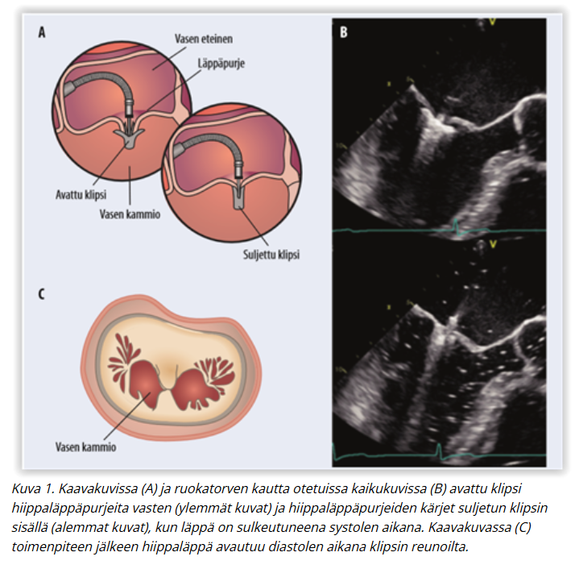

